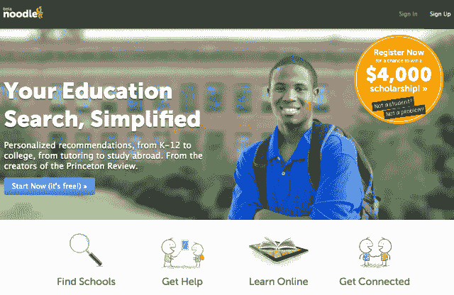

# 普林斯顿评论创始人的初创公司 Noodle 收购了 Lore，围绕搜索 TechCrunch 建立了一个教育市场

> 原文：<https://web.archive.org/web/https://techcrunch.com/2013/03/15/princeton-review-founders-startup-noodle-acquires-lore-to-build-an-education-marketplace/>

去年夏天，我们[告诉你面条教育](https://web.archive.org/web/20221006232213/https://beta.techcrunch.com/2012/05/02/noodle-education-launch/)的成立，这是一家由约翰·卡兹曼联合创立和领导的创业公司，他可能更为人所知的是《普林斯顿评论》和 2U(前 2tor)的联合创始人。这家初创公司的使命是将网飞式的推荐引擎引入分散而嘈杂的教育世界。与谷歌不同，Noodle Education 希望组织全球的学习平台，并将网上的大量教育信息整合到一个以学习为中心的个性化搜索和推荐引擎中。

这家初创公司此后一直很安静，但今天我们获悉该公司进行了首次收购，收购了创始人基金支持的学习管理初创公司 [Lore](https://web.archive.org/web/20221006232213/http://lore.com/) 。Lore 以前被称为 CourseKit，一直在开发一种熟悉的“课程管理系统”，带有年级册、日历和课堂作业文件上传器，同时为学生提供“一种社交网络风格的课堂对话新闻”，正如我们当时写的[。](https://web.archive.org/web/20221006232213/https://beta.techcrunch.com/2012/08/31/now-in-600-schools-and-open-to-any-student-lore-gives-higher-ed-a-next-gen-social-network/)

Lore 最初专注于利用专门为教师设计的工具围绕课程建立论坛，去年秋天，它推出了面向学生的平台，让学生创建学术档案，关注同学和教授，加入学习小组、俱乐部等。该网络于去年春天开通了第一个学期，自那以来已经注册了 600 多所学校，并增加了一系列学科的数千门课程。

虽然交易的条款没有透露，但我们知道这主要是一项技术收购。卡茨曼告诉我们，Noodle Education 将收购这个平台和 Lore 的所有资产，但这家初创公司的七名员工都在评估是否以个人身份加入 Noodle。

Lore 创始人约瑟夫·科恩(Joseph Cohen)将不会加入 Noodle，他在宾夕法尼亚大学(University of Pennsylvania)读本科时与丹·格特尔曼(Dan Getelman)和吉姆·格兰普雷(Jim Grandpre)一起开发了 CourseKit(后来成为 Lore)。这并不是说他对他的创业公司的退出不高兴——他和他的两位联合创始人离开了学校，开始全职工作——事实上，他告诉我们，他无法“想象一个更好的地方来存放知识。”

该公司分享“分享(Lore)为教育建设更美好未来的雄心，”他继续说道，“更重要的是，约翰·卡兹曼是我所知道的最优秀、最有经验的教育企业家之一，所以我很高兴看到他如何发展这个平台，并在我力所能及的地方帮助他。”卡兹曼告诉我们，科恩还没有决定他下一步要做什么，是回到学校，还是回到创业游戏中，但 Lore 的生活仍将继续。

但是，你会问，Lore 会怎么样呢？

好吧，面条教育在过去六个月里沉寂的原因，部分是因为它正在解决一个巨大的问题——一个实在太大了，必须分割才能有效解决的问题。教育信息，数据广泛多样。从大的方面来看，这意味着关于学校、学习平台、导师、学习内容、教科书、测试、评估、教师、表现等等的信息。

创建一个适合任何人的教育搜索引擎是一个巨大的挑战，无论你是为你的三年级学生寻找最佳导师的父母，还是正在考虑选择哪所大学的高三学生。尤其是如果你想建立一些对消费者和企业都有价值的东西，并提供个性化的推荐。

卡茨曼说，他从去年 12 月开始全职在 Noodle Education 工作，因为尽管增长率每月以 40%的速度增长，但问题比他想象的更棘手。另一个起作用的因素是，卡茨曼和 Noodle 不仅想建立一个工具，帮助学习者和教育更有效地联系和找到彼此和内容，而且想解决教育中可能最大的问题:成本。

创始人告诉我们，该公司的根本使命是提高整体教育质量，同时降低学费成本。为了做到这一点，这家 25 人的公司渴望围绕其旗舰搜索工具建立一个教育市场，卡兹曼表示，他们将寻求建立和收购有助于他们实现这一目标的伟大技术，同时影响优质教育的总体成本和获得优质教育的机会。

展望未来，Noodle Education 将寻求围绕其搜索和推荐引擎开发补充公司，首先是“Noodle Launch”，这是一家“姐妹”公司，卡兹曼希望在 4 月份或之后不久推出。他说，Noodle 的推出将专注于成本问题，以及“我们如何降低构建混合学习的异步部分的成本？”

收购 Lore 是这方面的第一步，他说，我猜这不会是 Noodle Education 的最后一步。“Lore 建立了一个漂亮的界面，”Katzman 告诉我们，通过提供一个已经成为脸书等网络标准的社交新闻订阅体验，Lore 与 Noodle 的集成将使该公司能够为学生提供他们熟悉的体验，同时使核心的 Noodle 体验更加社交化。

展望未来，Noodle 将寻求围绕搜索建立一个服务市场，就像谷歌围绕自己的搜索引擎所做的那样。卡兹曼承认，鉴于目前教育市场的不透明、分散和功能失调，这是一个雄心勃勃的目标，而且没有“灵丹妙药”。但是，如果 Noodle 能够开始通过某种统一的搜索和服务市场将教育中不同的孤岛联合起来，它可能会对学习体验和当前的教育基础设施产生重大影响。也就是说，这是一座需要攀登的巨大山峰。

我们还了解到，该公司目前正在筹集一轮重要的资金，以帮助它建立自己的教育市场，所以请继续关注来自面条生态系统的更多消息。

更多信息，请点击这里查看[家庭面条教育，点击这里](https://web.archive.org/web/20221006232213/http://www.noodle.org/)查看[知识。](https://web.archive.org/web/20221006232213/http://lore.com/)

