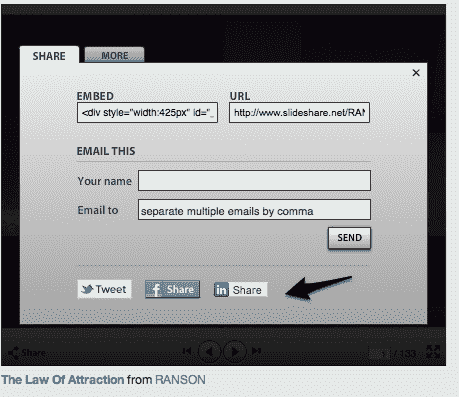
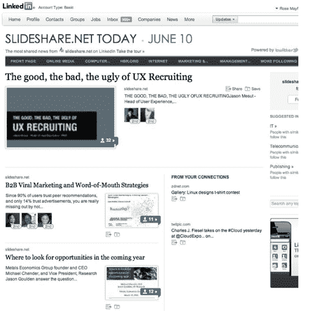

# 专业内容分享平台 SlideShare 深化 LinkedIn 整合

> 原文：<https://web.archive.org/web/https://techcrunch.com/2011/06/22/professional-content-sharing-platform-slideshare-deepens-linkedin-integration/>

# 专业内容分享平台 SlideShare 深化 LinkedIn 整合

[SlideShare，](https://web.archive.org/web/20230312065600/http://www.slideshare.net/)一个商业文档、视频和演示的共享平台，LinkedIn 已经合作了一段时间。2008 年，SlideShare 在 LinkedIn 上推出了一款应用，允许专业人士在他们的网络上分享幻灯片和文档。由于 SlideShare 的专业重点，利用 LinkedIn 的网络对该公司来说是有意义的。今天，slide share[正在深化其 LinkedIn 整合](https://web.archive.org/web/20230312065600/http://blog.linkedin.com/2011/06/22/linkedin-slideshare/)，让用户更容易在超过 1 亿会员的社交网络上分享和参与专业内容。

首先，SlideShare 为所有的 SlideShare 演示文稿、文档和视频添加了一个 [LinkedIn 共享按钮](https://web.archive.org/web/20230312065600/https://techcrunch.com/2010/11/30/linkedin-thinks-publishers-need-yet-another-share-this-button/)，它在功能上类似于 Twitter 的 Tweet 按钮，因此你可以在你的流中与你的专业网络共享内容。该按钮加入了 Twitter 和脸书按钮，所有这些按钮都将在 SlideShare 上的内容以及博客上的嵌入式 SlideShare 内容中提供。

LinkedIn 今天也在其社交新闻阅读器 LinkedIn 中添加了 SlideShare 内容。正如我们在 3 月[所写的那样](https://web.archive.org/web/20230312065600/https://techcrunch.com/2011/03/10/linkedin-today-a-social-news-product-for-professionals/)，LinkedIn 今天聚集了你网络中专业人士分享最多的新闻。现在，在网络上积极分享的 SlideShare 内容也可以在新闻阅读器中找到。SlideShare 是 LinkedIn 今天第一个不是来自出版商，而是由用户生成的内容来源。

在技术方面，LinkedIn 已经升级了在更新流中查看 SlideShare 内容的能力。因此，如果你在 LinkedIn 流中看到一个共享的 SlideShare 文档，你可以通过点击链接或缩略图来查看和参与该内容，而不必离开 LinkedIn 网站。

有趣的是，LinkedIn 和 SlideShare 将他们的关系比作专业人士的巧克力和花生酱。这也是 LinkedIn 在 2009 年首次整合通信平台时对其与 Twitter 关系的描述。

考虑到用户群的交叉，SlideShare 和 LinkedIn 作为合作伙伴实际上很有意义。SlideShare 增长迅速，现在每月有 5500 万独立访问者，每月有 30 亿张幻灯片被观看。SlideShare 业务开发副总裁 Ross Mayfield 表示，将来会有更多与 LinkedIn 的集成。

或许 LinkedIn 应该用该网络最近在首次公开募股中筹集的大量现金购买 SlideShare？

