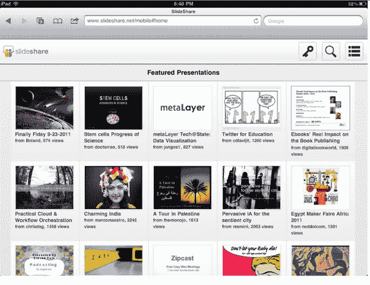

# 专业内容共享平台 SlideShare 通过新的 HTML5 网站实现移动化 

> 原文：<https://web.archive.org/web/https://techcrunch.com/2011/09/27/professional-content-sharing-platform-slideshare-goes-mobile-with-new-html5-site/>

# 专业内容共享平台 SlideShare 通过新的 HTML5 网站实现移动化

潘多拉、 [LinkedIn](https://web.archive.org/web/20230204213054/https://techcrunch.com/2011/08/16/linkedin-redesigns-android-iphone-apps-with-groups-and-more-debuts-html5-mobile-site/) 、[Box.net](https://web.archive.org/web/20230204213054/https://techcrunch.com/2011/08/11/box-net-bets-on-html5-for-new-mobile-site-launches-playbook-and-android-tablet-apps/)和许多其他公司都在转向 HTML5，为用户提供跨平台、丰富的媒体体验。最新参与此次招标的是 [SlideShare，](https://web.archive.org/web/20230204213054/http://www.slideshare.net/)一个商业文档、视频和演示的共享平台。

SlideShare 可以让任何人分享演示文稿和视频，也可以作为一个社交发现平台，让用户找到相关内容并与其他有相似兴趣的成员联系。该公司还有一个庞大的企业追随者，像 IBM 和其他公司使用这个平台在一个品牌页面上管理来自他们所有员工和合作伙伴的内容。

考虑到移动平台上内容发现的趋势，SlideShare 提供移动服务是有意义的。但这家初创公司没有提供任何原生应用，直到今天才有一个可以通过浏览器访问的基于 flash 的网站。联合创始人 Jonathan Boutelle 告诉我们，使用基于 Flash 的网站是用户从 iOS 网站访问 SlideShare 的一个障碍。当决定是否为 go HTML5 建立一个原生应用程序时，Boutelle 说，建立一个移动优化的网站最有意义，因为它具有跨平台的能力，可以在 iPads，iPhones 和 Android 设备上工作。

新的 HTML5 SlideShare 网站现在呈现速度提高了 30%，用户可以查看、共享演示文稿并与之互动。Boutelle 说，SlideShare 网站的最新版本使用了一项正在申请专利的文档转换技术，该技术只使用 HTML5 就可以呈现 PowerPoint 或 Word 文档的所有细节。

该网站还允许访问者利用以前只能在桌面版网站上使用的几个功能，包括复制和粘贴文本的能力；键盘导航；全屏视图；以及查看嵌入文档的能力。注册用户还可以查看私人内容，查看朋友的内容和喜欢的内容。现在，查看幻灯片视图页面的任何用户都可以看到元数据，如每个演示文稿的查看次数、嵌入内容和收藏夹，以及相关内容和同一作者的内容。主页现在显示了一个特色演示列表。

Boutelle 表示，SlideShare 的参与度持续增长，并预计 HTML5 平台的使用量也会增加。他解释说 HTML5 是有意义的，因为该公司希望为用户提供轻量级的体验，并希望文档、字体等在各种浏览器上看起来都一样。正如我们上面提到的，这是 SlideShare 的第一个移动应用，目前这家初创公司没有任何扩展到原生应用的计划。“我们在 HTML5 上加倍努力，让它变得更好，对每个人都有用，”Boutelle 说。

目前，该网站的 6000 万用户每天上传数万份专业演示文稿。SlideShare 已经从乔纳森·艾布拉姆斯、马克·库班、戴夫·麦克卢尔和文洛克那里筹集了 300 万美元的资金。

