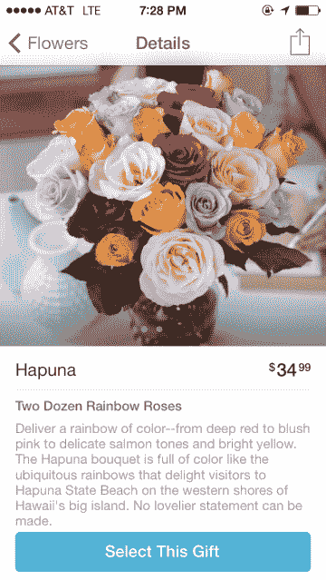

# ProFlowers 通过一个现代、简单的礼物应用程序 TechCrunch 来到 iPhone

> 原文：<https://web.archive.org/web/https://techcrunch.com/2014/02/06/proflowers-comes-to-iphone-via-a-modern-simple-gifting-app/>

去年 11 月被 Provide Commerce 收购的移动礼品公司[真诚地](https://web.archive.org/web/20221204090606/https://beta.techcrunch.com/2013/11/07/provide-commerce-acquires-mobile-gifting-startup-sincerely-will-expand-into-new-categories-apps-in-2014/)，今天推出了他们合并后的第一款新应用。真诚的创始人马特·布雷兹纳说: [ProFlowers](https://web.archive.org/web/20221204090606/http://www.proflowers.com/app) is 让从你的智能手机上订购鲜花变得像点一个优步一样简单。该应用程序利用了 Provide Commerce 拥有的花卉和植物分销网络，以及真诚在设计现代移动礼品应用程序方面的专业知识。

在收购之前，真诚已经进入了实物礼品领域，通过你的智能手机选择，发送和支付。最初，这是以名为 Sesame 的发送礼盒应用程序的形式出现的。但有消息称，该计划还将扩展到其他种类的实物礼物，包括像酒和花这样的东西。

Brezina 解释说，自从几年前真诚地开始以来，他一直想开发一个伟大的应用程序，用于从 iPhone 上送花。“令人难以置信的是，2014 年没有一款好的花卉应用，”他说。

当然，现在有订购鲜花的移动应用程序，比如来自另一个大牌鲜花网络 [1-800-Flowers](https://web.archive.org/web/20221204090606/https://itunes.apple.com/us/app/1-800-flowers-flowers-gifts/id457699767?mt=8) 的应用程序，但我不得不同意 Brezina 的观点——充其量也就是相当一般。与此同时，新的竞争对手 [H.Bloom](https://web.archive.org/web/20221204090606/http://www.hbloom.com/) 现在似乎更专注于商业和豪华花卉服务——其面向消费者的[iPhone](https://web.archive.org/web/20221204090606/https://itunes.apple.com/us/app/1-800-flowers-flowers-gifts/id457699767?mt=8)[应用](https://web.archive.org/web/20221204090606/https://itunes.apple.com/us/app/h.bloom-gifts/id635029927)已经从 App Store 中消失。另一个，Bloomthat，[刚刚推出](https://web.archive.org/web/20221204090606/https://beta.techcrunch.com/2014/02/06/bloomthat-funding/)。

至于新的 ProFlowers 应用程序，它确实有点像一家初创公司，而不是一家更古老、更传统的公司。该应用程序具有 iOS 7 的外观和感觉，并提供简单的图像，以及精简的产品选择，以免令人眼花缭乱。今天有 40 个 SKU 和一些精选的礼物选项，它提供地址导入和预先写好的情感卡片。

结账也很容易，信用卡扫描选项可以加快支付订单的过程。

这些花束和植物以著名的城市和国家公园命名，如 Funston、金门、Bryant、Millenium、新宿等，用户可以通过选择他们希望表达的情感来选择合适的选项，如“渴望”、“鼓励”、“庆祝”、“欣赏”或“安慰”这进一步缩小了选择范围，让你更快地选择合适的礼物。

ProFlowers 还与[真诚的“体贴引擎”](https://web.archive.org/web/20221204090606/https://beta.techcrunch.com/2013/06/05/sincerelys-new-thoughtfulness-engine-will-help-you-remember-birthdays-special-occasions-wont-spam-you-with-alerts/)——它给自己的生日提醒工具起的名字，与脸书捆绑在一起。同时，其他诚信通产品的用户，如[诚信通墨水](https://web.archive.org/web/20221204090606/http://www.sincerely.com/ink)、 [Postagram](https://web.archive.org/web/20221204090606/https://postagramapp.com/) 和[芝麻](https://web.archive.org/web/20221204090606/http://www.sincerely.com/sesame)，也将看到他们相同的通讯录、账单信息和体贴通知自动结转到新的应用程序中。这让 ProFlowers 感觉它是真诚应用套件中的下一个，而不是为了迎合新的企业霸主而构建的独立体验。

新的 ProFlowers 应用程序[可从这里](https://web.archive.org/web/20221204090606/http://www.proflowers.com/app)下载。一个介绍性的促销活动为前 200 名 TechCrunch 读者提供了第一笔订单 20%的折扣。(宣传语代码是“TechCrunch”。)