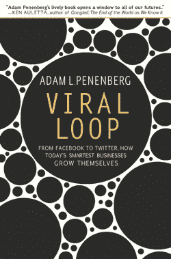

# PS:我爱你。在 Hotmail  获取免费电子邮件

> 原文：<https://web.archive.org/web/https://techcrunch.com/2009/10/18/ps-i-love-you-get-your-free-email-at-hotmail/>

 *以下节选自亚当·l·佩恩伯格的新书[病毒循环:从脸书到推特，当今最聪明的企业如何自我成长](https://web.archive.org/web/20230328040232/http://www.amazon.com/gp/product/1401323499/ref=s9_simz_gw_s0_p14_i1?pf_rd_m=ATVPDKIKX0DER&pf_rd_s=center-2&pf_rd_r=13RA4AHWQ5WM7A2XPHWH&pf_rd_t=101&pf_rd_p=470938631&pf_rd_i=507846)。* 
只要用正确的方式设计你的产品，你就可以从零开始建立一个飞速发展的企业。没有广告或营销预算，不需要销售队伍，风险投资家就会蜂拥而至向你砸钱。

许多最成功的 Web 2.0 公司，包括 MySpace、YouTube、易贝、Flickr 和像 Twitter 这样的后起之秀，都是“病毒循环”的典型例子——要使用它，你必须传播它。结果是:从未有过如此快速、如此大规模、从如此少的资金开始创造财富的潜力。

在 Viral Loop 中，Penenberg 讲述了企业家们的迷人故事，他们首先利用病毒循环的前所未有的潜力创建了成功的在线业务，有些业务价值数十亿美元，我们都依赖于这些业务。诀窍在于他们创造了人们真正想要的东西，以至于他们的顾客乐意为他们传播关于他们产品的信息。Hotmail 就是其中之一。在他们的第 20 次风险投资会议后，苹果公司的前硬件工程师萨比尔·巴蒂亚和杰克·史密斯首先提出了网络邮件的想法，最终从著名的风险投资公司德雷珀·费希尔·朱韦森那里筹集了种子资金。

**PS:我爱你。在 Hotmail** 获取免费电子邮件

在双方制定出最初 30 万美元种子投资的条款后，萨比尔·巴蒂亚和杰克·史密斯拿着一张 5 万美元的过桥支票走出了德雷珀·费希尔·朱韦森的办公室，并辞去了他们的日常工作。史密斯在家里工作，在带上另一名工程师后，开始着手建造一个原型。他们还需要想出一个名字，这个任务落到了史密斯身上，他和妻子一起熬夜集思广益。他们坐在一张白纸前，列出了包含某种形式的“邮件”的可能性。24 封邮件中有很酷的邮件、运行邮件、这封邮件、那封邮件，但没有“啊哈！”瞬间。最后，他的妻子建议说，“Hotmail。”

史密斯写下来了。他不确定“热”的部分，但考虑到其他一切，这似乎是最好的候选人。然后他注意到它包含字母“HTML”，是“超文本标记语言”的首字母缩写，是网页的通用语言。第二天，在乘电梯去律师办公室的时候，史密斯游说了巴蒂亚。像往常一样，他的朋友最初给了它一个冷淡的接待，但他们没有时间了，所以他去了。1996 年 3 月 27 日，史密斯注册了 Hotmail 域名。

与此同时，他在两周内完成了一个原型，并与一小群朋友分享，他们提供了宝贵的反馈，主要涉及布局、电子邮件应该如何查看以及索引页面的安排、界面的外观和感觉、栏目应该如何出现在屏幕上。史密斯在下一次与德雷珀和朱韦森的会面中展示了这一点，他们对此留下了深刻的印象。

德雷珀问道:“你打算怎么把消息传出去？”

“我们会把它放在广告牌上，”巴蒂亚说。他还提到了广播广告。

“天哪，”德雷珀回答说，“那是昂贵的营销，而我们却要把它送人？”他想了一会儿。"你不能把它发给网上所有的人吗？"

那将是垃圾邮件，史密斯回答说。

我想滥发信息是不好的，德雷珀想。他以前从未听过这个术语。然后他闪回了哈佛商学院，在那里他获得了 MBA 学位——他的教授在课堂上介绍了一个案例研究:女性为她们的朋友举办聚会，然后互相推销。每次聚会都有一定比例的女性通过介绍更多业务成为销售人员。特百惠，就是这样。他还回忆了 MCI 的“朋友和家庭计划”，该计划利用社会互动的力量来传播产品。他想知道他们是否可以用网络邮件做类似的事情。

“杰克，”德雷柏问道，“你能在每个人的屏幕底部放一条信息吗？”

“哦，别这样，我们不想那样做！”巴蒂亚脱口而出。

“但是技术上能做到吗？”德雷珀问道。

“我们当然可以在技术上做到这一点，”史密斯说。

“哦，太好了，”德雷珀说。“而且能坚持下去，对吗？你可以把它放在一条信息上，如果他给其他人发邮件，你也可以把它放在那条信息上，对吗？”

“是啊，是啊，”史密斯说，不相信。

“所以放‘PS:我爱你。在 Hotmail 底部的“获取免费电子邮件。”

巴蒂亚和史密斯通过痛苦的表情交流。“哦，不，”他们似乎在说。德雷珀以前见过这种表情。世界上那么多投资者，为什么我们最后会和这个白痴在一起？坦率地说，他不在乎他们怎么想。这感觉很好。

"等一下，伙计们，你们还不明白吗？"德雷珀问道。每条信息底部的标签行可以作为免费广告。“我可以给你发一封电子邮件，你可以把它发给你所有的朋友，他们收到邮件后可以注册，然后发给他们的朋友，很快它就开始流行了。”

史密斯说，“我不认为……”

巴蒂亚打断道。"让我们继续谈其他事情吧。"

德雷珀同意暂时搁置讨论，但并不打算就此罢休。他发誓要继续敲打，直到他们听进去为止。

他们在 1996 年独立日推出了 HoTMaiL。他们不仅喜欢这种象征意义——他们认为网络邮件是一种大众化的工具，因为任何用户都可以从世界任何地方登录——史密斯早就承诺这项服务届时会准备好。在下午早些时候打开注册功能并按下开关后，史密斯陪着他的小技术人员去圣何塞的 Chili's Grill & Bar 庆祝。为了跟踪注册情况，他带了一台笔记本电脑，背面附有无线电调制解调器接收器，天线像占卜棒一样竖起来。史密斯在第一个小时就数出了 100 个登记。午饭后，他们去看了电影，当夏季大片《独立日》开始上映时，他已经有 200 人报名了。走出电影院后，Smith 再次登录，发现又有 50 人加入了 HoTMaiL。他们通过口口相传找到了这个网站。人们在谈论它，并通过电子邮件让他们的朋友和家人参与交易，使用 Hotmail 消息作为概念证明:80%的注册用户说他们是从朋友那里得知的。

本周增长强劲，但并不惊人。在 DFJ 的下一次会议上，蒂姆·德雷珀再次敦促两位年轻的企业家在每条信息中插入一条标语。巴蒂亚和史密斯坚持不在邮件中掺假。只是没有完成。他们会觉得自己在用广告污染电子邮件，那么隐私问题呢？如果有人添加了标语，他们还做了什么？用户会想知道他们还能访问什么，他们也相当肯定这是不道德的。但德雷柏不会善罢甘休。他认为，好处远远超过了风险。如果他们根据用户群的规模来预测他们的整个业务，他们应该尽一切努力尽可能快地扩大用户群。“又及，我爱你。在 HoTMaiL 上获取免费电子邮件。”他越说越喜欢。

第二天，巴蒂亚打电话告诉德雷珀，他们同意这么做，但没有“附注:我爱你”那部分。撞击几乎是瞬间发生的。几个小时内，Hotmail 的增长呈现出经典的曲棍球棒曲线。他们开始平均每天有 3，000 个用户，每天都在增加。到劳动节的时候，他们注册了 75 万用户，六个月内就达到了 100 万。五个星期后，他们达到了 200 万用户大关，每天增加 20，000 多名注册用户，史密斯拼命地试图保持服务器正常运行。有时，该网站变得缓慢，并遭受重大停机。但是在整个过程中，史密斯仅仅使用了虚拟的唾液和胶水，就让 Hotmail——他们在这一点上已经放弃了笨拙的大写——保持运转。

德雷珀坚持要求巴蒂亚和史密斯在每条对外信息中插入带有可点击网址的标语，作为该公司的宣传口号。仅仅通过使用该产品，每个顾客都变成了一个不自觉的销售人员。这种来自朋友或同行的暗示性支持使它比传统广告更有力量，也更有影响力。Hotmail 消息的接收者可以看到 a .)他的朋友是用户，b .)它可以工作，c .)它是免费的。成功的消费者品牌通常基于用户关系。(酷小孩穿低胸牛仔裤，所以我也会。)这符合我们的部落本能。这也产生了用户群。巴蒂亚给印度的一个朋友发了一条消息，三周内 Hotmail 在印度注册了 10 万用户。它还成为了瑞典最大的电子邮件提供商，却没有在那里花一分钱做广告。相比之下，Juno 在营销和广告方面花费了 2000 万美元，而 Hotmail 在一半的时间内获得了三倍的用户。

正如 Jurvetson 在后来成为著名白皮书的文章中所述，Hotmail 的采用模式类似于“具有空间和网络位置”的病毒。一个人的电子邮件地址簿是一种不受地理位置限制的虚拟社交网络。一定比例的联系人是住在附近的朋友、家人和同事；其他人可能分散在世界各地。在全国范围内发送 Hotmail 邮件可能会产生新的用户群。Jurvetson 指出了 Hotmail 早期“平滑指数增长曲线”的“数学优雅”:累积用户=(1+扇出)周期。“我们会注意到来自大学城或印度的第一个用户，然后来自该地区的用户数量会迅速激增，”他写道。"从流行病学的角度来看，这是因为宙斯在地球上打了个喷嚏."