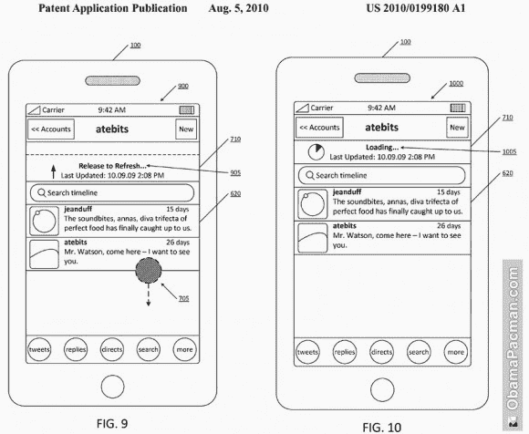

# 哦，iOS 里那个“拉刷新”的东西？是的，Twitter 在 TechCrunch 上有一个专利应用

> 原文：<https://web.archive.org/web/https://techcrunch.com/2012/03/27/pull-to-refresh-the-patent/>

就像许多流行的 iOS 应用程序中的“拉至刷新”功能，包括 Twitter、脸书、Tweetbot、Sparrow 和其他应用程序？我一直想知道为什么苹果没有在自己的应用程序中实现同样的功能，比如 Safari 或 Mail，而这样的功能可以极大地改善用户体验？事实证明，该功能尚未进入苹果核心 iOS 应用的原因可能与一项名为“[用户界面力学](https://web.archive.org/web/20230217205713/http://appft.uspto.gov/netacgi/nph-Parser?Sect1=PTO2&Sect2=HITOFF&u=%2Fnetahtml%2FPTO%2Fsearch-adv.html&r=1&f=G&l=50&d=PG01&p=1&S1=20100199180.PGNR.&OS=dn/20100199180&RS=DN/20100199180)”的专利申请有关——该申请将发明者列为 Tweetie 的创始人 Loren Brichter。你知道…翠儿？[Twitter 在 2010 年收购的应用](https://web.archive.org/web/20230217205713/https://techcrunch.com/2010/04/09/twitter-acquires-tweetie/)，后来成为 iOS 官方 Twitter 客户端？

没错，Twitter 正试图为“拉动更新”申请专利。但专利应用程序并没有就此止步——它会追踪任何发出下拉菜单命令的东西。

[专利申请](https://web.archive.org/web/20230217205713/http://appft.uspto.gov/netacgi/nph-Parser?Sect1=PTO2&Sect2=HITOFF&u=%2Fnetahtml%2FPTO%2Fsearch-adv.html&r=1&f=G&l=50&d=PG01&p=1&S1=20100199180.PGNR.&OS=dn/20100199180&RS=DN/20100199180)这样描述创新:

> 呈现了用于提供增强的用户界面机制的方法、计算机可读介质和装置。在一种布置中，可以显示内容项的可滚动列表。可以接收与滚动命令相关联的输入。然后，基于滚动命令，可以显示可滚动的刷新触发器。随后，响应于基于滚动命令确定可滚动刷新触发器已经被激活，可刷新内容项的可滚动列表。在至少一个实例中，可以响应于在可滚动刷新触发器被完全显示时确定滚动命令被完成，来确定可滚动刷新触发器已经被激活。

专利应用的细节( [20100199180](https://web.archive.org/web/20230217205713/http://appft.uspto.gov/netacgi/nph-Parser?Sect1=PTO2&Sect2=HITOFF&u=%2Fnetahtml%2FPTO%2Fsearch-adv.html&r=1&f=G&l=50&d=PG01&p=1&S1=20100199180.PGNR.&OS=dn/20100199180&RS=DN/20100199180) A1)由 [Dustin Curtis](https://web.archive.org/web/20230217205713/http://dcurt.is/pull-to-refresh) 发布，此前他与 Tapbots 的设计师 [Mark Jardine](https://web.archive.org/web/20230217205713/https://twitter.com/#!/markjardine) 和开发者 [Paul Hadddad](https://web.archive.org/web/20230217205713/https://twitter.com/#!/tapbot_paul) 进行了一次 Twitter 对话，他们是最好的第三方 Twitter 客户端之一 [Tweetbot](https://web.archive.org/web/20230217205713/http://tapbots.com/software/tweetbot/) 的团队。然而，哈达德随后的推文暗示他并不担心这种情况:

这里没什么可看的，继续？

当然可以。除了 Twitter 不总是做对第三方开发者最有利的事情， [Twitter 做对 Twitter 最有利的事情](https://web.archive.org/web/20230217205713/https://techcrunch.com/2011/03/11/twitter-ecosystem-guidelines/)。虽然现在对 Twitter 来说最好的办法(假设它获得了专利)是不强制执行，但这并不是说情况会一直如此。毕竟，如果有一天 Twitter 决定它需要对一个崛起的竞争对手发起专利攻击，那么如果这是它必须做的，它就会这样做。捍卫这项专利意味着其他应用程序可能会受到攻击。所以让我们希望它永远不会走到那一步。

另外，澄清一下，是 [Britcher 说他不会强制执行](https://web.archive.org/web/20230217205713/http://twitter.com/#!/lorenb/status/21684045608)。

我们还必须指出，这个专利应用已经是旧闻了——它早在 2010 年就提交了申请。尽管如此，这对一些人来说显然是一个惊喜，包括约翰·格鲁伯，他的[大胆火球](https://web.archive.org/web/20230217205713/http://daringfireball.net/linked/2012/03/27/pull-to-refresh)博客从内部人士的角度记录了苹果的来龙去脉。“我不知道 Twitter 在这方面有专利，”他写道。他不是一个人。[许多](https://web.archive.org/web/20230217205713/http://www.iphonehacks.com/2012/03/native-apps-pull-to-refresh-feature.html) [网站](https://web.archive.org/web/20230217205713/http://obamapacman.com/2012/03/twitter-pull-to-refresh-scrollable-refresh-trigger-patent-201001991809) [的](https://web.archive.org/web/20230217205713/http://www.loopinsight.com/2012/03/27/the-pull-to-refresh-patent/) [今天都在关注](https://web.archive.org/web/20230217205713/http://www.cultofmac.com/156636/twitter-puts-tweetbot-facebook-clear-apps-in-crosshairs-over-pull-to-refresh/)的新闻，好像他们也是第一次听说。这是那些在雷达下飞行的小事之一，直到一场完美的再博客风暴让每个人措手不及。*(咳咳，咳咳。)*

关于这种情况的一个更有见解的帖子来自于[杰里米·斯坦利](https://web.archive.org/web/20230217205713/http://www.jeremydstanley.com/2012/3/26/ridiculous.html)，他指出，据报道苹果[在它自己的一些内部应用中使用](https://web.archive.org/web/20230217205713/https://twitter.com/#!/tommypicard/status/184370952296075264)拉至刷新。是的，的确如此。我们也确认了。有趣的是，这个功能还没有在面向公众的应用中出现。

如果你想知道为什么对这款专利应用如此感兴趣，那么当世界上每个科技公司都有大量专利可供使用时，这就归结到了发布互动的本质。这是一个感觉如此明显、如此自然的功能，而且非常像 T21 在 iOS 设备上的工作方式，以至于许多人认为它最终会被转化为苹果的核心应用。这感觉像是苹果自己应该申请专利的东西，然后优雅地向 iOS 开发者和设计师建议，这是他们应用程序中刷新数据的首选方式。

如果这样的事情落到了 Twitter 的手里，那该有多奇怪。

好事 [Twitter 和苹果是最好的朋友](https://web.archive.org/web/20230217205713/https://techcrunch.com/2012/02/16/twitter-os-x-mountain-lion/)。

*形象演职员表，ht:[effreysambells.com](https://web.archive.org/web/20230217205713/http://jeffreysambells.com/posts/2012/02/01/mobile-app-style-guides/)；[obamapacman.com](https://web.archive.org/web/20230217205713/http://obamapacman.com/2012/03/twitter-pull-to-refresh-scrollable-refresh-trigger-patent-20100199180/)*