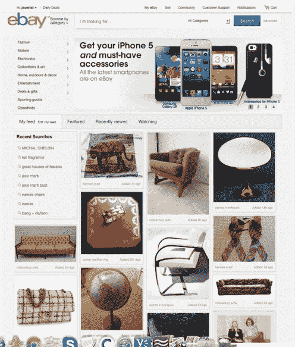

# 从超过 4 亿个列表中，易贝最像 Pinterest 的新个性化主页体验将于明天推出

> 原文：<https://web.archive.org/web/https://techcrunch.com/2013/02/18/pulling-from-more-than-400m-listings-ebays-pinterest-like-new-personalized-home-page-experience-rolls-out-tomorrow/>

# 从超过 4 亿个列表中，易贝的 Pinterest 式新个性化主页体验将于明天发布

去年 10 月，易贝推出了全新的主页体验和重新设计，这标志着该公司在市场历史上最大的主页。易贝的 feed 体验已经处于试点阶段几个月了，仅在不到 10%的用户中进行了测试，明天易贝将向美国所有客户展示新的体验。您可以在这里访问新的主页[。](https://web.archive.org/web/20221210043734/http://www.ebay.com/new)

易贝的新主页基本上是关于你的。该主页现在包括基于您的兴趣、品牌以及符合他们激情和喜好的趋势的高度视觉化、个性化的产品。在提要中，您可以添加您最喜欢的兴趣(如高尔夫)、品牌甚至趋势。使用这些数据，易贝将向您显示新项目、最近的搜索以及更多信息。易贝正在撤出超过 4 亿个上市公司。

汤姆·平克尼(Tom Pinckney)是纽约易贝办事处的负责人，也是个性化初创公司 Hunch 的创始人之一，他解释说，新主页不仅仅是搜索，还包括发现和意外发现。“我们正在引入一种不同类型的购物，并发明一种通过产品发现购物的新方法，”他解释道。“我们有一张巨大的关于发现和意外发现的日期地图，并且正试图找到利用这些数据和集体智慧的方法。”

这项新技术的另一个组成部分是对产品列表和变化的实时更新。易贝将在客户每次访问主页时为他们的订阅源提供新项目——并在易贝会议期间不断更新。

平克尼说，根据 10 月以来少数测试用户的结果，客户反应积极。另一个是易贝认为数据挖掘有巨大潜力的地方，产品正在帮助用户分享关于产品和列表的知识。

未来，我们会看到易贝的移动体验有所改善，但平克尼表示，未来的最新发展将在不久的将来在国际上推广。

正如我们在 10 月份提到的，该提要与 Pinterest 有着惊人的相似之处。但毫不奇怪，易贝正在努力提供更光滑、更流畅和更直观的体验。凭借易贝多年来积累的大量数据，该公司正在大力探索个性化和治疗。我们知道这是电子商务的未来，所以这是一个明智的选择。但这如何影响该公司的高层仍有待观察。

[YouTube http://www.youtube.com/watch?v=erczDO3qf9Y]