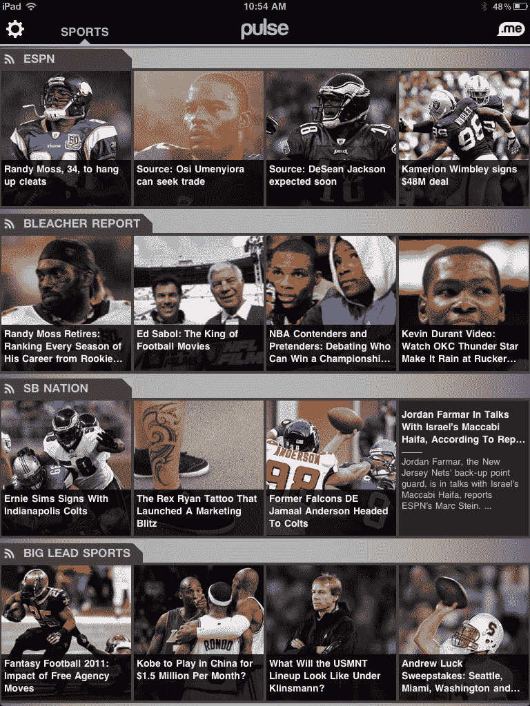
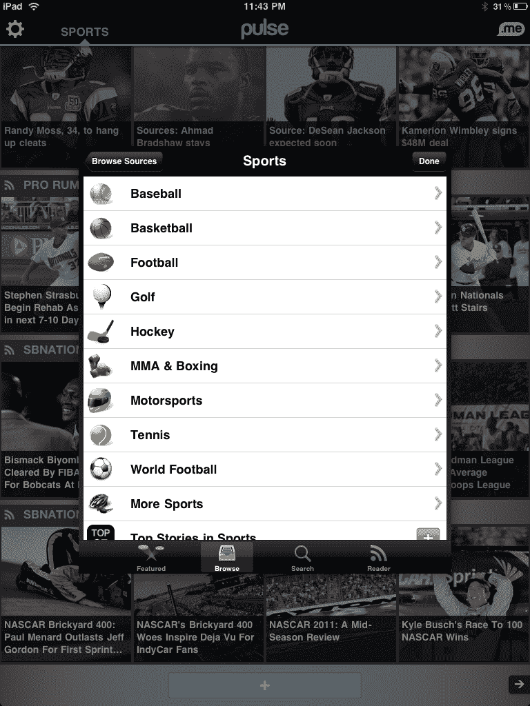

# 在接近 500 万用户的情况下，Pulse 赢得了第一笔 ESPN 交易 TechCrunch

> 原文：<https://web.archive.org/web/http://techcrunch.com/2011/08/02/pulse-espn-5-million/>

# 在接近 500 万用户的情况下，Pulse 获得了第一笔 ESPN 交易

在许多方面，专注于平板电脑的阅读器，如 [Pulse](https://web.archive.org/web/20230203164211/http://www.pulse.me/) 、 [Flipboard](https://web.archive.org/web/20230203164211/http://flipboard.com/) 和 [now Editions](https://web.archive.org/web/20230203164211/https://techcrunch.com/2011/08/02/aol-editions-ipad/) ，是 RSS 阅读器的下一个阶段。但它们是大众会真正使用的 RSS 阅读器，因为它们实际上是用户友好的，以体验和视觉为导向。但因为它们是为用户体验量身定制的，所以它们通常需要超越简单 RSS 提要的合作伙伴关系，以引入必要的信息来填充应用程序。今天，Pulse 在这方面钓到了一条大鱼:ESPN。

在平板电脑阅读领域，体育类一直有点代表性不足，因为 ESPN 内容基本上不存在。ESPN 是迄今为止体育新闻领域最大的名字，Pulse 指出，他们的协议是体育网络首次同意将他们的内容整合到不属于他们自己的移动应用程序中。

通过这笔交易，Pulse Sports 类别正在进行修改，以突出显示 ESPN 的内容以及 SB Nation、Bleacher Report、雅虎体育等网站的其他体育内容。ESPN 的交易将在 Pulse 上放置主要的头条新闻以及为 MLB、NFL、NBA、WNBA、大学橄榄球和大学篮球定制的新闻。在 Pulse 中，您现在还可以按单项运动细分区域，以获得有关该运动的新闻(这也包括主要运动之外的运动，如 MMA、网球、拳击等)。

除了这笔交易，联合创始人[阿克谢·科塔里](https://web.archive.org/web/20230203164211/http://www.crunchbase.com/person/akshay-kothari)告诉我们，Pulse 今天应该在所有平台(iPad、iPhone、Android)上拥有 500 万用户。仅仅一个半月前，这项服务的用户达到了 400 万人，正好赶上宣布他们 900 万美元的首轮融资。

你可以在 App Store [这里](https://web.archive.org/web/20230203164211/http://itunes.apple.com/us/app/pulse-news-reader/id371088673)找到 Pulse。而在安卓市场[这里](https://web.archive.org/web/20230203164211/https://market.android.com/details?id=com.alphonso.pulse)。

