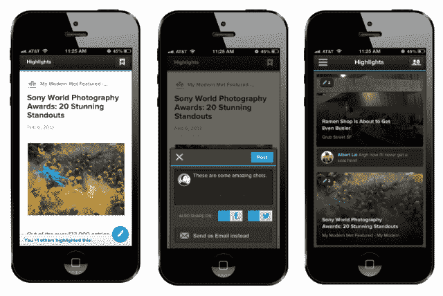
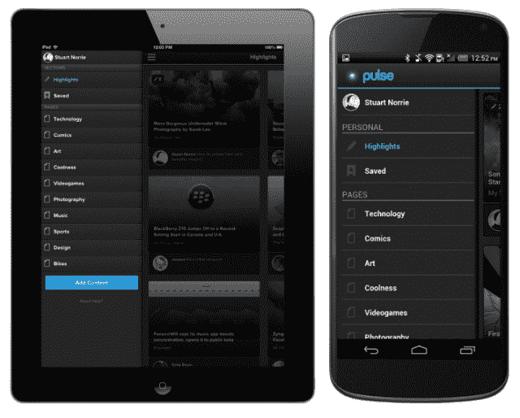

# Pulse News Reader 通过新的“亮点”功能涉足社交网站 

> 原文：<https://web.archive.org/web/https://techcrunch.com/2013/02/12/pulse-news-reader-dips-its-toes-into-social/>

两年多来， [Pulse](https://web.archive.org/web/20221205210034/http://pulse.me/) 一直在为其超过 2000 万用户提供一种从博客和社交网络上阅读内容的便捷方式。虽然 Flipboard 和 Zite 等其他服务使用社交更新和复杂的算法为用户提供个性化的世界视图，但 Pulse 团队避开了这些想法，坚持使用更传统的模式为您提供未经过滤的订阅源。然而，现在该公司[正在慢慢涉足社交](https://web.archive.org/web/20221205210034/http://blog.pulse.me/)，增加了“脉冲亮点”，这是一个专注于你的朋友在该服务和脸书上分享的故事的功能。

这项新功能将于今天在[安卓应用](https://web.archive.org/web/20221205210034/http://pulse.me/android)中推出。更新后的 iOS 应用程序目前正在审批过程中，应该会在本周晚些时候发布。

在该应用中，用户现在可以看到他们的一位脸书朋友何时也分享了他们正在阅读的相同故事(当然，你也可以将故事分享到脸书和 Twitter，或者只是在 Pulse 上)。此外，该应用程序中一个新的“亮点”部分将突出显示您朋友分享的故事。

正如 Pulse 的联合创始人阿克谢·科塔里本周早些时候告诉我的那样，这里的重点应该是你的亲密关系网与你分享的故事。他认为，人们总是使用这款应用来阅读他们信任的网站的内容，但现在他们也能够发现新的来源和故事，这些可能是他们在脸书的常规信息流中错过的。

“我们一直擅长为你提供真正好的东西来阅读，”科塔里说。“但现在我们也进入了探索阶段。”他还指出，Pulse Highlights 可以让你拿着你的脸书饲料“去除绒毛”Kothari 说，使用脸书的另一个好处是，如果你的朋友都不使用 Pulse，你甚至会看到推荐(尽管他希望脸书的连接会给 Pulse 用户一个理由，让他们在社交网络上的朋友也尝试一下)。

大约一年前，该公司开始尝试基于社交和算法的推荐。该团队对完全基于一篇帖子在社交网络上的受欢迎程度的方法没有印象(毕竟，当一个故事获得 500 个脸书的喜欢时，这到底意味着什么？)而且它对类似于 Zite 的纯算法解决方案的尝试也不太成功，因为它的 beta 测试人员从来不确定他们为什么会看到某篇文章。Pulse 认为，对于亮点，“发现是关于人的:亲密的朋友和家人分享对你来说有趣和相关的内容。”

从长远来看，Pulse 希望在此基础上建立更精细的分享选项，并能够不仅突出完整的故事，还可以突出部分故事。Pulse 还预计，这种新的共享数据将对该服务的广告商有用，他们现在可以更好地了解他们的内容在该服务上的表现。

