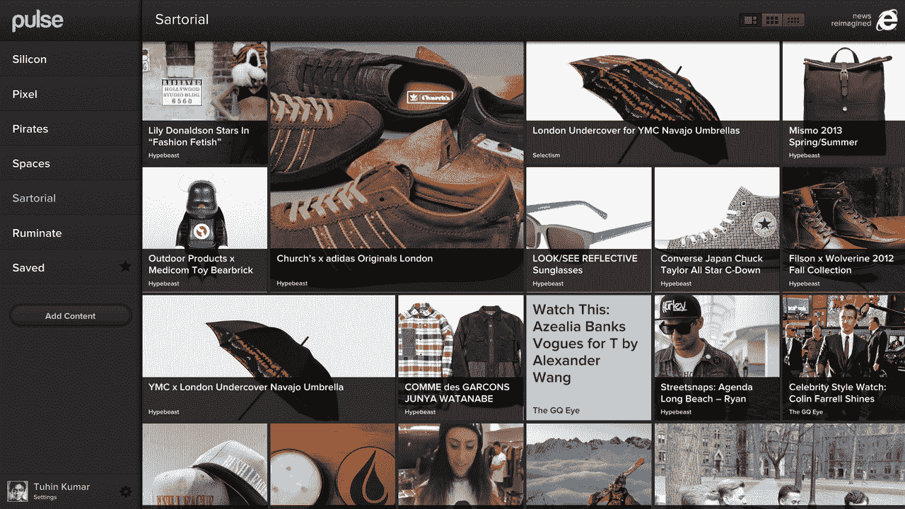
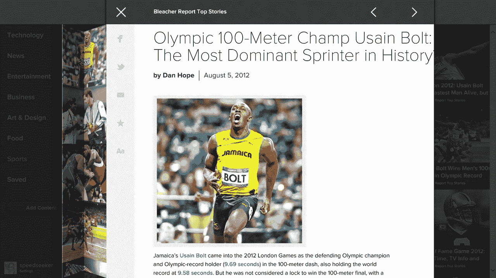
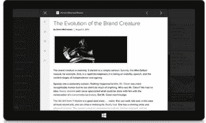

# Pulse 来到网络上(在微软的帮助下)

> 原文：<https://web.archive.org/web/https://techcrunch.com/2012/08/09/pulse-web-launch/>

iOS 和 Android 的热门新闻阅读应用 [Pulse](https://web.archive.org/web/20230406185434/http://www.pulse.me/) 终于可以在网络上使用了。这项服务于两年前推出，目前拥有超过 1500 万用户，但迄今为止只专注于移动平台。正如该公司首席执行官阿克谢·科塔里上周告诉我的那样，它的用户长期以来一直在要求一个网页版本，但该团队决定在解决网络问题之前专注于[增加更多的出版合作伙伴](https://web.archive.org/web/20230406185434/https://techcrunch.com/2012/06/26/pulse-adds-premium-subscriptions-launches-innovative-partnership-with-wsj/)并获得移动体验。然而现在，经过九个月的开发，在微软的[的一点点帮助下，Pulse 团队觉得他们的网络应用已经准备好发布了。](https://web.archive.org/web/20230406185434/http://windowsteamblog.com/ie/b/ie/archive/2012/08/09/with-internet-explorer-10-pulse-comes-to-the-web.aspx)

## 网络脉搏

Kothari 告诉我，他“希望确保体验的质量与 Pulse 在移动设备上创造的内容保持一致。”对于一家总是如此专注于移动的公司来说，这是一个非常有趣的挑战。在 Kothari 看来，与网络相比，iOS 和 Android 也相对容易开发，在网络上，各种各样的浏览器和操作系统比 iOS 甚至 Android 等受到严格控制的平台更加复杂。

就网络应用的功能集而言，Pulse 提供的功能与移动应用几乎相同。因为您在所有不同平台上的数据总是保持同步，所以您可以在首次登录后轻松开始使用网页版并查看所有常规新闻来源。Pulse 表示，这款网络应用是“为发现而设计的”，尽管它仍然是一种非常视觉化的体验，但 Pulse 取消了它在移动应用中使用的行布局。相反，你的来源列表现在在左边，故事出现在一个漂亮的动态网格布局中。这种设计具有响应性，因此布局会自动适应浏览器窗口的大小。

## Pulse 和微软

 为了做到这一切，Pulse 得到了微软的一点帮助(也和 [Pixel Lab](https://web.archive.org/web/20230406185434/http://thinkpixellab.com/) 的设计师合作)。微软认为 Pulse 将成为一个很好的应用程序，可以在 Windows 8 上演示 IE10 的高级网络功能。该公司还帮助 Pulse 优化了平板电脑和其他触控设备的网络应用。Kothari 上周给了我一个在 Windows 8 平板电脑上运行的 Metro 中 IE10 的 chrome 版本的 Pulse 演示，它确实是一个非常引人注目的产品，具有流畅的动画和使用复杂的多点触控手势来控制应用程序的能力。在 Windows 平板电脑上，只需滑动一下就可以在故事之间切换，两指滑动可以打开阅读列表，标准的捏手势可以关闭一篇文章。尽管进行了这些优化，Pulse 仍然可以在所有其他现代浏览器中运行。

正如微软的 Internet Explorer 总经理 Ryan Gavin 今天指出的，“迄今为止，在浏览器环境中的触摸还相当有限。基本的滑动和点击命令实际上是 it，受到本质上只支持基本手势的浏览器平台的限制。最终结果是，当你在自己最喜欢的设备上浏览网页时，touch 变成了二等公民。”鉴于微软对 Windows 8 触摸功能的关注，该公司选择像 [Pulse](https://web.archive.org/web/20230406185434/http://www.pulse.me/) 这样高度可视化的应用程序来突出其平台的力量并不令人惊讶。

[YouTube http://www.youtube.com/watch?v=5YPJ1CoiMBA]