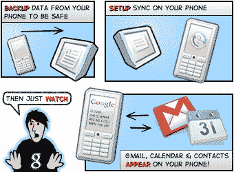

# 推送 Gmail 终于出现在 iPhone 上，这并不是苹果 TechCrunch 的功劳

> 原文：<https://web.archive.org/web/https://techcrunch.com/2009/09/22/push-gmail-finally-comes-to-the-iphone-no-thanks-to-apple/>

# 推送 Gmail 终于来到了 iPhone，不要感谢苹果

为 iPhone 推送 Gmail 支持终于[到了](https://web.archive.org/web/20221106233933/http://googlemobile.blogspot.com/2009/09/google-sync-now-with-push-gmail-support.html)。你要感谢微软。

不，推送支持还没有最终被添加到苹果的 iPhone 邮件应用中，这太容易了，也太有意义了。相反，谷歌似乎再次绕过苹果，为客户提供一些功能，这一次是通过谷歌同步产品。

基本上，要让它工作，你必须使用你的谷歌帐户凭证在 iPhone 上设置一个微软 Exchange 帐户。点击阅读更多关于流程[的信息。以前，这个选项可以用于其他一些谷歌应用程序，如日历和联系人，但现在支持 Gmail，这很重要，因为这意味着当有新邮件进来时，你会立即收到通知。](https://web.archive.org/web/20221106233933/http://www.google.com/support/mobile/bin/answer.py?answer=138740&topic=14252)

这对许多 iPhone/Gmail 用户来说是一件大事，因为 iPhone 内置了 Gmail 功能，你只能手动从服务器上提取邮件。这意味着你需要等待更长时间才能收到邮件，这取决于你设置的检查新邮件的时间间隔。尽管苹果公司为雅虎邮箱提供了即时推送支持，但由于某种未知的原因，通过邮件应用程序的 Gmail 仍然是拉式的。Gmail 推送在 Android 手机[和 Palm Pre](https://web.archive.org/web/20221106233933/http://www.beta.techcrunch.com/2009/06/05/one-definite-advantage-of-the-pre-over-the-iphone-push-gmail/) 上运行良好。

有几个第三方应用程序试图为你的 Gmail 邮件提供推送支持。Gpush 经历了[一个地狱般的时间](https://web.archive.org/web/20221106233933/http://www.beta.techcrunch.com/2009/08/08/app-store-thaw-apple-accepts-a-gmail-push-application/)才最终被接受，另一个 [Boxcar 2.0 仍在等待](https://web.archive.org/web/20221106233933/http://www.beta.techcrunch.com/2009/08/27/boxcar-20-is-a-must-have-for-the-iphone-its-the-best-push-notification-app-yet/)。

所有这一切有趣的一面是，谷歌又一次以自己的方式为 iPhone 带来了一项服务。苹果公司不允许使用本机 Latitude 应用程序，所以谷歌开发了一个可以在 iPhone 上运行 Safari 的网络应用程序。当然，我们都还在等着看谷歌如何在 iPhone 上实现谷歌语音功能，[苹果目前也不允许](https://web.archive.org/web/20221106233933/http://www.beta.techcrunch.com/2009/09/18/google-reveals-full-fcc-response-directly-contradicts-apple-on-google-voice-rejection/)。

谷歌同步适用于所有谷歌应用套件账户，拥有个人 Gmail 和谷歌日历账户的人也可以使用它。除了为 iPhone 和 iPod touch 提供推送 Gmail 支持，谷歌今天也为 Windows Mobile 手机推出了推送 Gmail。

**更新**:正如一些人指出的，这种方法有一个缺点。iPhone 只支持一个 Exchange 帐户，所以如果你碰巧在工作中使用了一个，你就不能把它也用于你的个人 Google 帐户。