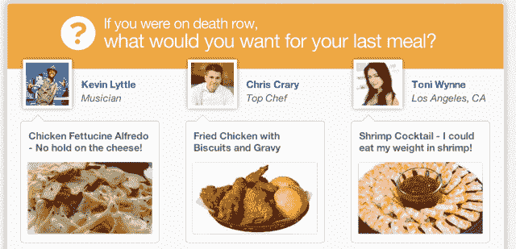
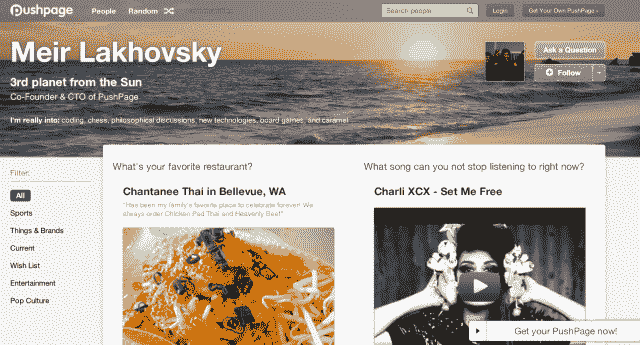

# PushPage 为其问答式个人主页平台 TechCrunch 筹集了 170 万美元

> 原文：<https://web.archive.org/web/http://techcrunch.com/2013/09/16/pushpage-raises-1-7-million-for-its-qa-style-personal-homepage-platform/>

总部位于剑桥的 PushPage 今天推出了个人主页和 Q 平台，获得了 170 万美元的种子资金支持。该产品目前在网络和[手机](https://web.archive.org/web/20230130002151/https://itunes.apple.com/us/app/pushpage/id677312662)上直播，为用户提供了一个在线平台，他们可以通过 PushPage 提供的一系列类似采访的问题来公布自己的喜好和兴趣，而不是像 Ask.fm 这样的基于社区的问题。

最终结果是个人主页在本质上比 Ask.fm 或其问答前身 Formspring 更专业。虽然这些网站倾向于吸引年轻的人群——通常是学龄儿童匿名谈论他们的朋友——但是 PushPage 是成年人的选择。

该公司由哈佛毕业生(前脸书实习生)梅尔·拉霍夫斯基和康奈尔大学毕业生贾里德·贾菲于 2011 年年中创立。Lakhovsky 解释说，他们受启发创建了 PushPage，因为他们意识到，即使在一群朋友和同事之间，他们也不太了解对方。

“与此同时，当你拿起一份美国周刊或《滚石》杂志时，你可以读一篇关于赛琳娜·戈麦斯的文章，了解她的一切，从她最喜欢的餐馆、电视节目和服装到她最有趣的时刻、最大的激情、怪癖、宠物脾气等等，”拉霍夫斯基说。“我们想把名人式快速采访的想法带给我们的朋友和同龄人，因为这些回答很有趣，能引发新的对话。”

这项服务目前处于测试阶段，已经有超过 5000 人在平台上创建了推送页面，回答关于他们的兴趣、爱好、推荐和品味的问题。当用户第一次注册时，他们会被问几个问题，有些比其他的更实际。例如，你可能会被问到你最喜欢的餐馆、电视节目或歌曲，或者“关于你的一些大多数人不知道的趣事？，“如果你想潜得更深一点。为了保持内容的新鲜，用户每周都会收到一个新问题需要回答。

在这个网站上，你还可以浏览朋友的页面，看到一个问题的所有答案。并且可以在手机 app 上回答问题或者查找添加好友[。](https://web.archive.org/web/20230130002151/https://itunes.apple.com/us/app/pushpage/id677312662)

创始人认为 PushPage 是名人和其他知名人士接触粉丝的一种方式(例如，见作者[丹尼尔·平克](https://web.archive.org/web/20230130002151/http://www.pushpage.me/DanielPink)，电视名人[弗拉·亚伯拉罕](https://web.archive.org/web/20230130002151/http://www.pushpage.me/FarrahAbraham/?all=1)，音乐家[想象龙](https://web.archive.org/web/20230130002151/http://www.pushpage.me/ImagineDragons)等)。)，同时也是作为封闭社区中的成员更好地相互了解的一种方式。虽然今天任何人都可以免费创建 PushPage，但公司、学校、兄弟会或姐妹会、非营利组织和其他组织都可以使用带有私人标签的版本。多达 15 人的小型“PushPage 社区”是免费的，中小型组织的起价为每月 60 美元。

通过在你的简历中添加一些链接，该网站可以作为其他个人“关于页面”提供商的替代，如 About.me 或 Flavors.me，但似乎更多的时候，它被用作这些网站或其他更强大的主页的补充。不过，这个想法很容易让人想起我们以前见过的平台，初创公司必须努力工作，在现在这个繁忙的领域开拓自己的利基市场。

这家初创公司的种子轮投资者包括:玫瑰公园顾问公司(Rose Park Advisors)、鲍勃·皮特曼(Clear Channel 首席执行官、MTV 创始人)、伊夫林·阿佐夫(Live Nation 前首席执行官/董事长)、斯科特·斯珀林(Scott Sperling)、兰斯·卡利什(Lance Kalish)和伊多·莱弗勒(I do Leffler)(yestocarots 创始人)、约翰·金(DirectDigital 创始人)、霍华德·沃尔克(Howard Wolk)(Cross Country Group 总裁)和子午线资本(Meridian Capital)。