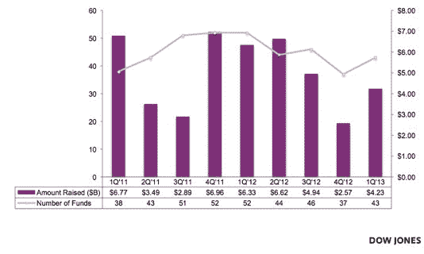
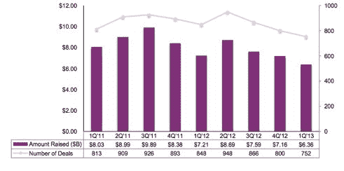
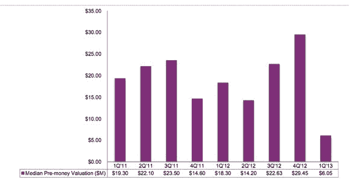
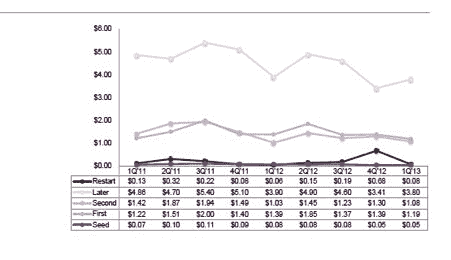
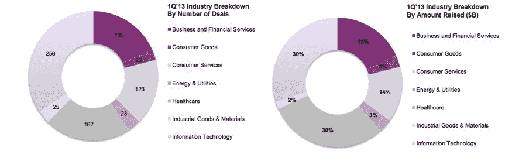
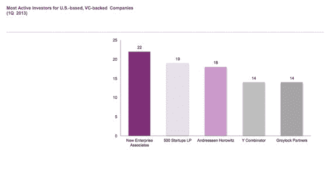

# Q1 风险资本支出和交易数量下降，M&A 活动下降 44%，融资前估值暴跌 

> 原文：<https://web.archive.org/web/https://techcrunch.com/2013/04/17/q1-venture-capital-spending-and-number-of-deals-down-ma-activity-drops-44-percent-and-pre-money-valuations-plummet/>

# Q1 风险资本支出和交易数量下降，M&A 活动下降 44 %,融资前估值暴跌

道琼斯风险投资来源发布了关于风险投资状况的季度报告，包括科技行业风险投资交易数量、融资额、并购和首次公开募股的数据。根据该报告，美国公司 2013 年在 Q1 通过 752 笔风险投资交易筹集了 60 亿美元，与上一季度相比，资本减少了 11%，交易数量减少了 6%。与 2012 年同期相比，交易量下降了 11%，投资额下降了 12%。此外，与 2012 年 4Q 相比，投资前估值中值下降了 79%。

信息技术(IT)、医疗保健、能源和公用事业以及工业产品的交易都有所下降，商业和金融服务、消费品和消费服务投资的交易比上一季度有所增加。

互联网和 IT 行业最大的融资交易包括 Pinterest 的 2 亿美元融资和 Living Social 的 1.1 亿美元融资。在风险投资公司中，NEA 是最活跃的投资者，有 22 笔交易，其次是 500 Startups，Andreessen Horowitz，Y Combinator 和 Greylock Partners。

在风险投资基金方面，2013 年 Q1 共有 43 只基金募集了 42 亿美元，与上一季度相比，基金数量增加了 16%，募集金额增加了 65%。本季度风险投资基金的最大一笔融资是 Battery Ventures X LP，它是美国今年最大的风险投资基金，融资 6.5 亿美元，占本季度融资总额的 15%。Spark Capital 宣布了一只 4.25 亿美元的新基金，Redpoint 在本季度筹集了 4 亿美元。该季度美国基金规模的中值为 1.43 亿美元。

尽管筹集的资本下降了 16%，医疗保健行业的投资分配仍然是最大的，162 笔交易筹集了 19 亿美元，占风险资本投资总额的 30%。该公司报告称，在 256 笔已完成交易中，投资额下降了 30%，为 19 亿美元，与上一季度相比，交易数量下降了 10%。

M&A 的活动在 2013 年第一季度有所下降，是自 2009 年第一季度以来最少的退出。收购总额为 43 亿美元，与上一季度相比，M&A 活动减少了 44%，融资额减少了 24%。

在首次公开募股方面，2013 年，九家风险投资公司在 1Q 通过公开募股筹集了 6.43 亿美元，比 2012 年 1Q 20 起 IPO 筹集的 14 亿美元同比下降了 55%，比上一季度下降了 47%。本季度最大的 IPO 是 Marin Software，完成了 1 . 05 亿美元的 IPO。