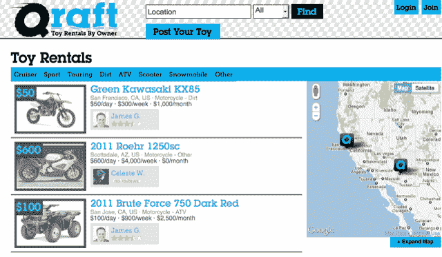

# 飞机、火车和汽车的 Airbnb(火车，我指的是船。)

> 原文：<https://web.archive.org/web/http://techcrunch.com/2011/09/13/qraft-the-airbnb-for-planes-trains-and-automobiles-and-by-trains-i-mean-boats/>

# 飞机、火车和汽车的 Airbnb(火车，我指的是船。)

当你还是一个小婴儿时，一个新玩具的想法是最令人兴奋的事情。然后你长大了，“玩具”变得贵得离谱。你想要一辆雪佛兰科尔维特 C6 Z06？请付 70，000 美元。你有兴趣买一辆 2011 款 Roehr 1250sc 摩托车吗？$40,000.

虽然我确信我们的许多非常成功的读者对像那样扔钱没有问题，但是我们中的绝大多数人就是不能把它吐出来。这就是 Qraft T1 的用武之地——把它想象成成人玩具的 T2 Airbnb T3。你可以花 950 美元用 Z06 玩一天。还有 2011 款 Roehr 1250sc？600 美元/天。

除了摩托车和汽车，Qraft 还为人们提供了一种从同行那里租赁船只、直升机、飞机、房车和其他随机装备(如超级昂贵的野营背包)的方式。因此，如果你有一艘超级酷的船，但没怎么用，或者你的房车整个赛季都在车库里，你可以把它发布在 Qraft 上，赚点小钱。

Qraft 允许你按日、周、月出租，每个用户选择自己的价格。搜索从确定位置开始，但看起来 Qraft 还没有扩展到美国的所有角落。例如，纽约不受支持，而旧金山则受支持。这项服务是免费加入的。

这项服务为你租赁的物品提供保险，所以如果有人决定把你的车滚进沟里，你不会花很多钱。Qraft 还为租赁者和所有者提供反馈系统，他们也有一个通过扫描确认驾照信息的系统。他们试图避免 Airbnb [在自己的灾难中吸取的惨痛教训。显然，这些人不涉及房地产，所以在浴缸里制造冰毒的可能性很小，但如果有人翻了我的特斯拉(假设我有特斯拉)，我会非常生气。)](https://web.archive.org/web/20230312005615/https://techcrunch.com/tag/AirBnB)