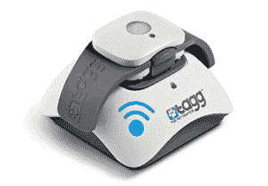

# 高通探索新市场:寻找你丢失的狗 TechCrunch

> 原文：<https://web.archive.org/web/http://techcrunch.com/2011/08/15/qualcomm-explores-a-new-market-finding-your-lost-dog/>

# 高通探索新市场:寻找你丢失的狗

高通。你可能听说过他们。见鬼，很有可能你现在口袋里已经有了一点高通——至少如果你有最近流行的安卓手机的话。很有可能，它运行在高通的骁龙芯片组上。

高通最近一直在做各种有趣的事情:[他们有一个 SDK](https://web.archive.org/web/20230203091141/https://techcrunch.com/2011/07/27/qualcomms-awesome-augmented-reality-sdk-now-available-for-ios/) ，这使得几乎任何开发者都可以构建难以逾越的增强现实项目，他们正在围绕[基于位置的点对点技术](https://web.archive.org/web/20230203091141/https://www.alljoyn.org/)做各种工作，现在他们……嗯..建立可充电的 GPS 项圈，帮助你追踪走失的狗。

这个被称为“Tagg”的东西是由高通的一个新的全资子公司 Snaptracs 建造的。

**它是这样工作的:**

*   你给标签充电，然后把它绑在你的狗或猫现有的项圈上。高通说，它应该非常适合任何超过 10 磅的狗或猫。上面那只小公牛狗看起来有点傻——但是，看起来傻总比看起来永远消失好。
*   你定义了“标记区域”，它标出了宠物最常去的地方，比如你的房子和周围的院子。
*   在任何时候，你都可以使用你的手机或基于浏览器的工具来定位你的狗的当前位置。
*   任何时候你的小狗漫游出预定义的“标记区域”，你都会收到一封电子邮件和/或短信，提醒你 Mittens 先生已经决定去冒险了。
*   可充电电池可持续使用 30 天左右(尽管你可能想更频繁地充电。没有什么比在第 30 天失去你的狗。)当你的收入开始下降时，你会收到一条短信，提醒你该充电了。
*   一个“旅行”按钮可以让你暂时禁用项圈，允许你带着雪花穿过栅栏线(比如说散步)，而不会有警报吹爆你的收件箱。

哦，它是防水的。任何一个曾经让走失的狗回来的人都会告诉你，这可能是一个好主意。

这个项圈的无线连接全部由威瑞森的网络供电。高通说，这个东西应该在 9 月份的某个时候推出，200 美元就可以买到项圈、充电器和一年的跟踪服务。