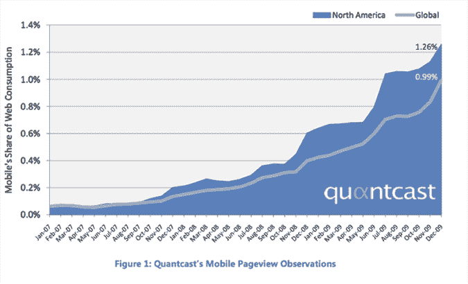
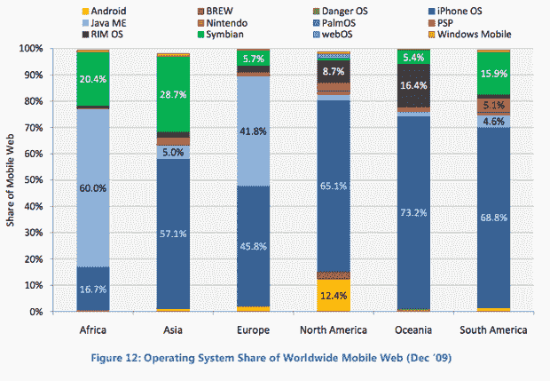
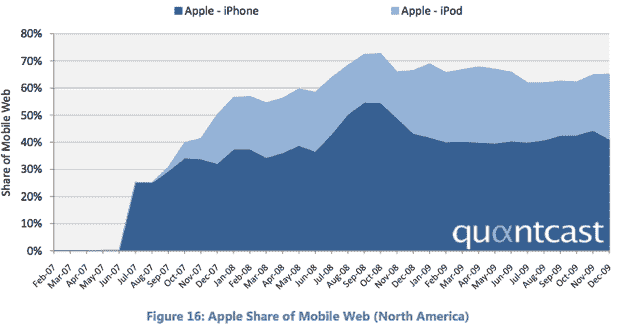
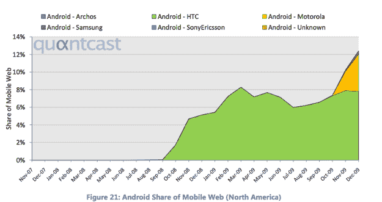

# 去年，美国移动网络使用率增长了 110 %;苹果称霸，安卓第二 

> 原文：<https://web.archive.org/web/https://techcrunch.com/2010/01/05/quantcast-mobile-web-apple-android/>

# 去年，美国移动网络使用率增长了 110 %;苹果称霸，安卓第二

根据一份新的 [Quantcast 移动趋势报告](https://web.archive.org/web/20221011171921/http://www.quantcast.com/docs/display/info/Mobile+Report)(嵌入下文)，以浏览量的增长来衡量，去年移动网络在美国增长了 110%，在全球增长了 148%。即便如此，移动网络仅占美国网络消费的 1.26%(全球为 0.99%)。

苹果的 iPhone 和 iPod Touch 推动了这一增长。在美国，截至 2009 年 12 月底，苹果占据了手机网络接入 65%的市场份额。其中只有 41%来自 iPhone。另外 24%来自 iPod Touch，尽管它只有 WiFi，但作为移动网络设备，它一直在快速增长。从全球来看，苹果还在除非洲以外的所有市场占据主导地位(在非洲，更简单、更便宜的 Java 手机仍占主导地位)。

Android 在美国之外还算不上一个真正的玩家，但在美国，Android 正在快速崛起，拥有 12%的市场份额。Android 现在是第二大移动网络操作系统，最近击败了黑莓的 RIM OS，后者拥有 8.7%的市场份额。

Android 的突然增长伴随着 Admob 数据显示自 10 月以来翻了一番。而这还是在今天发布 [Nexus One](https://web.archive.org/web/20221011171921/http://www.beta.techcrunch.com/2010/01/05/google-nexus-one-the-techcrunch-review/) 之前。其中大部分份额来自 HTC 手机，以及威瑞森在 11 月发布的 Droid T10。(摩托罗拉的机器人是下图中黄色的部分。

[Quantcast 手机报道 1](https://web.archive.org/web/20221011171921/http://www.scribd.com/doc/24826531/Quantcast-Mobile-Report1 "View Quantcast Mobile Report1 on Scribd")http://d1.scribdassets.com/ScribdViewer.swf?[document _ id = 24826531&access _ key = key-2 einbf 1 u 9 OS 07n 9 kgxsn&page = 1&version = 1&view mode = list](https://web.archive.org/web/20221011171921/http://d1.scribdassets.com/ScribdViewer.swf?document_id=24826531&access_key=key-2einbf1u9os07n9kgxsn&page=1&version=1&viewMode=list)