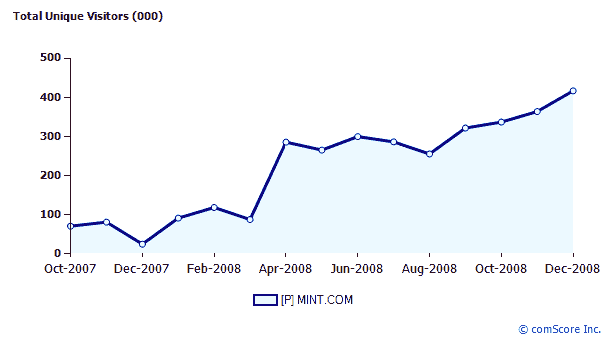

# Quicken Online 不敢相信 Mint 做得这么好；发送恐吓信| TechCrunch

> 原文：<https://web.archive.org/web/https://techcrunch.com/2009/02/19/quicken-online-cant-believe-mint-is-doing-so-well-sends-threatening-letter/>

Intuit 是著名的资金管理软件 Quicken suite 的幕后公司，该软件包括 [Quicken Online](https://web.archive.org/web/20230407045507/http://quicken.intuit.com/online-banking-finances.jsp) ，它无法相信它的竞争对手 [Mint](https://web.archive.org/web/20230407045507/http://www.mint.com/) 做得如此之好。事实上，他们对 Mint 声称的一天增加 3000 名新用户，并在几个月内从 60 万用户跃升至 85 万用户感到非常困惑，以至于他们决定发送一封恐吓信，要求对这一显然不可思议的壮举做出解释。

我们已经获得了 Intuit 的信和 Mint 回复的副本，我们已将其嵌入下面。来自 Intuit 的信:

> “虽然我们不想暗示 Mint.com 在做虚假广告，但短时间内(从 60 万到 80 万)声称的用户数量的巨大差异令人担忧。因此，我们要求您在 2009 年 2 月 6 日之前向我们提供您所依赖的证明和证据来支持上述参考声明。”

请注意，信中说 Intuit 不“希望暗示 Mint 从事虚假广告”，尽管事实上这是这封信的全部目的。很好。

除了 Mint 惊人的增长率，Intuit 的担忧还集中在这家初创公司对“用户”的定义上。Mint 的回复称，该公司认为任何填写了电子邮件地址、邮政编码和密码的人都是“用户”，不管他们是否曾经将自己的银行账户与他们的 Mint 用户名相关联。这个数字显然夸大了每天实际使用 Mint 的人数，但它也是大多数 web 服务定义“用户”的一个相当标准的方式。从外部来看，康姆斯克每月全球独立访客数为 41.6 万，并且还在快速增长(见下图)。

也就是说，Mint 对“用户”的定义引起了我的一些担忧——我怀疑在输入他们的电子邮件信息并被算作新成员后，当他们意识到需要输入他们的银行账户信息时，他们中的许多人会跳槽。但首席执行官 Aaron Patzer 表示，截至今天，934，000 名注册用户中约有 680，000 人(超过 70%)至少有一个银行账户与 Mint 相关联，其中大多数人都有 5-6 个金融账户。坦率地说，这个数字远远高于我的预期，这表明大多数人访问 Mint 的目的是输入他们的帐户信息。Patzer 还指出，虽然那些没有将银行账户与 Mint 关联的用户将只能使用较少的功能，但他们仍然会定期收到 Mint 合作伙伴提供的服务。

Mint 的用户数量还能更透明吗？可能吧，但是他们测量用户统计的方法在这里是意料之中的——当然没有什么值得 Quicken 苛求的信。这里的底线是 Mint 增长如此之快(它的用户将很快超过 100 万——毫无疑问是受糟糕的经济和税收季的刺激)，以至于它的竞争对手简直不敢相信。对于任何创业公司来说，这都不是一件坏事。

Intuit 发言人 Scott Gulbransen 对此事做出了如下回应:

> 如果我们的信只是简单地要求了解他们是如何统计用户的，那么我们要向 Mint.com 道歉。企业总是这样做，我们感谢他们的回复。
> 
> 我们对 Quicken Online 的快速增长非常满意，我们只是好奇我们做得怎么样。现在我们有了一个共同的衡量标准，通过比较，我们知道我们做得很好。Quicken Online 现在拥有超过 650，000 名用户，自 2009 年 1 月以来，平均每周增加约 45，000 名新用户。
> 
> 现在您知道了…客户比以往任何时候都更倾向于选择 Quicken Online。
> 
> 谢谢，
> 斯科特

这是两封信:

[http://viewer.docstoc.com/](https://web.archive.org/web/20230407045507/http://viewer.docstoc.com/)
[mintpdf 1](https://web.archive.org/web/20230407045507/http://www.docstoc.com/docs/4412790/mintpdf1)–[自由法律形式](https://web.archive.org/web/20230407045507/http://www.docstoc.com/)
[http://viewer.docstoc.com/](https://web.archive.org/web/20230407045507/http://viewer.docstoc.com/)
[mintpdf 2](https://web.archive.org/web/20230407045507/http://www.docstoc.com/docs/4412787/mintpdf2)–[自由法律形式](https://web.archive.org/web/20230407045507/http://www.docstoc.com/)