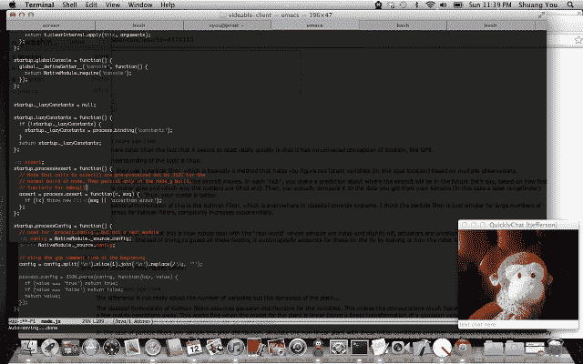

# QuicklyChat 为小型远程团队带来“一键通”视频| TechCrunch

> 原文：<https://web.archive.org/web/https://techcrunch.com/2012/08/13/quicklychat-brings-push-to-talk-video-to-small-remote-teams/>

Y Combinator 支持的初创公司 Chat 参与了 2012 年夏季项目，它对视频会议有着有趣的看法。QuicklyChat 新推出的解决方案专为远程工作的小团队设计，它正试图恢复即席对话，这仍然是办公室工作环境中最有价值的方面。借助其“一键通”视频聊天系统，您的同事可以立即联系到您，但前提是您的状态指示器显示您不忙。

这是关键的卖点——状态指示器会根据您当前在计算机上的操作自动更新。在您的 IDE 编码中？它是红色的。冲浪 Reddit？它是绿色的。看邮件？很可能是黄色的。

“我们认为视频真的是与任何人交流的最佳方式，”联合创始人詹姆斯·哈维说，“因为你比即时消息获得更多的背景信息。但 Skype 之类的东西太正式了，”他补充道。“这就像你的电话在响。你不会希望每次有人问你一个 10 秒钟的问题，你的电话就响个不停。”

[Harvey 和联合创始人](https://web.archive.org/web/20230316161342/http://www.quicklychat.com/about.html)Lu 和 Shaung You 都是在麻省理工学院认识的，他们认为这个系统需要两个主要因素才能成功:一个自动调整的指示器和消除响铃然后应答的连接过程。

该系统的工作方式与 IM、Skype 和其他消息程序过去的工作方式截然不同。在所有这些场景中，用户必须配置他们自己的状态指示器，以反映是否可以联系到他们，或者是否可以打扰他们。不过，很难猜测这个状态指示器是否准确。你可能记得当你接到一个电话的时候要变红，但是后来你忘了，让它一整天都变红。其他时候，你可能会被抨击，但你的绿灯一直告诉人们“请 ping 我！”

有了 QuicklyChat，它可以作为桌面软件在 Windows 或 Mac 上运行(Linux 正在开发中)，你不再需要整天手动将状态指示灯从绿色切换到红色。(万岁！)但是，您也不再能够忽略视频通话。它就这么出现了。

需要说明的是，该系统确实尊重你的隐私——它不会告诉同事你具体在做什么(例如浏览 Reddit、阅读电子邮件)——它只会向他们显示绿色/红色/黄色指示器。这可以在应用程序的设置中进一步定制。例如，当他们访问 YouTube 时，很可能是视频编辑在工作，而不是在看有趣的猫视频。或者你可能觉得电子邮件阅读是“红色”而不是“黄色”

不过，这样的系统需要一点时间来适应。哈维说，对于大多数人来说，一旦他们克服了最初的“这有点奇怪”的感觉，他们就会欣赏这些好处。“我们有一个用户说，他意识到这意味着当他在家工作时，他实际上必须穿衬衫，”哈维笑着说，“但这并不需要太多努力，”他补充道。

最终，该计划是将 QuicklyChat 开发成一项免费增值服务，但目前该公司正在开发其他功能，例如屏幕共享，他们有兴趣了解用户可能希望包括的其他功能，例如文件共享或协作。同时，在这次公测期间，[quick chat 可以从](https://web.archive.org/web/20230316161342/http://www.quicklychat.com/beta/index.html)这里免费下载。