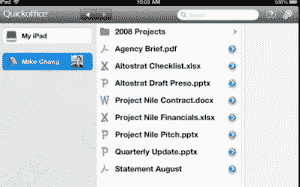

# 浏览器中的 Quickoffice:微软突然对谷歌的生产力工具如此恐惧的原因

> 原文：<https://web.archive.org/web/https://techcrunch.com/2013/05/12/quickoffice-the-reason-why-is-microsoft-suddenly-so-scared-of-google/>

# 浏览器中的 Quickoffice:微软为何突然如此害怕谷歌的生产力工具

我们距离搜索巨头年度开发者大会[谷歌 I/O](https://web.archive.org/web/20230320054738/https://developers.google.com/events/io/) 的开幕只有几天了，虽然我们对谷歌计划在周三长达三小时的大型主题演讲中宣布的内容知之甚少，但山景城正在酝酿一些让微软办公室部门[紧张不安的事情](https://web.archive.org/web/20230320054738/https://techcrunch.com/2013/05/10/microsoft-google-docs-is-not-worth-the-gamble-makes-everybody-less-productive/)。在过去的一周里，微软[发起了](https://web.archive.org/web/20230320054738/http://blogs.office.com/b/microsoft_office_365_blog/archive/2013/05/10/office-is-a-team-player.aspx)一场非常负面的反谷歌文档运动，这符合其更普遍的 [Scroogled](https://web.archive.org/web/20230320054738/http://scroogled.com/) 反谷歌广告的模式。但是为什么突然关注谷歌的生产力工具呢？这个原因，我相信是浏览器中的 [Quickoffice](https://web.archive.org/web/20230320054738/http://www.quickoffice.com/) 。

谷歌去年 6 月收购了 Quickoffice，它允许用户在 iPad、iPhone 和 Android 上阅读和编辑 Word、Excel 和 PowerPoint 文档。与微软 office 相比，谷歌文档仍然是一个相对有限的生产力套件，与此不同，Quickoffice 在允许您打开和编辑 Office 文件方面做得非常好，而不会丢失文档的布局和其他文档目前无法处理的高级功能。就在上个月，谷歌将 Quickoffice [引入安卓系统，iPhone](https://web.archive.org/web/20230320054738/http://www.engadget.com/2013/04/03/quickoffice-android-iphone-free-for-google-apps-business-users/) 和[引入了新的 Chrome Office 浏览器](https://web.archive.org/web/20230320054738/http://chrome.blogspot.ca/2013/04/a-speedy-more-secure-way-to-view.html)，用于显示 Word、Excel 和 PowerPoint 文件。谷歌没有明确这样说，但它是一个公平的假设，这个工具也使用了 Quickoffice 的一些魔力(它以前只适用于 Chrome OS)。

http://www.youtube.com/watch?feature = player _ embedded & v = qk 2t 3 gvjafm

当谈到在浏览器中编辑 Office 文档时，微软自己的 Office Web 应用程序是该公司阵容中被低估的瑰宝，目前，谷歌的 Web 应用程序清单中没有任何东西可以与之媲美。

然而，Quickoffice 正在走向网络。当谷歌在 2 月份推出 Pixel Chromebook 时，它也暗示它正在使用自己的原生客户端技术将 Quickoffice 移植到 Chrome(T2)上。当时，谷歌的桑德尔·皮帅说，许多人喜欢谷歌的生产力应用程序，但在商界，微软 Office 仍然是事实上的默认。他说，让 Quickoffice 在 Chrome 和 Chromebooks 上可用，“对很多用户来说，这是一个完整的故事。”在 2 月份的活动中，谷歌表示，将需要大约 3 个月的时间来推出基于浏览器的具有完整编辑功能的 Quickoffice 版本——这使得推出日期几乎与下周的 I/O 完全一致。

微软知道在线生产力领域的竞争即将升温，可能会采取防御措施。对于许多潜在的 Office 365 和 Office Web Apps 用户来说，谷歌这样的公司在浏览器中推出的成熟的 Office 兼容生产力套件是使用微软工具的一个非常可行的替代方案。毫不奇怪，雷蒙德的人们现在正在发起他们的反医生营销活动。