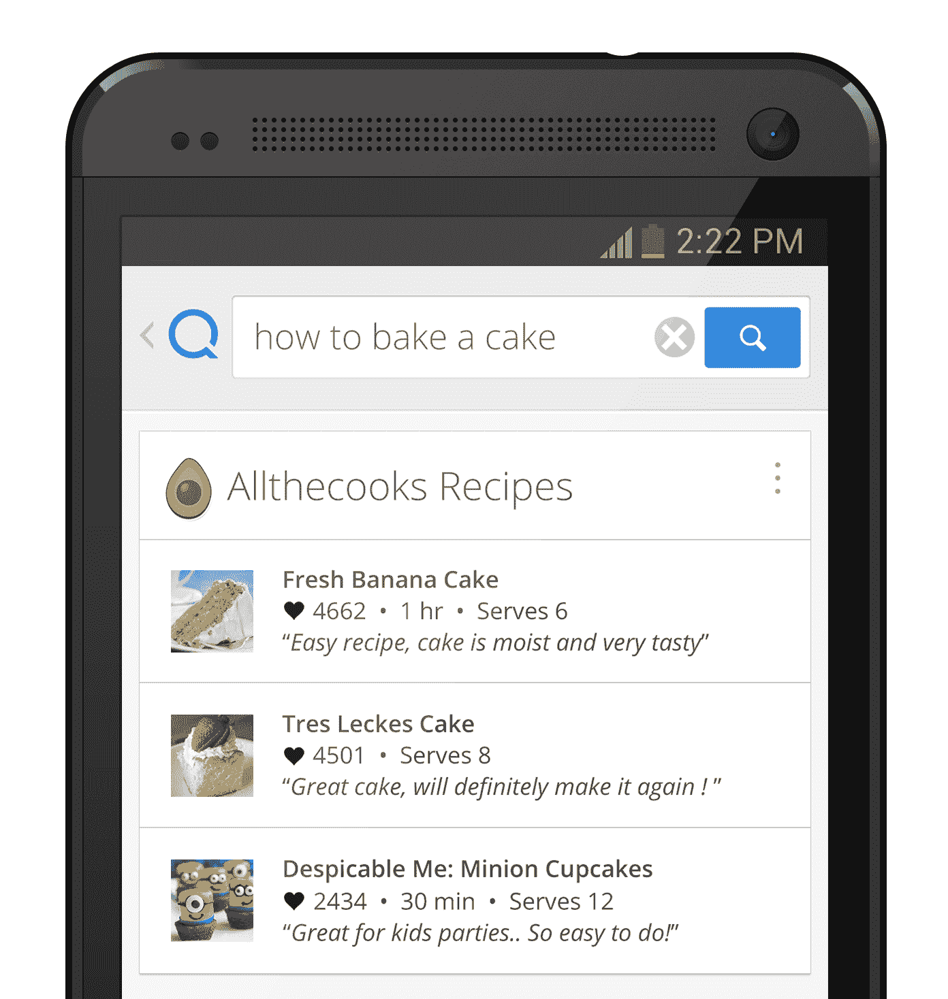

# 语义应用搜索引擎 Quixey 现在挖掘应用本身，为您提供直接结果 

> 原文：<https://web.archive.org/web/https://techcrunch.com/2014/02/25/quixey-functional-search/>

语义应用搜索引擎 Quixey 已经从阿里巴巴、埃里克·施密特(Eric Schmidt)的创新努力等公司筹集了约 7420 万美元，它再次提高了门槛，试图让应用和它们持有的数据更容易被发现。今天，这家初创公司推出了一项新功能，称之为“功能搜索”——这将让用户不仅可以通过关键词和短语连接到正确的应用程序，还可以从这些应用程序中找到回答用户特定问题的内容。

换句话说，你可以使用 Quixey 的功能搜索来寻找 Linkin Park 的一首特定歌曲，它会为你提供你可以听到这首歌的应用程序的结果，以及歌曲本身的直接链接。或者，无论你在哪里，你都可以搜索出租车或汽车服务，Quixey 的结果不仅会给你一个汽车应用程序的链接，还会将它们排列在一个列表中，最接近你的应用程序位于顶部。

功能搜索将在一个月后在 Android 上开放私人测试，计划在六月推出更广泛的版本。Quixey 告诉我，其他平台会在那之后出现。私人测试版将为用户提供食物搜索结果——特别是餐馆列表。随着 Quixey 继续解决服务中的问题，它将及时为更广泛的推广添加更多类别。

当然，还有其他人也在追求应用程序内的可发现性这一相同问题。

Everything.me 是潜在竞争对手的一个例子。另一个是强大的谷歌本身。该公司去年推出了自己的[应用索引](https://web.archive.org/web/20221209070529/https://beta.techcrunch.com/2013/10/31/android-4-4-kitkat-app-indexing/)功能。Quixey 对竞争并不担心。

一位发言人告诉我，“我们认为谷歌已经确认‘在应用中打开’是一项搜索功能，并且谷歌正在推广应用的深度链接，这太好了。”。“然而，这是不同的，因为它不会像谷歌提供自己的服务那样，让用户更深入地了解应用程序，比如谷歌位置，而且它不会改变排名——所以在移动设备上，如果你完全 SEOd，你仍然会在第 4 页上。”

还有一个有待观察的问题是，应用程序制造商是否愿意合作。无论一个应用是基于广告还是付费下载，如果你马上给人们结果，这可能会让用户完全不下载你的应用——从而剥夺开发者获得下载或直接流量的能力。诸如此类的问题将促使 Quixey 更快地找出以直接有利于这些应用程序制造商的形式赚钱的方法。

但事实上，Quixey 破解了跨应用程序和在应用程序中搜索的基本概念，不依赖于特定的关键词，不管是谁发布的应用程序，都按照最密切的相关性进行排序，这是一种破坏性的举动，可能会默认这些问题的解决方案。

功能搜索的工作原理

功能搜索的思想是双重的。首先，Quixey 在创始人兼首席执行官 Tomer Kagan 的带领下，认为应用程序是当今用户与内容互动的未来，但迄今为止还没有有效的方法来搜索它们，就像谷歌或必应等搜索引擎对网络所做的那样。然而，这也是人们对应用程序越来越多的需求。

其次，实际上，Quixey 的搜索引擎本身希望成为内容消费平台，成为用户需要信息，然后找到将为他们提供信息的应用程序之间的纽带。Quixey 将这个概念称为“搜索平台”，它对这个概念如此投入，以至于 Kagan 告诉我 Quixey 已经为这个短语申请了商标。

但并不总是这样。

“实际上，我们三年前就有提供功能搜索的想法，但当我们把这个想法告诉投资者时，他们认为我们疯了，”他在昨天的一次采访中告诉我。

那么有什么变化呢？应用经济呈爆炸式增长——有数百万个本地和网络应用，它们已经成为人们在手机上体验内容的必经之路。但在许多方面，它们似乎和以往一样孤立，因此解决这个问题的时机似乎更成熟了。(从[最近的 5000 万美元融资来看，这也是 Quixey 的投资者现在的想法。)](https://web.archive.org/web/20221209070529/https://beta.techcrunch.com/2013/10/03/quixey-series-c/)

关于功能搜索将如何工作，有一些有趣的地方:它不会基于付费位置(至少最初不会)——赞助结果是 Quixey [去年在其更基本的版本中引入的。](https://web.archive.org/web/20221209070529/https://beta.techcrunch.com/2013/06/27/quixey-adds-sponsored-results-to-its-app-search-engine-its-first-step-to-revenue-generation/)

“结果中没有赞助的结果，”Kagain 告诉我。“我不会说永远不会有，但现在我们仍然需要找到正确的道路。”

这也不是基于任何其他交易与特定开发商的特殊关系。“这就是我们认为搜索应该有的样子，”卡根解释道。

虽然 Kagan 表示，今天有相当多的搜索平台比你想象的更需要人的参与，但 Quixey 语义抓取的想法是，它完全基于一种算法，这种算法将抓取应用程序本身内部的深层链接。

“Quixey 的功能搜索正是基于这些功能，”Kagan 说。“我们不只是帮助用户找到应用程序，我们根据他们的功能提供结果，说明为什么这是他们的最佳选择。从根本上说，我们将根据我们认为深层链接回答查询的程度来区分谁到达搜索列表的顶部。此外，排名、可用性等一系列变量也有助于确定谁能拔得头筹。”

卡根说，他和 Quixey 与谷歌甚至 Siri 的观点根本不同。“施密特曾经说过，理想的谷歌搜索结果应该是一个单一的答案，”他指出。“越来越多的答案是谷歌的答案之一。我不相信谷歌已经涉足真正的搜索业务了。”

虽然不会与开发者达成任何特殊协议，但 Quixey 一直在与游戏、食品、娱乐等类别的不同出版商进行沟通，看看他们认为哪种结果最适合他们自己的特定内容类型。指向音乐或特定食谱的链接是显而易见的，但是如何最好地表示游戏搜索呢？目前看来，答案可能是游戏中特定“房间”的链接，直接带你去玩。因此，在扑克游戏中，特定的锦标赛或活跃牌桌列表。

