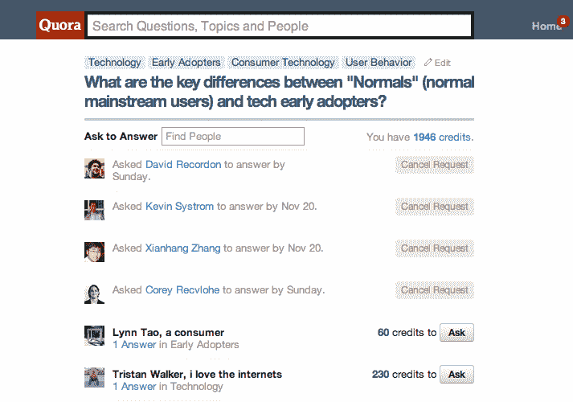

# Quora Gamifies:学分和“问与答”建议面向所有人 

> 原文：<https://web.archive.org/web/https://techcrunch.com/2011/11/14/quora-gamifies-credits-and-ask-to-answer-suggestions-live-for-everyone/>

# Quora Gamifies:学分和“问与答”建议为每个人而生

经过五个月的测试，Quora 今天为每个人提供了 Quora 积分和“问答”用户建议。

所有用户现在都可以通过各种积极的用户参与获得积分——放大 Quora 的行为，如回答他们被要求回答的问题，通过“问与答”获得对他们请求的问题的答案的投票，以及获得对他们对其他问题的答案的投票。用户还可以互相赠送积分，这很棒，可以通过这里的积分[界面](https://web.archive.org/web/20230203084938/http://www.quora.com/credits)进行管理。

这一切都很好，但是 Quora 到底希望你在哪些方面花费积分呢？尤其是你不能兑现它们？Quora 希望你“付钱”给重要的人来回答你的问题。

例如，如果我回答这个问题，[“Match.com 和 eHarmony 哪个商业模式对一个‘寻找联合创始人’网站更好？”](https://web.archive.org/web/20230203084938/http://www.quora.com/Startup-Business-Models/Which-business-model-would-be-better-for-a-find-a-co-founder-website-Match-com-or-eHarmony)比我重要一个数量级的 Quora CEO [Adam D'Angelo](https://web.archive.org/web/20230203084938/http://www.crunchbase.com/person/adam-d-angelo) 对我的[“普通人”(正常的主流用户)和科技早期采用者的关键区别是什么？”这个问题要花费 960 个信用点。](https://web.archive.org/web/20230203084938/http://www.quora.com/What-are-the-key-differences-between-Normals-normal-mainstream-users-and-tech-early-adopters/)

为了加强这种用户层次结构，Quora 现在会在你提问后建议主题专家——例如，在我将我的问题标记为“UI”后，我得到了一系列用户界面专家选项，如 37Signals 产品经理[瑞安·辛格](https://web.archive.org/web/20230203084938/http://www.quora.com/Ryan-Singer)用户现在还可以在拒绝他们被要求回答的问题时发送原因，并在他们想提高赌注时使用更多的点数来提问，这是自测试版以来添加的两个功能。

那么，Quora 只是想尝试游戏化，看看它是否能坚持下去吗？在使用了一段时间后，我可以肯定地说它足够粘了。我的[测试问题](https://web.archive.org/web/20230203084938/http://www.quora.com/What-are-the-key-differences-between-Normals-normal-mainstream-users-and-tech-early-adopters/suggestions)在不到 24 小时的时间内获得了 17 个可靠的答案，学分和“问与答”元素肯定会创建一个积极的反馈循环；似乎更多的人想要回答，因为他们看到像 Quora 设计师 Rebekah Cox 这样的“有影响力的人”正在回答。

Quora 超级用户 Semil Shah 说:“就我个人而言，我喜欢 Quora 积分。这并不是因为我会数一数或者试图积累一堆……主要是因为当我有一个问题想要得到一系列的意见时，我不是希望有人回答或者直接问别人，我可以要求一定数量的用户(他们已经在这些类别中写了答案)回答，根据我的经验，回答率真的很惊人。”

正如我们之前[所写的，](https://web.archive.org/web/20230203084938/http://www.techmeme.com/110727/p66#a110727p66) Quora 仍在解决整个价值主张的问题(更不用说货币化了)。我是说得到答案和回答哪个更有价值？事情并没有那么简单。

Credits 是一个量化 Quora 价值交换的彻底尝试，所以用户知道(更多)他们的确切位置。当然这很复杂，但这可能行得通，特别是如果这是某种[式的计划的中间步骤，最终用实际的钱来支付人们的努力。](https://web.archive.org/web/20230203084938/http://www.mahalo.com/)

Quora 联合创始人 [Charlie Cheever](https://web.archive.org/web/20230203084938/http://www.crunchbase.com/person/charlie-cheever) 告诉我:“我们将会赚钱，但这次发布的重点是为人们的问题提供更多好的答案，我们的信用测试版的结果非常有希望，所以我希望它会做得很好，我们将继续扩展和发展 Quora 信用。”