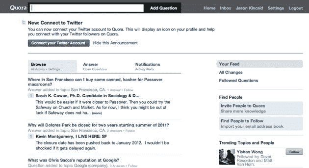

# Quora 备受赞誉的问答服务向公众推出(真正的测试开始了)

> 原文：<https://web.archive.org/web/https://techcrunch.com/2010/06/21/quoras-highly-praised-qa-service-launches-to-the-public-and-the-real-test-begins/>

# Quora 备受赞誉的问答服务向公众推出(真正的考验开始了)

 [Quora](https://web.archive.org/web/20230326022424/http://www.quora.com/) ，一项由早期脸书员工创立的服务已经引起了不小的轰动，并已向公众推出。该服务于 2010 年 1 月 4 日首次亮相，但此前仅限于被邀请的用户(或已向网站请求邀请的用户)。该消息于今晚在《华尔街日报》的一篇文章中公布。

Quora 自推出其私人测试版之日起就吸引了大量关注，但事情在 3 月份真正有所好转，当时我们听说这项服务以高达 8600 万美元的估值从 Benchmark Capital 筹集了约 1100 万美元(《华尔街日报》称，它最终以 8750 万美元的估值筹集了 1400 万美元，所以这里有一些差异，可能是由于 Benchmark 以外的其他投资者)。当时，我们与 Benchmark 的 Matt Cohler 和 Quora 的联合创始人 Adam D'Angelo 和 Charlie Cheever 坐在一起，他们概述了他们与 Quora 的目标以及他们将如何面对迫在眉睫的障碍。

他们最大的挑战即将开始。Quora 引起关注不仅仅是因为它光滑的界面，还因为它迄今为止极高质量的回答——有人提出一个问题，该领域的顶级专家在几个小时(或更短时间)内就回答了这个问题，这并不罕见。同样，关于各种互联网公司的问题经常会吸引老员工的回答。现在最大的问题是 Quora 是否能够在应对新用户涌入时保持这种质量。当我们在采访中问到这个问题时，他们是这样回答的:

> 一部分是让你看到你关心的东西，而看不到其他的东西。我认为最近很多服务在这方面做得越来越好。用户关注他们感兴趣的话题和人物，这些信息会为他们突出显示。

换句话说，该网站将帮助用户通过注册他们感兴趣的主题来筛选问题和答案(该网站目前似乎很擅长这一点，但随着问题和主题的数量迅速增加，这可能会变得更加困难)。然而，如果质量开始下降，网站将再次禁止新注册。Quora 创始人(前脸书首席技术官)亚当·安吉洛在他自己的网站上分享了这次发布的更多细节:

> 此前，Quora 有两种注册方式。您可以从现有用户那里获得邀请，也可以在我们主页上的框中输入您的电子邮件地址，我们会在扩大容量后立即邀请您。
> 
> 我们已经到了这样一个地步，我们有信心在新用户注册的同时整合他们并保持网站的质量，所以我们今天开放注册。然而，我们把质量放在增长之前作为优先事项，因此我们将根据需要改变计划和限制注册，以实现这一目标。
> 
> 在这一点上，我们不会对搜索引擎开放。

Quora 面临着来自雅虎广受欢迎的回答服务等在位者的大量竞争，尽管那里的回答质量往往很差。更具威胁性的是[脸书提问](https://web.archive.org/web/20230326022424/https://techcrunch.com/2010/05/23/facebook-questions/)，这是一个 Q &服务，脸书目前正在进行私下测试，可能会成为一个新的脸书“杀手级应用”。也就是说，我们采访的一位用户表示，这项服务感觉与 Quora 不同，因为它“似乎比智力/有用/详细更亲密/有趣/简洁”，这是 Quora 迄今为止的优势所在。

