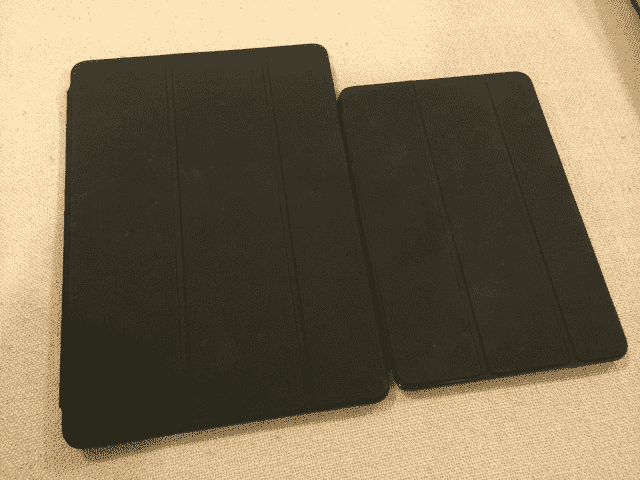
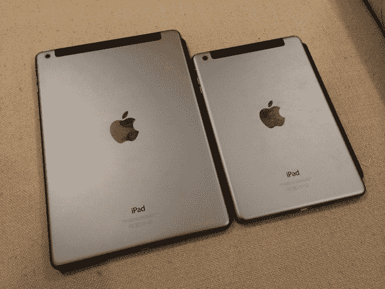

# 迷你还是空中，这是 iPad 的问题 TechCrunch

> 原文：<https://web.archive.org/web/https://techcrunch.com/2013/11/18/quoting-shakespeare-and-speed/>

突击测验，热门镜头。你走进苹果商店去买新的 iPad。但是有两款新的 iPads。iPad Air 和新款 iPad mini。只能买一个。你是做什么的？你是做什么的？

新款 retina iPad mini 很棒。这是你喜欢第一代 iPad mini 的一切，但在两个最重要的方面进行了升级:更清晰的屏幕和更快的速度。两者本身都是令人惊叹的更新，当你考虑到设备在很大程度上是相同的尺寸(它稍微重一点，稍微厚一点)并保持同样出色的电池寿命时，这就更好了。这显然是更小的平板电脑。

这一段，大约 75 个字，是[关于新 iPad mini 你需要知道的全部。如果你正在考虑买一个，并且有办法买，你应该买。故事结束。](https://web.archive.org/web/20221226003436/https://techcrunch.com/2013/11/18/ipad-mini-retina-display-review/)

关于新 iPad，更有趣的问题是我在 Twitter 和其他地方反复听到的问题:iPad mini 还是 iPad Air？这就是问题所在。

这是一个很难回答的问题，因为它显然取决于许多因素。实际上，今年*更难回答这个问题了，因为新款 iPad mini 和 iPad Air 基本上是一模一样的机器。所以这只是一个尺寸的问题。*

但是既然这么多人在问，我想他们会想要一个实际的答案，而不是“视情况而定”的逃避。所以，是时候主观了。

过去几周，我一直在权衡使用这两种设备。起初，我随身携带并使用 iPad Air(因为它最先问世)。然后我开始随身携带并使用新的 iPad mini。在过去的几天里，我一直在两者之间转换，试图更好地了解我更自然地被哪个吸引。

以前在家里，9.7 英寸的 iPad 是我放在沙发上的首选设备。与此同时，iPad mini 是我在旅途中要带的设备。较大的 iPad 功能更强大，而较小的 iPad 更便于携带。世界上的一切都是有意义的。

然后苹果给了我们一个曲线球。

他们不仅缩小了 9.7 英寸 iPad 的尺寸，使其获得了“空气”的绰号，还充分提升了 7.9 英寸 iPad 的内部结构，使其与更大的同类产品一样强大。结果是一个令人困惑的选择困境。

新的 iPad mini 现在足够锐利，足够强大，可以做我想在沙发上做的一切事情。iPad Air 非常时尚和轻薄，可以放心地放在我的包里。

这个问题我自己来回答，既归结于过去，也归结于未来。第一，过去…

新 iPad mini 提供了很好的体验，但它确实需要在原始 iPad mini 旁边使用才能体会到它的速度有多快。我尝试的每一个应用程序在新款 iPad mini 上的加载速度都明显更快——鉴于它的功能更强大，你会希望这是真的。但在日常使用中，老实说，我并没有注意到大多数应用程序的速度都有很大提高。这可能是因为很少有应用程序针对新的 A7 芯片进行了优化。也可能是因为我已经被 iPad Air 和 iPhone 5s 的速度宠坏了(这两款手机都有相同的 A7 芯片)。

肩并肩，这不是比赛。与新型号相比，最初的 iPad mini 显得很笨重。但是每天，至少现在，我认为大多数用户不会注意到速度上的差异，因为他们不会将两者并列比较。

在某种程度上，新的 retina 显示屏也是如此。并排，没有可比性。retina 显示屏比最初的 iPad mini 的显示屏要好很多。这就像是在看一本印刷精美的杂志，而不是在看一台点阵打印机。当然，这有点夸张，但也不算夸张。旧屏幕在新屏幕旁边看起来像素化且模糊不清。

但由于 9.7 英寸的 iPad 屏幕明显更大，视网膜级别的跳跃在该设备上更加明显。由于苹果刚刚在 iPhone 4 中也采用了第一个 retina 显示屏，对旧 iPad 屏幕的抱怨似乎也更多了。相比之下，所有屏幕看起来都很糟糕。

但同样，在日常生活中，除非你比较新旧 iPad minis，否则我不确定屏幕升级对大多数消费者来说有多大意义。如果你经常在 iPad 上阅读，那当然可以。否则，在我看来，对视网膜来说，这根本不像过去那样是一个大的飞跃。

这将我们带到了未来…

我不禁想知道，我们是否又一次即将迎来一款新的更大屏幕的 iPhone。关于[的传言](https://web.archive.org/web/20221226003436/http://www.bloomberg.com/news/2013-11-10/apple-said-developing-curved-iphone-screens-enhanced-sensors.html#9to5mac)满天飞，有些可能是假的，有些可能不是。如果我们真的在今年晚些时候看到像 5 英寸 iPhone 这样的东西，那这款设备和 iPad mini 之间的差距显然会比现在小得多。

在一个 5 英寸 iPhone 占主导地位的世界里，我还会觉得必须使用 7.9 英寸的 iPad mini 吗？很难确定。也许对于一些 iPad 优化的应用程序来说。但我的感觉是，在这样一个假设的世界里，在我不使用 iPhone 的时候，我会更喜欢 9.7 英寸的 iPad Air。

事实是，在过去的一周里，我已经发现自己更喜欢 iPad Air 了。除了显而易见的原因之外，很难确切地说出原因:更大的屏幕与新的令人印象深刻的尺寸和重量相结合。在日常使用中，*感觉 iPad Air 对我来说比新的 iPad mini 更升级。*

比起速度和分辨率，人们总是更容易察觉物理尺寸和重量的差异。前两者可以利用肌肉记忆(特别是大小)，而后两者通常需要比较点才能真正得到欣赏。

这就是为什么如果有人问我，如果只能选择一款，我会推荐哪款 iPad，我会投票给 iPad Air。对我来说，这感觉像是今年更令人印象深刻的升级,如果更大屏幕的 iPhone 即将推出，明年可能更是如此。

当然，这是一个很大的“如果”。你永远无法确定苹果要做什么。事实上，你唯一可以确定的是，这两款新 iPads 明年也会以某种方式升级。

但除了永远袖手旁观或每年升级之外，你需要在某个时候冒险买一台 iPad mini 或 iPad Air。今年，我再次投票给空气。但是已经很接近了。非常接近。

