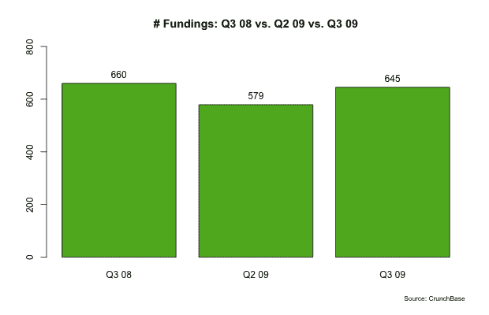
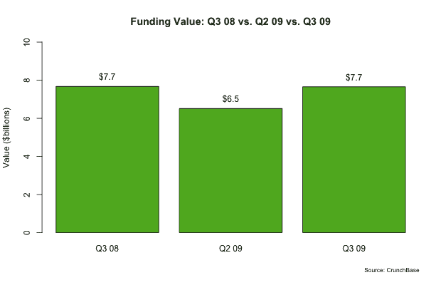
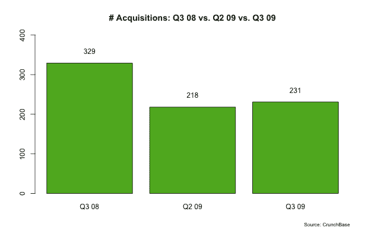
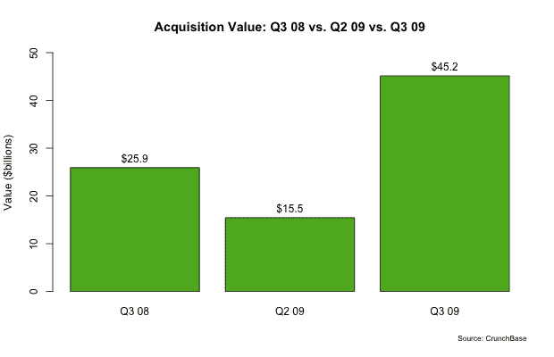

# 好时光:一年后 

> 原文：<https://web.archive.org/web/https://techcrunch.com/2009/10/06/r-i-p-good-times-one-year-later/>

自从硅谷风险投资家决定结束融资聚会以来，整整一年过去了。[红杉资本](https://web.archive.org/web/20221207205736/http://crunchbase.com/financial-organization/sequoia-capital)首先向投资组合的首席执行官们展示了 56 张幻灯片，标题是 [R.I.P .美好时光](https://web.archive.org/web/20221207205736/http://www.beta.techcrunch.com/2008/10/10/sequoia-capitals-56-slide-powerpoint-presentation-of-doom/)。在信中，他们警告说“这次不一样了”，并表示“最快者生存”要求大幅削减成本。

[标杆资本](https://web.archive.org/web/20221207205736/http://www.beta.techcrunch.com/2008/10/09/benchmark-capital-advises-startups-to-conserve-capital/)也与他们的首席执行官进行了沟通，[告诉他们](https://web.archive.org/web/20221207205736/http://www.beta.techcrunch.com/2008/10/09/benchmark-capital-advises-startups-to-conserve-capital/)到*“要冷静，但要务实”*和*“你没有意识到事情失控的速度有多快。”超级天使*罗恩·康韦同样[警告他的公司](https://web.archive.org/web/20221207205736/http://www.beta.techcrunch.com/2008/10/08/angel-investor-ron-conway-adresses-his-portfolio-companies-over-financial-meltdown/)，谈到正在蔓延的金融危机*“我们不会对它的剧烈影响“免疫”*

因此，这是大规模裁员的一年(自 2008 年 8 月以来，我们跟踪了超过 34 万人)。当你削减成本时，人们通常是第一个去的。

但是在过去的一年里，我们没有看到新资金的完全枯竭，或者大规模的创业公司[死亡池](https://web.archive.org/web/20221207205736/http://www.beta.techcrunch.com/tag/deadpool/)。要么是建议一开始就偏离了目标，要么是努力工作和削减成本奏效了。

可能两者都有一点。

今天早些时候，我和罗恩·康韦聊了聊，问他对去年有什么看法，事情进展如何。他说:“我们已经看到实时数据初创公司的爆炸式增长，这有助于抵消硅谷的低迷。我们仍然每天看到 5-6 笔交易，这告诉我市场非常活跃。我觉得我们已经很好地度过了这场风暴。此外，去年许多需要资金的公司迅速筹集资金或削减成本并幸存下来，因此我们的失败率比我们想象的要低。”

我也和红杉的皮特·弗林特谈过，今天康威支持了 T2 的 Trulia。房地产初创公司 Trulia 一年前有 80 名员工。弗林特说，他们没有解雇任何人，现在有 90 名员工。他说，他们现在也接近盈亏平衡。他说，过去 12 个月，收入大幅增长。虽然他不愿透露收入，但 90 名员工暗示，仅每月工资就在 100 万美元左右。房地产市场在过去的 12 个月里变得更加艰难，Trulia 通过订阅和广告从房地产专业人士和公司那里赚钱。但是他们已经找到了一种方法来度过难关，并开始盈利。弗林特说，公司一年前做出的一个战略选择是将收入多元化，从少数大广告商转向许多小广告商。到目前为止，Trulia 已经筹集了[3300 万美元](https://web.archive.org/web/20221207205736/http://crunchbase.com/company/trulia)，他们上一次筹集资金是在 2008 年的 Q2。

当然，有过一些艰难的时期。我们跟踪了今年早些时候风险投资和流动性事件的急剧下降，特别是在 2007 年第四季度的高峰期。

但是硅谷现在看起来很稳定，特别是当你比较 2009 年和 2008 年的时候。我们在 [CrunchBase](https://web.archive.org/web/20221207205736/http://crunchbase.com/) 上跟踪风险投资和收购，我们现在正准备发布[第三季度数据供下载](https://web.archive.org/web/20221207205736/http://www.beta.techcrunch.com/research/)(应该会在本周晚些时候或下周发布)。我看了一下数据，很令人惊讶。

2009 年第三季度有 645 笔风险融资，总额为 77 亿美元，而 2008 年第三季度有 660 笔和 77 亿美元(基本持平，但根本没有下降)。收购已经变得不那么常见，但平均价格却在大幅上涨。2009 年第三季度发生了 231 起收购，总金额为 452 亿美元。2008 年第三季度，共发生了 329 起收购，总价值为 259 亿美元。

下面是所有这些数据的图表，我们很快会对这些数据进行更深入的分析。但至少现在，天还没有塌下来。

