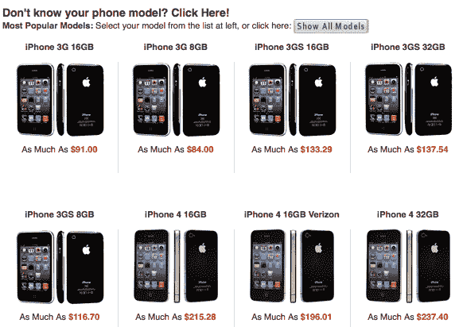

# RadioShack 的以旧换新计划可能会给你一部免费的 iPhone 4S 

> 原文：<https://web.archive.org/web/http://techcrunch.com/2011/10/07/radioshacks-trade-in-program-may-just-get-you-a-free-iphone-4s/>

# RadioShack 的以旧换新计划可能会让你得到一部免费的 iPhone 4S

RadioShack 有一个针对二手设备的[以旧换新程序](https://web.archive.org/web/20230204220109/http://radioshack.cexchange.com/online/home/index.rails)，如果情况允许的话，这可能会让你在 iPhone 4S 上省下不少钱。更好的是，如果你以未受损的 32GB iPhone 4 进行交易(无划痕，无电池问题，等等。)，你将从 RadioShack 获得足够的商店积分来购买一台 16GB 的 iPhone 4S，而且还有钱可以花。好吧，不烧这么多的配件或其他 RadioShack 好东西，但你得到了要点。

它是这样工作的:

把你的功能智能手机(顺便说一下，它不一定是 iPhone)放入 RadioShack，让商店代表对它进行评估。他们会告诉你它值多少钱，你可以用它作为下次购物的信用。既然我假设你们中的许多人正在考虑购买 iPhone 4S，那么这个时机真的再好不过了。据 [TechnoBuffalo](https://web.archive.org/web/20230204220109/http://www.technobuffalo.com/companies/apple/iphone/radio-shack-offering-up-to-200-off-iphone-4s-with-trade-ins/) 报道，折价贴换和保存交易只持续到 10 月 31 日。

就苹果产品而言，节省是相当惊人的。看看这个:

RadioShack 不允许在线预订 iPhone 4S——你必须去商店才能预订。然而，无论如何，你都必须去商店对你的旧手机进行评估，所以你不妨关注一下预购，看看是否有人会为你暗示你的旧手机的折价价值。然后，当你回到 RadioShack 拿起它时，你可以以旧换新，可能会得到一部全新的 iPhone 4S。

如果你的旧设备很不幸地损坏得无法让你获得任何商店积分，RadioShack 将免费为你回收它。你不会带走任何额外的钱，但至少你会拯救地球。

附近没有无线电黑客吗？[沃尔玛](https://web.archive.org/web/20230204220109/http://walmart.gazelle.com/)和[塔吉特](https://web.archive.org/web/20230204220109/http://sites.target.com/site/en/spot/page.jsp?title=nextworth)也有类似的计划。