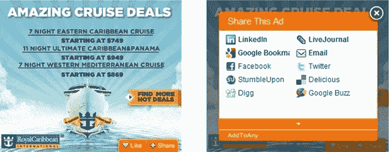

# RadiumOne 推出包含赞、分享等内容的社交广告形式 

> 原文：<https://web.archive.org/web/http://techcrunch.com/2011/02/15/radiumone-unveils-social-ad-format-with-likes-shares-and-more/>

# RadiumOne 推出了包含赞、分享等内容的社交广告形式

[RadiumOne](https://web.archive.org/web/20230203142600/http://radiumone.com/) ，一家旨在结合社交和意图数据提供广告的在线广告网络，今天推出了一种新的广告形式，旨在将社交元素引入实际的展示广告中。[衍生自 gWallet](https://web.archive.org/web/20230203142600/https://techcrunch.com/2010/10/18/gwallet-founder-launches-new-data-focused-ad-platform-radiumone/) ，RadiumOne 挖掘社交数据，利用这些信息为品牌识别相关消费者，然后基于这些数据向这些受众投放广告。

这个新按钮被称为“R1 喜欢按钮”，它可以被放在 add 上，让用户喜欢一个广告。当然，它不是一个脸书式的按钮，实际的“喜欢”广告的行为除了帮助 RadiumOne 为你提供更多相关的广告之外，并没有真正的作用。广告商也可以选择在广告上包含“分享”按钮，这将允许消费者通过脸书、推特、电子邮件和其他社交媒体网站分享广告。

RadiumOne 声称用户更有可能与社交广告形式互动。在早期测试中，R1 的 Like 按钮产生了 0.12%的点击率和 0.18%的 Like 按钮点击率；份额率为 0.02%。此外，销售线索请求增加了 45%。

这些数据令人印象深刻，但我仍然怀疑许多用户会真的“喜欢”他们在出版商网站上看到的广告。虽然这在脸书行得通，但 RadiumOne 正在出版商网站上测试这一点，在这些网站上，用户可能不太热衷于“喜欢”页面上没有脸书“喜欢”的对象

我认为消费者需要更多的激励来与在线广告互动。有趣的是，如果 RadiumOne 允许广告商为用户“喜欢”广告提供激励，即你可以因为“喜欢”广告而在餐馆获得折扣。