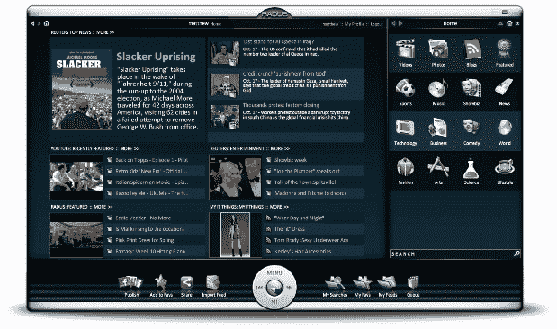

# RADUS 推出用于消费和发现在线内容的精美应用程序 TechCrunch

> 原文：<https://web.archive.org/web/https://techcrunch.com/2008/10/30/radus-debuts-slick-application-for-consuming-and-discovering-online-content/>

# RADUS 首次推出用于消费和发现在线内容的流畅应用程序

 [RADUS](https://web.archive.org/web/20230128095608/http://www.radus.com/) (发音为“radius”)是一个新的媒体中心，作为内容的聚合器，包括 RSS 订阅源、视频、照片和音乐。虽然该网站肯定不是第一个将所有这些整合在一起的网站，但它以一种非常巧妙的方式做到了这一点，并且非常吸引眼球。

该网站的界面包括一个位于左侧的大型媒体浏览器，旁边是一个用于浏览文件类型的较小面板。书面内容(如来自 RSS 提要的博客文章)以类似杂志文章的多栏格式显示。类似地，媒体面板在适当的地方显示视频和图像。不幸的是，侧边栏在搜索内容时不是很有效，因为它没有留下足够的空间来描述给定的视频。

在发布时，该网站从许多来源获取内容，包括 Flickr(照片)，Hulu 和 CBS(视频)，以及超过 100 个手工选择的 RSS 源(如果你喜欢的 RSS 源不在网站上，你可以添加自己的内容)。

RADUS 可能不会吸引那些已经习惯了每天访问 Google Reader 和 Hulu 的超级用户——在消费内容方面，它的效率不是很高。但是对于只是寻找一些媒体来打发时间的用户来说，RADUS 是一个很好的(也很好看的)选择。

该公司表示，目前正在将 RADUS 平台移植到新的媒体设备上，桌面和移动支持正在进行中。

注意:RADUS 说火狐 3 的用户应该使用 www.radus.com(无 http)访问网站。

*( **编者注**:这篇报道的原署名是罗宾·沃特斯，但现已改为杰森·金凯，也就是这篇文章的实际作者。由于技术上的困难，沃特斯不得不在昨晚发表了这篇文章，并且错误地把它放在了他的署名下。如有任何困惑，敬请原谅)。*

