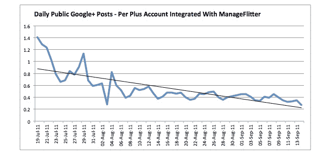

# 如果你还在使用 Google+TechCrunch，请举手

> 原文：<https://web.archive.org/web/https://techcrunch.com/2011/09/15/raise-your-hand-if-youre-still-using-google/>

# 如果你还在用 Google+,请举手

几个月前，当 [Google+](https://web.archive.org/web/20230205005307/http://www.crunchbase.com/product/google) [推出](https://web.archive.org/web/20230205005307/https://techcrunch.com/2011/06/28/google-plus/)时，我相对较快地加入进来，[喜欢我所看到的](https://web.archive.org/web/20230205005307/https://techcrunch.com/2011/06/28/google-plus-design-andy-hertzfeld/)。我相信社交网络会成为脸书和 Twitter 等公司的强大挑战者，主要是因为谷歌现有的庞大用户群(我仍然相信，只要该公司打对了牌)。

我已经有一段时间没有在 Google+上访问或发布任何东西了，但我想那只是我的。

事实证明，我可能不是唯一的一个人， [89n 现在说](https://web.archive.org/web/20230205005307/http://89n.com/blog/manageflitter/google-public-posts-decrease-41-over-past-two-months)，基于一些快速和肮脏的内部[manage fliter](https://web.archive.org/web/20230205005307/http://www.manageflitter.com/)数据研究。

根据其数据，Google+每日公开(即*非私人*)帖子的平均数量从 2011 年 7 月 19 日至 2011 年 8 月 19 日期间的每日 0.68 个减少到 2011 年 8 月 19 日至 2011 年 9 月 14 日期间的每日 0.40 个。

这代表了 41%的下降，这可能会导致人们认为早期采用者正在悄悄地放弃 Google+。(有人通知斯考伯！)

请注意，尽管最近推出了[增强的](https://web.archive.org/web/20230205005307/https://techcrunch.com/2011/08/24/googles-1-button-gets-its-treat-now-lets-you-share-to-google-circles/) Google +1 按钮[功能](https://web.archive.org/web/20230205005307/https://techcrunch.com/2011/08/31/google-plus-one-chrome-extension/)，一个类似 Twitter 的[“建议用户”列表](https://web.archive.org/web/20230205005307/https://techcrunch.com/2011/09/02/google-to-roll-out-a-suggested-user-list/)和[已验证的个人资料](https://web.archive.org/web/20230205005307/https://techcrunch.com/2011/08/20/google-rolls-out-verified-profiles-still-struggles-with-real-name-policy/)，这种可感知的行为还是发生了。

89n 表示，迄今为止，已有 7280 人使用其 ManageFlitter 服务将他们的 Google+账户链接到 Twitter。该公司表示，每隔 10 分钟就会检查这些账户，看是否有新的公开帖子。

现在，89n 不完全是一家研究公司，他们很少提供关于他们收集和解释数据的方法的见解。我要求他们澄清，但与此同时，你们中有多少人在早期尝试过 Google+,发现自己不像开始时那样经常返回帖子？

**更新:**是的，我知道数据不包括私人发帖，据我所知，私人发帖显著增加。没有人说 Google+已经死了，我只是问你是否发现公开发帖正在减少，这是真的，89n 的数据显示。放松一点:)

