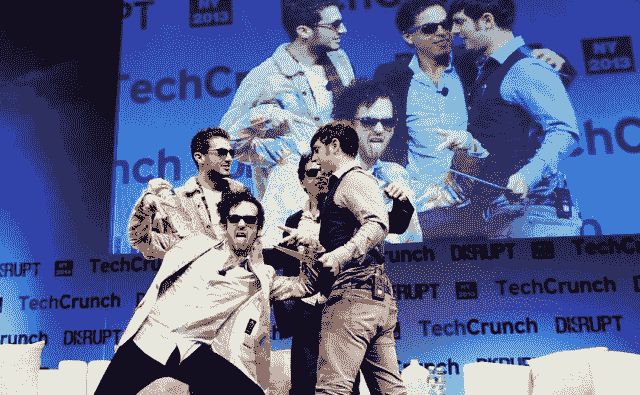

# 说唱天才的联合创始人向扎克道歉(然后说他们会比脸书更伟大)

> 原文：<https://web.archive.org/web/https://techcrunch.com/2013/05/01/rap-genius-co-founder-apologizes-to-zuck-then-says-theyll-be-bigger-than-facebook/>

如果你不在 Disrupt NY 或[在家](https://web.archive.org/web/20230404184302/https://techcrunch.com/2013/05/01/watch-the-last-day-of-techcrunch-disrupt-ny-2013-right-here/)看直播，你就错过了一些东西……相当特别。

我们自己的 Josh Constine 与文本注释服务公司 [Rap Genius](https://web.archive.org/web/20230404184302/http://rapgenius.com/) 的联合创始人一起登台，该公司最近从 Andreessen Horowitz 那里筹集了 1500 万美元，谈话很快从指标和浏览器扩展转向 adderall，这是一场即兴的拳击会议，一位创始人为告诉马克·扎克伯格给他口交而道歉。

Rap Genius 最初是一个允许 hiphop 粉丝注释 Rap 歌词以解释其含义的网站。随着时间的推移，它扩展到其他非抒情文本；就在今天早上，他们透露了闯入[注释突发新闻](https://web.archive.org/web/20230404184302/https://techcrunch.com/2013/05/01/rap-genius-news-genius/)的计划。将来，它计划通过为企业建立一个名为[“企业天才”](https://web.archive.org/web/20230404184302/https://techcrunch.com/2013/05/01/rap-genius-enterprise/)的协作文档注释工具来赚钱

该公司的三位创始人——马哈茂德·莫格达姆、汤姆·雷曼和伊兰·泽乔里——都颇具争议。就在今天，我听到他们被称为“疯子”、“疯子”和“完全疯了”……然而，他们的小组似乎是这里所有人谈论的话题。不管你怎么说这些人(他们可能根本不在乎)，但是他们很清楚自己在做什么。

为了工作中的每一个人，我从采访中摘录了一些精选的语录——但实际上，你可能应该只看视频。

**关于为什么说唱天才会起作用:**

“说唱天才不只是众包。它始于我们和我们的六个兄弟。它来源于人道主义。我们向大众开放，所以它成为众包。然后我们决定让它‘球化’，[所以我们在网站上验证了一堆这样的巨星]”

“说唱天才的秘密成分是爱。我们经常告诉人们，说唱天才是建立在爱情之上的”

**与马克·安德森和本·霍洛维茨合作，他们资助了整个 1500 万美元的首轮融资:**

“我们说我们想要这样那样的数百万美元。[马克]问我们要用它做什么；我说了一些非常愚蠢的话，比如我们会收购一批公司。他完全失控了，到处敲他的腿。我以为我们彻底搞砸了这次会议，但这只是他表达爱意的方式。”

“本是一个真正的说唱乐迷。他就像说唱天才教父。我们认为他是兄弟…人们不知道的是他是一个营销天才。他想出了将用户称为“学者”和“顶级学者”的主意。他想出了[新闻。本，我们爱你，老兄。"](https://web.archive.org/web/20230404184302/https://techcrunch.com/2013/05/01/rap-genius-news-genius/)

**关于球队使用药物的传言要重点关注:**

“是啊，我们会做裸体的 adderall。这是在 Y-Combinator 之前。(当我们需要生产一些东西时)我们会裸体做 adderall，因为这样我们就不能离开房子(而且会整天在工地上工作)。”

**当联合创始人马哈茂德·莫格达姆告诉《纽约时报》沃伦·巴菲特和马克·扎克伯格可以“舔他的鸡巴”时:**

“我要说的是:奥马哈先知(T10)、沃伦巴菲特(T11)、无论马克·扎克伯格来自何方的先知——对不起，扎克，我爱你，伙计。”

**生活中的哪些因素导致他们“毫不在乎”:**

“呃，连续剧 A？我不知道。我们可以卖掉这些东西，我们可以去某个岛上酗酒。[但我们正在这里建造一些东西。]"

**关于他们臭名昭著的个性:**

“我刚刚会见了我在谷歌的前老板。我想说服他来说唱天才工作，他说‘如果我去说唱天才，我要做的第一件事就是摆脱那个让·拉尔菲奥的家伙。我当时就想:‘嗯，哪一个？我们有两个！"

“很多人认为我们需要改变。我……认为这不会发生。”

“是啊。如果你想成为职业球员，你就必须喝下苦艾酒。你应该更放松，但你必须全天候生活。感觉不到*自由*。我要成为说唱天才。”

[gallery ids="810361，810362，810363，810364，810365，810359，810366"]