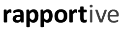
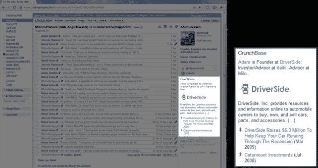

# Gmail 插件 Rapportive 从 Gmail Creator 和许多其他人那里筹集了 100 多万美元 

> 原文：<https://web.archive.org/web/https://techcrunch.com/2010/08/02/rapportive-funding/>

# Gmail 插件 Rapportive 从 Gmail Creator 和许多其他人那里筹集了 100 多万美元

 [Rapportive](https://web.archive.org/web/20221007032516/http://www.rapportive.com/) ，一家旨在通过提供你的联系人的上下文相关信息来改善[Gmail](https://web.archive.org/web/20221007032516/https://beta.techcrunch.com/2010/05/02/rapportive/)的初创公司，已经筹集了超过 100 万美元的种子资金，一些知名天使投资者也参与其中。完整名单:Gmail 创建者[保罗·布赫海特](https://web.archive.org/web/20221007032516/http://www.crunchbase.com/person/paul-buchheit)，[斯科特·巴尼斯特](https://web.archive.org/web/20221007032516/http://www.crunchbase.com/person/scott-banister)，[杰森·卡拉卡尼斯](https://web.archive.org/web/20221007032516/http://www.crunchbase.com/person/jason-calacanis)，[加里·维纳查克](https://web.archive.org/web/20221007032516/http://www.crunchbase.com/person/gary-vaynerchuk)，[大卫·卡塞](https://web.archive.org/web/20221007032516/http://www.crunchbase.com/person/david-cancel)，[达梅什·沙阿](https://web.archive.org/web/20221007032516/http://www.crunchbase.com/person/dharmesh-shah)，[舍温·皮什瓦尔](https://web.archive.org/web/20221007032516/http://www.crunchbase.com/person/shervin-pishevar)，以及[罗伊·罗德斯泰因](https://web.archive.org/web/20221007032516/http://www.crunchbase.com/person/roy-rodenstein)。参与的还有戴夫·麦克卢尔的新基金 [500Startups](https://web.archive.org/web/20221007032516/http://www.crunchbase.com/financial-organization/500-startups) 、Nivi & Naval Ravikant 的 [VentureHacks](https://web.archive.org/web/20221007032516/http://www.crunchbase.com/company/venture-hacks) 、查理斯·里弗风险投资公司、基马风险投资公司、泽尔科瓦风险投资公司和 BOLDstart 风险投资公司。

Rapportive 还宣布，它是最新一批 Y Combinator 公司的一部分——首席执行官拉胡尔·沃赫拉说，YC 的保罗·格拉厄姆形容这轮融资“令人震惊”,这符合他对未来融资方式的预测,采用大规模联合融资，没有固定金额，结算或引导。

Rapportive 使用浏览器插件在 Gmail 的侧边栏中显示你的联系人信息(它取代了广告)。这包括个人资料照片、职业和社交网络链接等信息。该公司表示，将利用这笔资金招聘员工，改进现有产品，并扩展到其他电子邮件平台(换句话说，未来不会只有 Gmail)。

