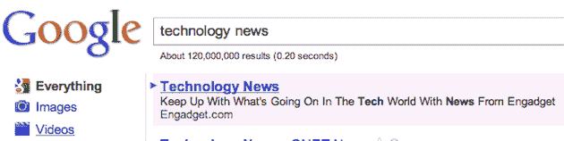
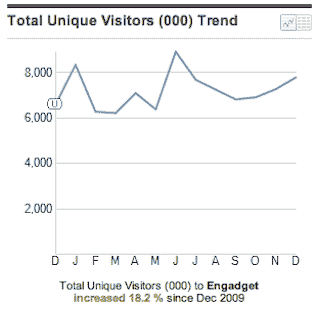

# 真正的博客不会在 Google TechCrunch 上购买广告

> 原文：<https://web.archive.org/web/https://techcrunch.com/2011/01/11/real-blogs-dont-buy-ads-on-google/>

博客，即使是大博客，也应该与旧的媒体网站有所不同。我们写得更快，经常更新。文字处理较少。我们打破更多的真实新闻，我们毫不犹豫地发表意见。我们倾向于在评论中与读者发生冲突。我们的目标是通过有机地参加活动、在 Twitter 和脸书上传播消息，以及成为社区的一部分，来获得更多的读者，甚至是令人讨厌的读者。

大型博客不会做的一件事是购买流量来增加康姆斯克的数字。这是潜规则。这是一种欺骗，它带来的是不良流量，这些流量在很大程度上不会停留或返回(或者我们是这样认为的)。

所以我们很难过地看到我们的[姐妹](https://web.archive.org/web/20230215213147/https://techcrunch.com/2010/09/28/why-we-sold-techcrunch-to-aol-and-where-we-go-from-here/)博客 Engadget 正在这么做——购买广告来提升他们的康姆斯克排名。在过去的一两个月里，我们在谷歌上看到了数量惊人的广告，比如“通过 Engadget 了解科技世界的最新动态。”

我知道这看起来没什么，但这有点像发现你最喜欢的棒球运动员正在服用类固醇，这样他就可以在过期后继续打球。

不管怎样，好消息是交通流量滚滚而来。去年夏天，康姆斯克显示 Engadget 的独立访客大幅下降。但是广告活动似乎在帮助他们弥补差距。这很好，因为 Engadget 的编辑似乎花了[更多的时间](https://web.archive.org/web/20230215213147/https://techcrunch.com/2011/01/10/verizon-iphone-2/#comment-127526416)在搜索 TechCrunch 的评论上，而不是做任何实际的工作。

我怀念 Ryan Block 管理那个网站的日子。几乎就在他离开之后,[座无虚席](https://web.archive.org/web/20230215213147/https://techcrunch.com/2008/10/13/memories-of-gizmodogate-ces-names-engadget-as-official-blog-partner/)开始了，Engadget 粗糙但聪明的锋芒蒸发成一个真实博客的塑化漫画。

**更新:**嗯，得到答案的一个方法就是发表一篇博文。这个广告全是 TechCrunch 的。AOL 销售没碰这个。我们不会再犯了。如果这个政策在 AOL 销售部门接管后有所改变，我们会通知他们。