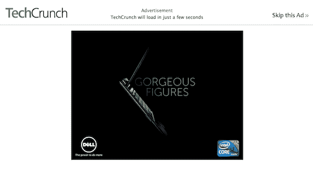

# 真正的博客没有间隙广告 

> 原文：<https://web.archive.org/web/http://techcrunch.com/2011/01/25/real-blogs-dont-have-interstitial-ads/>

嘿，如果我[对](https://web.archive.org/web/20230213024723/https://techcrunch.com/2011/01/11/real-blogs-dont-buy-ads-on-google/)发号施令，我也必须能够接受。还有[拿着吧](https://web.archive.org/web/20230213024723/http://twitter.com/#!/travis_beauvais/status/30002644873383936)今天我有。我们在 TechCrunch 上贴了这个可笑的插页广告，它会在你第一次访问这个网站时出现。

这是戴尔的广告。我喜欢戴尔，在我去苹果电脑之前，我主要购买他们的电脑。但是广告很烂。

有趣的是，我听说插播广告表现很好，因为它们没有给访问者任何选择。他们看了广告，然后上了网站。大量的印象和点击以及销售人员喜欢的东西。

但是和你一样，我不喜欢他们。我倾向于停止访问显示它们的网站。它们不像漂浮在你试图阅读的文本上的荒谬广告那么糟糕，但它们也差不多。

他们也大大降低了网站的速度。

过去，我们的销售人员提出过这类广告，我们的首席执行官希瑟拒绝了。在这种情况下，我不确定谁该负责。我相信 AOL 现在已经接管了我们的一些广告销售。我们出色的销售团队(他们不得不忍受像这样的事情)正在处理剩下的事情。反正我是这么认为的，通常我不太关注这方面的业务。到目前为止，我要求更多信息的内部请求一直被忽视。

不管是谁干的，我都要阻止它。这可能包括六个小时的内部会议和至少一个幻灯片。所以至少你知道这会让我比你更痛苦。

你有这样的优势，这很好。