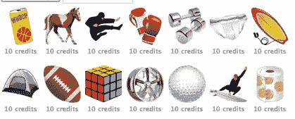

# 虚拟商品中有真金白银 TechCrunch

> 原文：<https://web.archive.org/web/https://techcrunch.com/2010/06/23/real-money-virtual-goods/>

***编者按**:以下客座博文由[虚拟货币优惠初创公司](https://web.archive.org/web/20230129152245/https://techcrunch.com/2010/02/25/gwallet-launches-new-format-for-virtual-currency-offers-eyes-international-expansion/)的 CEO[古尔巴斯克·查哈尔](https://web.archive.org/web/20230129152245/http://www.gwallet.com/)。此前他创立了 BlueLithium，并于 2007 年以 3 亿美元的价格卖给了雅虎。*

如果很快有一天这个季节的必备单品甚至不存在了，也不要惊讶。反正在现实世界里不会。话说回来，现实和欲望有什么关系呢？快速增长的虚拟市场的心理与真实市场惊人地相似。

人们很容易忽视虚拟商品和用于购买虚拟商品的虚拟货币的兴起。藏在社交游戏的封底，要约墙看起来像是只有最坚定(或有勇无谋)的玩家经常光顾的不起眼的小巷——尤其是在 [Scamville](https://web.archive.org/web/20230129152245/https://techcrunch.com/2009/10/31/scamville-the-social-gaming-ecosystem-of-hell/) 争议之后。关于“黄金农民”在血汗工厂中辛苦劳作以获得《魔兽世界》和《无尽的任务》等 MMOGs 中令人垂涎的物品的说法，增加了笼罩在虚拟经济之上的可疑感。当然，有些人可能愿意用他们的大量时间——甚至现金——来换取只存在于网上的产品，但是虚拟商品究竟能有多大呢？答案越来越清晰:非常大——而且一直在变大。

**2.3 亿社交游戏玩家不会错**

虚拟货币的出现伴随着社交游戏的主流化，虚拟货币在社交游戏中扮演着重要角色。像他们运行的社交网络一样，像 Farmville 和 Mafia Wars 这样的游戏吸引了比最流行的主机和 PC 游戏更多样化、更广泛的玩家群体。每月有超过 2 . 3 亿的独立用户，仅 Farmville 发行商 Zynga 的游戏每月就有世界上一半的脸书用户在玩。据游戏制造商 [PopCap](https://web.archive.org/web/20230129152245/http://popcap.mediaroom.com/index.php?item=149&s=43) 称，美国和英国大约有四分之一的人经常玩社交游戏。引人注目的是，其中一半以上是女性——这与传统的“游戏玩家”刻板印象相去甚远。随着时间的推移，社交游戏将在家庭时间中发挥越来越大的作用，特别是对于偏远地区的家庭成员来说，这种游戏将取代过去几年的棋盘游戏。

社交游戏很容易被吸引，基于开放式的故事以及增强参与度和长期忠诚度的社交互动，已经产生了大量证明其上瘾性质的轶事:在韩国实行的[宵禁](https://web.archive.org/web/20230129152245/http://www.ft.com/cms/s/0/6981ea66-4728-11df-b253-00144feab49a.html)是因为一对夫妇在忙着喂养虚拟婴儿时让他们的真实婴儿饿死。这个 12 岁的孩子在玩 Farmville 时花掉了 1400 美元。不计其数的工作时间——更不用说睡觉了——都被强迫性的玩耍浪费了。对于出版商来说，问题不在于如何获得大量读者，而在于如何赚钱。

这就是虚拟货币的由来。通过向观看电影预告片或参加测验的玩家奖励游戏内现金，发行商可以从广告商那里获得较高的 CPM。到目前为止，它的效果相当不错——虚拟货币已经是社交游戏行业中增长最快的货币化部分，PopCap 研究中超过一半的玩家每天都在赚取和消费虚拟货币，其中大多数人要么是赠送朋友，要么是在游戏中升级。让玩家赚取虚拟货币而不是支付虚拟货币现在是一项价值 7 . 2 亿美元的业务，2009 年 PlaySpan/VGMarket 里程碑式的数字商品研究预测，到 2011 年，虚拟商品可能占游戏收入的 20%。当然，这些都是去年的数字——鉴于休闲游戏的快速增长(据可靠消息来源称，仅 Zynga 一家今年就能赚到 10 亿美元)，虚拟货币的真实规模是一个不断上升的目标。

随着新一代易于使用的工具栏取代了那些粗略的交易墙，获得虚拟货币的机会被更加无缝地编织到游戏中，以及随着更严格的发行商控制在最严重的 Scamville 类型的滥用中占据主导地位，越来越多的主流消费者将愿意参与虚拟经济。由于真金白银岌岌可危，出版商、社交网站、零售商和生态系统的其他成员将继续推动虚拟商品达到新的可见性水平。随着虚拟经济的增长，它的心理将越来越像真实的市场。至少，这是像我这样的业内人士所押注的。

**虚拟范思哲**

品牌已经是社交网络的重要组成部分。脸书用户在彼此的墙上张贴品牌礼物——用真金白银支付——并成为这些品牌页面的粉丝。为什么他们不会呢？社交网络的本质是个人身份的表达和投射，品牌亲和力是几乎每个现代消费者角色的中心主题。当你可以从 DKNY 甚至 J Crew 那里买到同样的造型时，为什么还要买一件古驰的裙子呢？因为它能帮助你表达不同的东西，并让你感觉更好。虚拟商品没有什么不同，除了它们没有那么贵。品牌虚拟商品的点击率已经是非品牌商品的十倍。在这种情况下，不难想象不久的将来的虚拟市场。

随着更多类别的更多现实世界品牌延伸到虚拟市场，品牌化将越来越像是一种规范，将无品牌的虚拟商品的地位降至商店品牌和仿制药的水平。对于一些消费者来说，这提供了复制他们现有品牌关系的机会；对另一些人来说，虚拟物品可以帮助满足他们买不起的真实物品的欲望。最热门的品牌将获得最高的价格，即使实际上与较小的标签和仿冒品没有什么区别——就像在现实世界中一样。

**下一步是什么**

正如已经开始发生的那样，虚拟货币将成为在线和离线环境中更被接受的支付形式。品牌将在更大程度上渗透到游戏中，不仅仅是流通虚拟物品，而是从头开始创造嵌入了强大品牌信息的游戏。这并不是一个新的想法，但对于主机游戏来说，巨额预算和有限的开发流程意味着品牌必须投入大量资金来传达无法保证经得起时间考验的信息。相比之下，社交媒体游戏的开发成本相对较低，而且它们可以不断被操纵和改进，以便在正确的时间为品牌传达正确的信息。

新的商业模式也会出现。虚拟商城将直接向消费者出售品牌虚拟商品。对消费者友好的、易贝式的虚拟商品二级市场将在多个社交游戏中出现，价格由实际需求决定，至少对那些发行商愿意允许的游戏来说是如此——鉴于此类交易将培养更深的参与度和忠诚度，为什么不呢？事实上，这种事情已经在 MMOGs 的世界里发生了；现在，只是将这些经过验证的模型应用到更广阔的社交游戏世界中。

对于广告商来说，我相信社交游戏和虚拟商品背后的动力将是不可抗拒的。他们不再依赖单一的消费者行为来传递印象，而是将广告整合到整个互动社交游戏环境中，以利用他们的客户现在在那里花费的大量时间。

就在五年前，任何预测我们将在 2010 年谈论主流虚拟商品的人都会被斥为梦想家。去年秋天，在斯卡维尔事件之后，人们准备为它写讣告。但是虚拟货币和社交游戏都将继续存在——它们创造的机会比任何人想象的都要快。