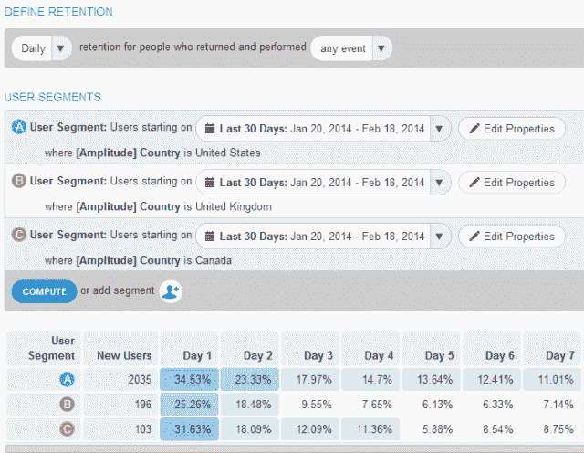
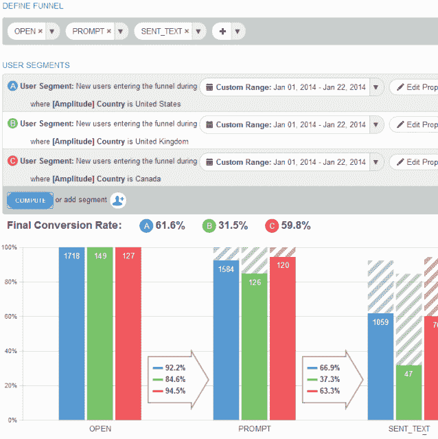
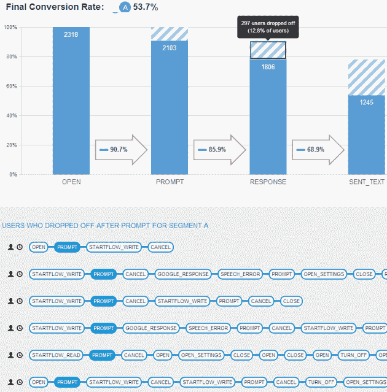

# 实时移动分析平台 Amplitude 挑战 Flurry & Mixpanel 

> 原文：<https://web.archive.org/web/http://techcrunch.com/2014/02/20/real-time-mobile-analytics-platform-amplitude-takes-on-flurry-mixpanel/>

Y Combinator 支持的移动分析服务 Amplitude ，旨在通过以更具竞争力的价格提供先进的功能来挑战 Flurry 和 Mixpanel，今天在 YC 演示日之前正式公开亮相。事实证明，该公司以前实际上经历过这一过程——这是来自[语音短信安卓应用 Sonalight](https://web.archive.org/web/20230129225831/https://techcrunch.com/2012/03/08/sonalight-lets-android-users-text-while-driving-without-touching-a-phone/) 的同一个团队，该团队参加了 2012 年冬季团队。

Amplitude 的联合创始人 Spenser Skates 解释说，Sonalight 做得“相当不错”,下载量达到了数十万次，并有一些付费用户，但它从未真正成为主流成功。然而，作为构建他们自己的移动应用程序的过程的一部分，该团队也花了很多时间来创建他们自己的分析工具，以便以定制的方式检查他们的数据。

Y Combinator 的其他开发人员在看到这款产品后，很快就开始寻求同样的产品。所以团队从 Sonalight 转向，建造了现在所谓的振幅。

溜冰鞋说，大约一年半前，事情开始了。“我们观察了市场，我们知道许多其他移动公司对他们的分析非常不满意，”他解释道。公司将从 Flurry 或 Google 这样的免费服务开始，然后逐步发展到 Mixpanel 或其他企业级公司提供的高级但昂贵的服务。

但是 Skates 认为他们可以通过建立一个更加以开发者为中心的服务来做得更好，并且只专注于移动设备。

今天， [Amplitude](https://web.archive.org/web/20230129225831/https://amplitude.com/) 已经发展到大约 30 个企业客户使用它的平台(通过它的开源 SDK)，并且由于与 Corona Labs SDK 的集成，已经拥有大约 20，000 个应用程序。但这项服务直到现在才面向公众开放。

Amplitude 的与众不同之处不仅在于它对移动的严格关注，还在于它为开发人员需要跟踪的事情(如漏斗、细分、货币化等)提供实时分析。此外，它的成本更低。斯卡特斯说，这对新上市的产品尤其重要。“如果你要推出一款产品，你需要马上知道它是成功了还是失败了。你不会想等 24 小时才得到数据，”他说。

使 Amplitude 脱颖而出的另一个特性是它提供了对原始数据的直接数据库访问。也就是说，开发人员可以直接连接到它的服务器，在原始数据上输入 SQL 查询，然后以任何他们想要的方式分析数据，或者将数据放入 Tableau。

正是这一特性吸引了几位前 Zynga 员工，他们现在正在经营自己的移动创业公司。一些著名的客户包括前 Zynga 总经理陈思琪，现在是全盛时期的 T2；前 Zynga 副总裁 [Bret Terrill，](https://web.archive.org/web/20230129225831/http://www.linkedin.com/pub/bret-terrill/2/790/8a9)现在的 [12 场演出](https://web.archive.org/web/20230129225831/http://www.crunchbase.com/company/12-gigs)；加上[游戏关闭](https://web.archive.org/web/20230129225831/http://www.crunchbase.com/company/game-closure)的[米迦勒·卡特](https://web.archive.org/web/20230129225831/http://www.crunchbase.com/person/michael-carter-2)；[呼啦啦](https://web.archive.org/web/20230129225831/http://www.crunchbase.com/company/hullabalu)；[lvl 6](https://web.archive.org/web/20230129225831/http://www.crunchbase.com/company/lvl6)；和其他人。

Skates 表示，Amplitude 一直在吸引那些“经历过使用其他移动平台的痛苦”的客户，以及那些寻求高级功能集而不需要使用 Mixpanel 等更高成本的客户。

“我们的成本可能是 Mixpanel 的五十分之一，”他说。" Mixpanel 将所有数据保存在内存中，以便在查询时使用，我们对其进行预处理。但是预处理的难点在于你需要能够提前预测人们会查询什么，我们已经找到了一种方法来做到这一点。Skates 说:“我们非常聪明地知道如何节省空间和内存计算，以便以非常低的成本提供这种服务。

该公司提供免费增值服务，T1 计划从每月 299 美元到 1999 美元不等，直至企业定价。如今，就收集的数据而言，振幅以每月 30%-50%的速度增长，每月约有 80 亿次事件(Skates 指出，约为 Mixpanel 的三分之一)。

总部位于旧金山的 Amplitude 是一个由四名全职员工组成的[团队，其中包括联合创始人兼首席技术官柯蒂斯刘(Curtis Liu)。该公司仍有少量来自 Sonalight 时代的天使投资，但目前没有讨论其融资计划。](https://web.archive.org/web/20230129225831/https://amplitude.com/about)