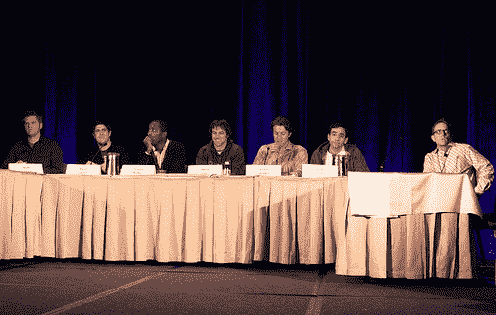

# 实时处理:地理流的兴起 

> 原文：<https://web.archive.org/web/https://techcrunch.com/2009/11/20/realtime-crunchup-the-rise-of-geo-streams/>

今天在 [RealTime CrunchUp](https://web.archive.org/web/20221231070943/http://techcrunch.com/2009/11/20/live-from-the-realtime-crunchup/) 上，来自一些参与基于位置服务的顶级公司的代表聚集在一起，谈论基于地理位置服务的现状和未来。

参加小组讨论的有:
Matt Galligan，SimpleGeo 的联合创始人
Ryan Sarver，Twitter 的平台总监
Tristan Walker，Foursquare 的业务开发副总裁
李家鼎，Google Maps for Mobile 和 Google Latitude 的集团产品经理
Justin Shaffer，Hot Potato 的创始人
Elad Gil，Mixer Labs 的首席执行官
主持人是我们自己的 Erick Schonfeld 和 MG Siegler。

[http://www.ustream.tv/flash/video/2603549](https://web.archive.org/web/20221231070943/http://www.ustream.tv/flash/video/2603549)

[视频](https://web.archive.org/web/20221231070943/http://www.ustream.tv/recorded/2603549)由 [Ustream](https://web.archive.org/web/20221231070943/http://www.ustream.tv/) 制作

在小组讨论的早期，话题转向了 SimpleGeo，这是本周早些时候发布的新的定位基础设施。谢弗谈到他对这项新服务有多兴奋。当被问及是否有人可以复制 Foursquare 正在做的事情时，沃克谈到了 Foursquare 在过滤内容方面的努力(这是更难复制的)。

MG 随后将话题引向弥合社交网络和现实世界之间的鸿沟，指出移动设备正在为这种变化铺平道路。但是他想知道除了 Foursquare(有一个游戏机制)之外的服务如何吸引用户定期分享他们的位置。

Lee 谈到了对 Latitude 持续位置共享的担忧，他解释说，您可以与您指定的某些人共享您的位置，但 Latitude 的持续跟踪方法可以提供有趣的服务。他说，如果没有持续的共享，附近的警报是不可能的(或者至少是有效的)。他说，签到模式和持续模式可能会共存(签到甚至可以帮助提供更多关于你在哪里的背景信息)，但如果没有持续跟踪，有些事情你就做不了。关于签入 verus 连续映射，Elad Gil 说他看到了它们之间“九对十”的关系。

Galligan 插话说，总有一天我们会知道每个人在哪里，但环境不一定是已知的。Galligan 随后透露了他们正在研究的一项新技术，涉及 SimpleGeo 创建的四维地理定位，允许他们将位置和时间戳压缩到一个数据点，允许应用程序查看同一位置的过去。

萨弗谈到了 Twitter 为什么对位置感兴趣，描述了它将如何帮助过滤噪音。他提到 TrendsMap.com 是可视化地理标签推文的一个好方法。

谢弗说，HotPotato 正在寻求将位置整合到他们的服务中，但另一个关键因素是将对话聚集在一起。他说仅有位置数据是不够的(他指出看棒球比赛的人可能真的在比赛现场，或者在电视上看。)

在广告方面，似乎有一个广泛的共识，即基于地理位置的广告有可能非常成功。Galligan 提出了特殊广告和交易的潜力，指出 Yowza 是一个很好的例子。萨弗后来评论说，这些服务必须有一个微妙的界限——让广告真正感觉像广告是一件坏事(相反，让它们感觉像交易会更好)。