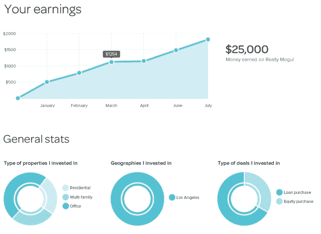

# 房地产巨头推出其房地产众筹平台(针对经认证的投资者)，筹集 50 万美元

> 原文：<https://web.archive.org/web/https://techcrunch.com/2013/03/20/realty-mogul-launch/>

# 房地产巨头推出其房地产众筹平台(针对经认证的投资者)，筹集 50 万美元

[房地产大亨](https://web.archive.org/web/20221207074813/http://www.realtymogul.com/)，一个被认可的投资者可以聚集他们的钱来支持房地产交易的网站，今天即将上线。

联合创始人吉利恩·赫尔曼认为，在当前的金融形势下，房地产是“人们仍然可以获得收益的方式之一”。她也承认，现在对初创公司的股票众筹有很多兴奋之处，但她指出，对房地产大亨的投资可以在几个月内(以房租支票或贷款支付的形式)开始见效，而不是五年或十年:“我们对投资者的最大关注是现金流。”

赫尔曼表示，目前房地产大亨“100%专注于获得认可的投资者”(要使[获得“T3”个人资格，您需要拥有超过 100 万美元的净资产或超过 20 万美元的收入)。她还表示，这类投资也可能非常适合“大众富人”——即年收入超过 10 万美元的非认证投资者——但该公司目前正在等待《就业法案》的最终规定，然后再决定是否向该群体开放。](https://web.archive.org/web/20221207074813/http://www.sec.gov/answers/accred.htm)

房地产大亨是由西雅图的微软/科技之星加速器孵化出来的，它还宣布了一轮 50 万美元的种子资金(稍后会有更多)。参与的天使投资者包括阵风首席执行官大卫·罗斯、戈登·斯蒂芬森(齐洛公司董事会成员)和系列企业家斯基·克鲁斯。

尽管该项目今天正式启动，但房地产巨头已经资助了它的第一个项目——AH Capital 利用该项目融资 11 万美元，用于购买和修复洛杉矶的一栋复式住宅。

当您加入该网站时，您可以浏览不同投资的市场，然后签署文件，并为您感兴趣的交易提交付款。只有达到总资金目标，投资才会发生。如果是，您可以在投资者仪表板中跟踪您的投资。

赫尔曼说，她的一大目标是建立投资者的信任。例如，Realty Mogul 链接到所有房地产公司的 LinkedIn 个人资料，因此用户可以看到他们是否以某种方式与该公司有联系。目前，该网站仅限于华盛顿和加州的房产，尽管投资者可以在任何地方参与。赫尔曼说，她计划逐步扩张。

“我们是一家科技初创公司，科技初创公司应该尽可能快地发展，”赫尔曼说。“但我们首先是一家金融服务公司，其次才是一家科技创业公司，所以我希望尽可能快速但保守地发展。我们需要确保首先保护投资者。”

其他房地产众筹网站还有 [Fundrise](https://web.archive.org/web/20221207074813/http://www.fundrise.com/) 和 [Prodigy Network](https://web.archive.org/web/20221207074813/http://www.prodigynetwork.com/) 。