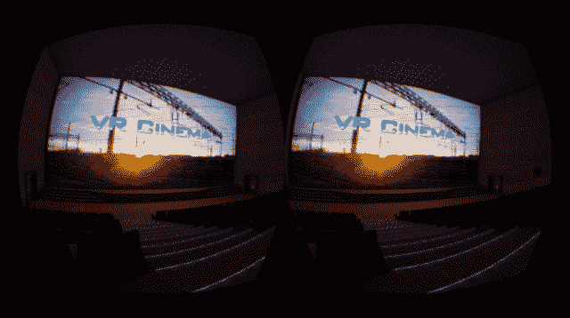

# 理由#152 虚拟现实很棒:没有可怕的其他人的个人电影院 

> 原文：<https://web.archive.org/web/https://techcrunch.com/2013/12/29/reason-152-virtual-reality-is-awesome-personal-movie-theaters-without-the-awful-other-people/>

我喜欢去电影院。说真的，我喜欢它。

我只是讨厌所有其他去的人。

很早以前，我的父母就告诉我，去剧院只有一条规则:沉默是金。如果剧院是观影者的教堂，谈论或以其他方式破坏他人的体验就是罪。如果我说了，我们就会离开。就这么简单。

然而，在过去几年的某个时候，人们似乎已经忘记了如何在 T2 的电影院看电影。

我试过在不同的时间去。我试过去不同的剧院。无论我做什么，无论我去哪里，低劣的电影观众跟着。他们会说话。他们讲只有他们的朋友才会笑的笑话。他们摆弄着他们的手机，弄瞎了他们后面一排的每个人，这样他们就可以在没人会在意的情况下发布脸书的最新消息。

今年去看了 10 场电影；90%的人至少有一个人乐意花 12 美元进去为其他人在电影上拉屎。我已经放弃了。

但是这…这给了我希望。希望下一个最好的事情。而*男*是否让我想要[一个高清 Oculus Rift](https://web.archive.org/web/20230129081411/http://www.engadget.com/2013/06/11/oculus-rift-hd-prototype-vr-headset-hands/) 就像现在的*。*

 *VR Cinema 3D 是一个电影院…模拟器。它以 Oculus Rift 虚拟现实耳机为基础，是一个模拟的电影院，没有排队，没有大幅膨胀的优惠价格，也没有蹩脚的人。这是一个舒适的全尺寸电影院，直接向你的眼球播放。

【YouTube = http://www . YouTube . com/watch？v=Nha5VVslG_o&w=640&h=360]

你带上 Rift，加载你最喜欢的电影(命名为“movie.avi”)，不管它实际上是什么样的视频文件。万岁，测试版软件！)，随便挑个屋子里的座位，踢踢后背。“剧院内”的灯光变暗，放映机开始滚动——一点环境光从屏幕上反射回房间。

不喜欢你的座位？走到另一个房间，或者打开用户界面在房间里快速移动。

乍一看，这似乎很傻。为什么要模拟环境？为什么不直接在 Rift 的显示器上播放视频呢？

然而，一旦你尝试了，一切都变得有意义了。熟悉的环境让这一切感觉非常真实，让你很快迷失在电影中。同时，在真实的距离上模拟屏幕给了它巨大的规模感。

想象一下，加入一点网络魔法。您和您的朋友可以并排观看最新电影，即使你们相隔千里。如果其中一个开始说得太多呢？Boop！静音。

在我尝试过的所有 Oculus Rift 演示中，这一个可能是我最喜欢的。他们最初用沉浸式游戏的承诺吸引了我，但他们用私人影院的承诺永远出卖了我。

如果你有一个裂缝，你可以在这里找到 [VR 电影院的早期(偶尔有问题)版本。抱歉，Mac 用户——目前只支持 Windows。](https://web.archive.org/web/20230129081411/https://share.oculusvr.com/app/vr-cinema)

还是不明白吗？以下是 YouTube/Rifter emart 正在使用的应用程序的一个稍长的视频:

【YouTube = http://www . YouTube . com/watch？v=z_JkrU2kxag&w=640&h=360]

*(如果你不熟悉裂缝:这些视频显示了两个相同的东西，因为每只眼睛前面都有一个图像。当你打开裂缝时，你的大脑将这些图像组合成一个无缝的视图。)**