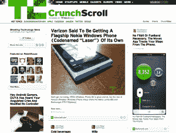
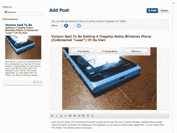

# RebelMouse 雇佣前 CNNMoney 和 VaynerMedia 的人才来构建其内容和合作关系

> 原文：<https://web.archive.org/web/https://techcrunch.com/2013/01/24/rebelmouse-hires-former-cnnmoney-and-vaynermedia-talent-to-build-out-its-content-and-partnerships/>

内容聚合和监管网站 RebelMouse 已经从 CNNMoney 和 VaynerMedia 雇佣了一些关键的前员工，该网站允许用户建立个人档案，从他们的社交网络账户以及其他来源获取内容。

自从[去年 6 月](https://web.archive.org/web/20230324083449/https://techcrunch.com/2012/06/15/rebelmouse-first-week/)向公众开放以来，RebelMouse 已经创建了 24 万个网站，其登陆页面的每月独立访客达到 150 万。该公司告诉我们，它看到了出版商的巨大需求，并与《时代》杂志合作开展年度人物活动。此外，它与 C-Span 在总统就职典礼上合作，将为 ESPN 杂志[的超级碗](https://web.archive.org/web/20230324083449/http://www.espnnext2013.com/)在线体验提供动力，并继续引入电影和电视资产来创建他们自己的“门户”

为了帮助 RebelMouse 建立这些合作伙伴关系和未来计划，它聘请了前 CNNMoney 社交产品负责人 Niketa Patel 担任内容总监，并聘请 VaynerMedia 的 Stephanie Bagley 担任合作伙伴关系总监。这是一次有趣的雇佣，因为 VaynerMedia 的创始人加里·维纳查克是 RebelMouse 的投资者和顾问。两人都将向山姆·爱泼斯坦(Sam Epstein)汇报工作，后者是 RebelMouse 的平台 VIP，此前曾在谷歌和赫芬顿邮报(HuffingtonPost)工作。是的，这是一个强大的内容监管和分发团队的开始。

除了这些角色，RebelMouse 开发团队现在有 24 人，并增加了 iOS 和 Android 专家来构建其移动产品。我与 RebelMouse 的首席执行官保罗·贝瑞谈论了该公司目前的状况以及我们对其未来的期望。

你看到小老鼠朝哪个方向走了？

 **贝里:** RebelMouse 正在解决实时和社交网络发布的一个核心问题。每个人的努力在每个网络上都是分散的，每个人都需要将所有的努力集中在一起，以展示他们是谁，并突出他们的努力和他们社区的最佳表现。我们认为企业和个人越来越多地使用相同的工具，这是一个很好的例子。大型出版商和品牌将使用 RebelMouse 为其网站上越来越多的部分提供支持。RebelMouse 将坚持免费增值模式，在这种模式下，rebelmouse.com/You 将永远是免费的，但你可以付费使用 RebelMouse 来增强你的域名，并使用更复杂的功能。RebelMouse 应该是每个人都使用的解决方案，从拥有大量收入或流量的公司到小公司。我们相信我们可以将网络效应应用到开放的网络上。今年，我们将重点放在构建越来越多的网络动态和产品参与度上，同时帮助与合作伙伴和直接与消费者一起扩大规模。

**TC:内容聚合是什么让你对这个领域如此感兴趣？**

我不认为 RebelMouse 是一个简单的聚合器。策展和内容创作的结合非常有趣。每个人都在他们的博客中挣扎，因为实时和社会对我们做了什么。五年前如果你的最后一篇博文是在三周前，你完全可以接受。今天开始变得尴尬。因此，当你在这些重要的社交网络上不断更新你的网站时，你也开始发布更多的原创内容。

**TC:像推特和脸书这样的公司对你的所作所为有什么反应？基本上，你是在从他们的目的地网站上偷走一些眼球。**

**贝瑞:**我们的任务是证明加入 RebelMouse 的 Twitter 用户发现 Twitter 对他们来说比以往任何时候都更加重要和必要。现在，他们知道这些互动正在填充他们的网站，而不是作为一个小工具，而是作为内容的核心部分，显示他们是谁，谁爱他们，以及哪些文章支持他们的世界论点，而不仅仅是接触那些在他们发推特时关注他们的人。我们非常努力地工作，以确保我们为这些网络增加价值。我们将关注推回到他们来自的网络，而不是要求他们只关注 RebelMouse。我们相信，尽管这些网络的规模和增长令人震惊，但它们仍处于萌芽阶段，我们可以成为它们的强大合作伙伴，帮助它们在参与方面获得更多投资回报。我们是首批使用新 Twitter API 并正式满足新显示要求的公司之一。随着他们的成长，我们将不断迭代并快速工作。

**TC:你现在是如何与社交网络合作的，将来你会如何与他们合作，以一种美丽的方式向你的用户展示事物？**

**Berry:** 我们正与每家公司合作，帮助用户了解互动和展示方面的最新最佳实践。例如，因为脸书是私人和公共的混合体，我们仔细查看每个帖子的权限，只发布明确标记为公共的内容，并发送仅供朋友起草的内容，以便您可以决定是否公开。RebelMouse 的一个基本特性是能够将故事定格在一个点上，这样对你个人或公司来说特别有意义的东西就不会在流中丢失。

TC:该产品的下一步是什么？

 **贝里:**我们对即将到来的更新感到非常兴奋。我们已经到达了一个临界点，在这个临界点上，我们不再对如何使用我们正在建造的东西抱有期望，而是被世界上一些最聪明的人在高流量、高影响的情况下使用。因此，我们与他们一起迭代，接受他们的反馈并将其循环回去，使 RebelMouse 变得复杂而简单。

特别是，我们真的很高兴为 Rebel Nav 添加内容，因为基本上人们可以即时创建基于主题的首页，邀请客座编辑，并在他们组织和创建内容时结识新朋友。我们致力于赞助内容解决方案，在使产品经久耐用的地方增加收入，并专注于在软件的每个层面创造网络动态。
———

我们都分享很多东西，很难把我们最喜欢的内容放在一个地方，以一种任何不完全痴迷于互联网内部工作的人都可以消费的方式显示。在它的核心，RebelMouse 让你策划你自己的杂志，充满了你选择分享的照片，故事和视频，按照你希望它们被分享的顺序。这是一个很好的脱离当前在 Twitter 或脸书上阅读持续信息流的模式。

把 RebelMouse 想象成你的网络混音带。虽然这不是一个全新的概念，但它与人们在 Pinterest 上收集物品的时代非常相关，因此这是该产品的正确时机。另外，玩起来也挺有趣的。