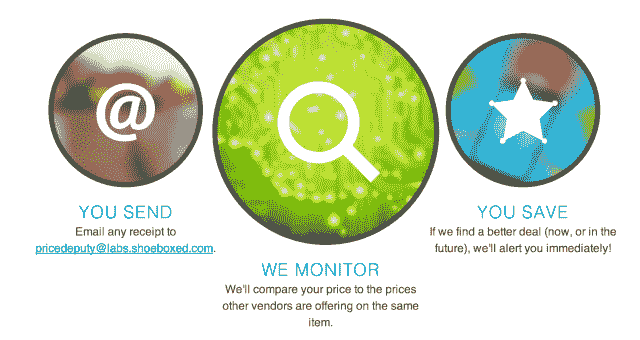

# 收据扫描服务 Shoeboxed 推出“实验室”，这是一个实验产品的地方，从价格下跌警报开始 TechCrunch

> 原文：<https://web.archive.org/web/https://techcrunch.com/2013/09/20/receipt-scanning-service-shoeboxed-launches-labs-a-place-for-experimental-products-starting-with-price-drop-alerts/>

收据和名片数字化服务 [Shoeboxed](https://web.archive.org/web/20221208110431/http://www.shoeboxed.com/) 现在开始对它扫描和在线存储的所有数据做一些事情，这些数据现在包括数千万张收据。该公司本周推出了一项名为“ [Shoeboxed Labs](https://web.archive.org/web/20221208110431/https://www.shoeboxed.com/labs/) ”的新计划，这将使它能够更快地向其核心服务推出实验功能。第一个功能被称为“[价格代理](https://web.archive.org/web/20221208110431/https://www.shoeboxed.com/labs/)”，这是一种价格比较服务，在消费者购买后提醒他们更好的交易。

选择加入服务的工作原理是将购物者的收据与鞋盒数据库中的其他收据进行比较。基本上，价格代表检查收据上的项目和支付的价格，并查看是否有其他人得到了更好的交易。如果是这样的话，消费者会收到警告，该服务会总结零售商的退货和价格匹配政策，以便他们也知道下一步该采取什么步骤——也就是说，是要求价格匹配还是简单地退货并在其他地方购物。

除了一个免费的 DIY 计划，Shoeboxed 本身在很大程度上是一项高级服务，计划范围从个人每月 9.95 美元到大型组织每月 99.95 美元。然而，价格代理是免费的，不需要注册或鞋盒账户。相反，该程序是一项独立的服务，只需通过电子邮件向 pricedeputy@labs.shoeboxed.com 发送一份收据即可。

目前，这适用于电子收据，但计划是未来将价格代理的支持扩展到纸质收据，并在测试期后将该功能集成到所有的小型账户类型中。该公司表示，在他们解决了错误和缺陷后，这一集成预计将在未来两到三个月内完成。

继 Price representative 的首次亮相之后，Shoeboxed 计划从现在起每两到三个月推出其他新的实验室产品，为它提供一种测试其他不属于 B2B 领域的东西的方法。其中大部分，比如 Price representative，最终会包含在 Shoeboxed 核心服务中，如果客户觉得它们有用的话。

该公司警告说，尽管在供应商或产品选择方面没有具体限制，但这项服务仍处于测试阶段，随着更多提交的到来，它正在提升其匹配技术。我们被告知，有时可能需要两次甚至三次尝试才能正确识别收据上的所有正确项目。

购买前进行价格比较的工具相当普遍，但如果你错过了一笔交易，事后提醒你的服务却很少。另一家名为 [Slice](https://web.archive.org/web/20221208110431/http://priceadjustment.slice.com/) 的风险投资公司是我们之前报道过的一家公司，它挖掘电子邮件收件箱数据，让你知道购买后价格是否下降。但是 Slice 在商家方面寻找价格变化——它只与符合条件的商家合作，如百思买、家得宝、诺德斯特龙、捷步达康、REI、Buy.com 等等。另一个， [OneReceipt](https://web.archive.org/web/20221208110431/http://www.onereceipt.com/#savecash) ，在退货政策即将到期时提醒你，但就此打住。

Shoeboxed 的价格代理是不同的，因为它利用了客户发送的原始数据(显然，没有透露购买的个人信息)。价格变化的信息来自人们在现实世界中支付的实际价格，而不是来自商家提供的数据。

感兴趣的测试者可以立即通过电子邮件发送收据，开始使用这项新服务。(更多信息[此处](https://web.archive.org/web/20221208110431/http://support.shoeboxed.com/knowledgebase/articles/249364))。

Shoeboxed 是在线收据扫描领域的早期参与者之一，早在 2007 年就在北卡罗来纳州的罗利-达勒姆地区成立了。虽然该公司没有披露其收入数据，但今年夏天它的现金流确实变成了正数，并表示在为下一阶段的增长做准备时，它将继续保持三位数的年增长率。

【YouTube = http://www . YouTube . com/watch？v=MCO4oLp0xPw&w=640&h=360]