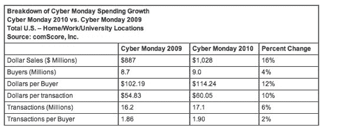
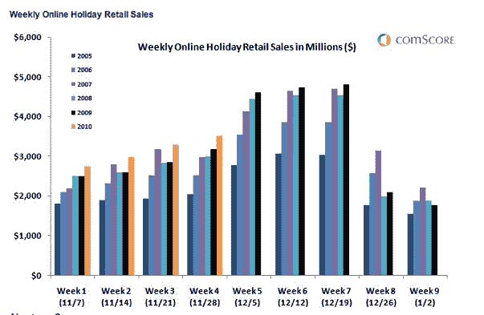

# 破纪录的网络星期一在美国在线消费超过 10 亿美元 

> 原文：<https://web.archive.org/web/https://techcrunch.com/2010/12/01/record-breaking-cyber-monday-surpasses-1-billion-in-u-s-online-spending/>

# 破纪录的网络星期一在美国网上消费超过 10 亿美元

在线零售商欢欣鼓舞！根据 comScore[的最新统计数据，](https://web.archive.org/web/20230203001214/http://www.comscore.com/Press_Events/Press_Releases/2010/12/Billion_Dollar_Bonanza_Cyber_Monday_Surpasses_1_Billion_in_U.S._Spending)美国在线消费在网络星期一(感恩节和黑色星期五后的星期一)超过 10 亿美元，比一年前增长了 16%。这一天也标志着历史上最大的在线消费日，也是第一个消费超过 10 亿美元的日子。

据 comScore [报道](https://web.archive.org/web/20230203001214/http://www.comscore.com/Press_Events/Press_Releases/2010/11/Black_Friday_Boasts_648_Million_in_U.S._Online_Holiday_Spending)周末，美国网购者在黑色星期五的网上销售额为 6.48 亿美元，比去年增长了 9%，也创下了电子商务史上最大消费日的记录。到目前为止，该公司报告称，假日季的网上支出为 135.5 亿美元，与去年同期相比增长了 13%。

comScore 主席 Gian Fulgoni 在一份声明中表示,“消费者支出的早期增长几乎肯定是零售商在这个季节早期比正常情况下更大的促销和折扣活动的结果。“随着假期的临近，零售商继续进行折扣和促销活动，这应该是件有趣的事情。

创纪录的十亿美元日主要归因于每位买家的平均支出增加(增长 12%)，而买家数量仅增长 4%，达到 900 万。每笔交易的平均支出增长了 10%，达到 60.05 美元，而交易总数增长了 6%，达到 1710 万笔。

当然，网络星期一的销售得益于许多消费者可以在工作时在线购物。美国网站近一半的网上消费来自工作电脑(48.9%)。这实际上比去年下降了 3.8 个百分点。在家购买占剩余份额的大部分(45.4%)，而在美国网站上从国际地点购买占销售额的 5.8%。

支出的大幅增加并不完全令人惊讶。经济形势比去年稍好，零售商继续降价促销。comScore 几周前预测，假日季的在线支出将达到 324 亿美元，比去年增长 11%。但是随着破纪录的网络星期一和黑色星期五消费，这个数字可能会随着几周的过去而增加。

