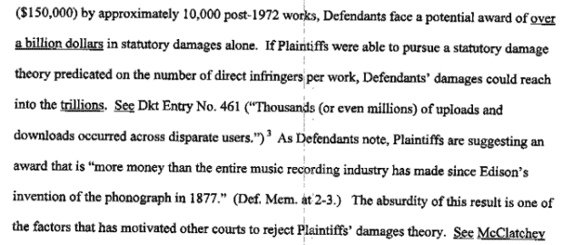

# 唱片业:Limewire 可能欠下 75 万亿美元——法官:“荒谬”

> 原文：<https://web.archive.org/web/https://techcrunch.com/2011/03/24/record-industry-limewire-could-owe-75-trillion-judge-absurd/>

# 唱片业:Limewire 可能欠 75 万亿美元——法官:“荒谬”

所以我们现在对唱片业在盗版案件中鲁莽地试图分配损害赔偿时表现出的令人震惊的愚蠢已经相当麻木了——当他们告诉一个分享了 24 首歌曲的女人，她[欠了将近 200 万美元](https://web.archive.org/web/20221007025704/http://www.crunchgear.com/2009/06/19/24-songs-woman-ordered-to-pay-192-million-to-riaa/)时，有人感到惊讶吗？是的，荒谬。但是这个——*这个*简直不可理喻。这是…崇高的。

起诉 Limewire 的唱片公司被要求估算文件共享服务应该支付的损失。他们的估计？低端 4000 亿美元，高端 75 万亿美元。这比整个世界的国内生产总值还要多。

法官凭着敏锐的判断力，[认为这些潜在的损害赔偿是“荒谬的”](https://web.archive.org/web/20221007025704/http://www.law.com/jsp/cc/PubArticleCC.jsp?id=1202486102650&Manhattan_Federal_Judge_Kimba_Wood_Calls_Record_Companies_Request_for__Trillion_in_Damages_Absurd_in_Lime_Wire_Copyright_Case)并且原告的做法是“站不住脚的”。75 万亿美元的数字依赖于对版权法的解释，该解释为每一次复制提供了法定损害赔偿，加上该行业声称的下载量和单首歌曲的数量，这笔钱很快就会增加。即使是 4000 亿美元的数字，也肯定是严重膨胀的，无论它在维珍、大西洋、索尼等看来多么“保守”。

人们认为，对版权法的解释使音乐行业能够起诉获得比他们在录制音乐历史上获得的更多的钱，这必然是错误的，因此损害赔偿被减少到“被告对每件侵权作品的单一法定损害赔偿，而不管有多少个人用户直接侵犯了该特定作品。”

当然，这个数额会有所不同，取决于被证明侵权的作品数量，以及法官对每件作品的裁决。这很重要，不是因为 Limewire 将不得不支付更少的费用(他们可能已经因为法律费用而破产)，而是因为它对我们过时的版权法进行了“合理”的解释，并限制了共享歌曲的潜在价值。这并不完全类似，但至少是前面提到的杰米·托马斯-拉塞特在法庭上可以依靠的东西。

哪家唱片公司拥有《时代在变》的版权？他们应该听一听。

[通过[热硬件](https://web.archive.org/web/20221007025704/http://hothardware.com/News/Record-Labels-Claim-Limewire-Liable-For-75-Trillion-in-Damages/)