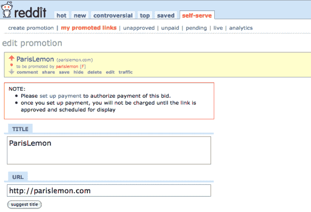

# Reddit 向任何愿意付费的人开放主页(邀请)

> 原文：<https://web.archive.org/web/https://techcrunch.com/2009/11/12/reddit-advertising/>

在一个脸书和推特占据头条的世界里，人们很容易忘记其他社交属性，如 Reddit(T2)仍然为网站带来大量流量。但他们绝对有，现在你可以花钱买了。从今天开始，Reddit 正在测试一项新的封闭测试实验，允许任何人在 Reddit 的主页上购买赞助链接。是的，这意味着你，而不仅仅是一些随机的广告商。不仅仅是主页，它还是顶部的整体链接。

现在，很明显，这个链接将被清楚地标记为“赞助商”，但这不应该使它对一些想为他们的网站带来流量的人来说是一个诱人的机会。Reddit 表示，在这个区域投放的广告点击率在 2%到 10%之间。至少，这应该意味着成千上万的点击量来到你的网站，否则不会得到。

那么有什么问题呢？唯一的问题是钱。只要你愿意每天至少支付 20 美元，Reddit 就会把你和其他愿意付费的人放在一起，决定你在主页上的曝光时间。例如，如果一天的总出价等于 200 美元，而你的最低出价为 20 美元，你将获得该天 10%的广告位。看起来很有可能每天的出价会比这个数字高很多，所以 20 美元可能买不了多少东西，但它仍然会让你有所收获。

在这个测试版中，将不会有针对特定 Reddit(例如[政治 Reddit](https://web.archive.org/web/20230224211701/http://www.reddit.com/r/politics/) )的能力，但计划是最终提供这种选择，以更好地匹配个人广告商和他们试图接触的观众。

添加您自己的自助广告非常简单。一旦你被接受进入测试版，你只需为你的链接填写一个标题，输入网址，输入你希望运行你的活动的持续时间，可选地禁用评论，输入你的出价金额，然后上传一张图片(如果你选择)。然后，您通过在表单中输入您的信用卡信息来付款。

最棒的是，就像普通的 Reddit 项目一样，用户可以对你的广告进行投票，这意味着如果你的内容确实很好，你甚至可以在主页上出现更长时间。

该公司指出，用户多年来一直试图利用该系统来获取流量，因此这是允许他们付费获取流量的合理延伸。它在一月份正式为广告商(大牌)推出了赞助商链接。Reddit 的主要竞争对手 Digg 也有广告投票系统，但目前为止，它只对 Digg 的广告合作伙伴开放，而不是任何愿意付费的人。假设他们制定了指导方针(T2，Reddit 有 T3)，不难看到这种模式最终也会走向 Digg。

Reddit 的创始人[史蒂夫·霍夫曼](https://web.archive.org/web/20230224211701/http://www.crunchbase.com/person/steve-huffman)和[亚历克西斯·奥哈尼安](https://web.archive.org/web/20230224211701/http://www.crunchbase.com/person/alexis-ohanian)，最近[离开了公司](https://web.archive.org/web/20230224211701/https://techcrunch.com/2009/10/27/three-years-after-their-acquisition-reddit-founders-move-on/)，三年前的一天，康泰纳仕[收购了他们](https://web.archive.org/web/20230224211701/https://techcrunch.com/2006/10/31/breaking-news-conde-nastwired-acquires-reddit/)。但他们显然仍然参与其中，正如我们与 Ohanian 谈论这次新的发布，他似乎对此非常兴奋。

作为发布的一部分，Reddit 给了我们一些邀请，让 TechCrunch 的读者来看看这个自助广告系统。前 50 名给 reddit.com 万灵顿发邮件的人将会收到邀请函。

