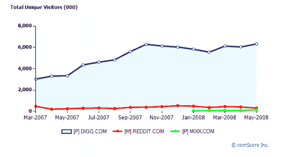
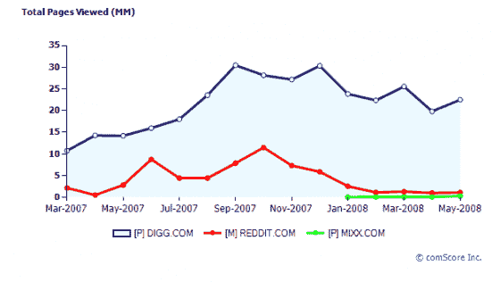

# 更新:Reddit 试图以开源方式竞争 

> 原文：<https://web.archive.org/web/https://techcrunch.com/2008/06/18/reddit-tries-to-compete-the-open-source-way/>

# 更新:Reddit 试图以开源的方式竞争

成为第二名并不容易。正如我们[昨天](https://web.archive.org/web/20230210004006/https://techcrunch.com/2008/06/17/what-is-reddit-announcing-tomorrow-and-why-is-a-penguin-involved/)暗示的那样，Reddit，新闻投票网站，于 2006 年被 Conde Nast 收购，正在开放其网站[的代码。](https://web.archive.org/web/20230210004006/http://blog.reddit.com/2008/06/reddit-goes-open-source.html)(代码可以在[这里找到](https://web.archive.org/web/20230210004006/http://code.reddit.com/))。这意味着任何人现在都可以创建自己的类似 Digg 的网站。这并不是说 Digg 的复制品在过去一直都不存在。Reddit 开源软件的举动仅仅是承认它已经是一种商品。

事实是，并不是技术让 Digg 或 Reddit 这样的网站成功。是使用它们的人。使用它们的人越多，它们就越有用。这是一个典型的、网络效应的、赢家通吃的市场。

尽管 Reddit、Mixx 和其他公司做出了巨大努力，但赢家显然是 Digg(只要它不疏远核心用户)。根据 comScore 的数据，今年 5 月，Digg 的美国访问量和浏览量是 Reddit 的 20 多倍。即使 comScore 统计不足，相对差距只有一半(这是 Compete 的数据显示的)，这仍然是不可逾越的。

(注意，comScore 几乎肯定低估了 Reddit。它衡量的 5 月份美国独立访客只有 30 万，而 Digg 的独立访客有 630 万。而 Compete 分别为 240 万和 2400 万。这就是为什么在这种情况下，查看相对差距比查看绝对数字更能提供信息。这是一个 comScore 图表比较浏览量。看看 Reddit 这一年有多平淡。

