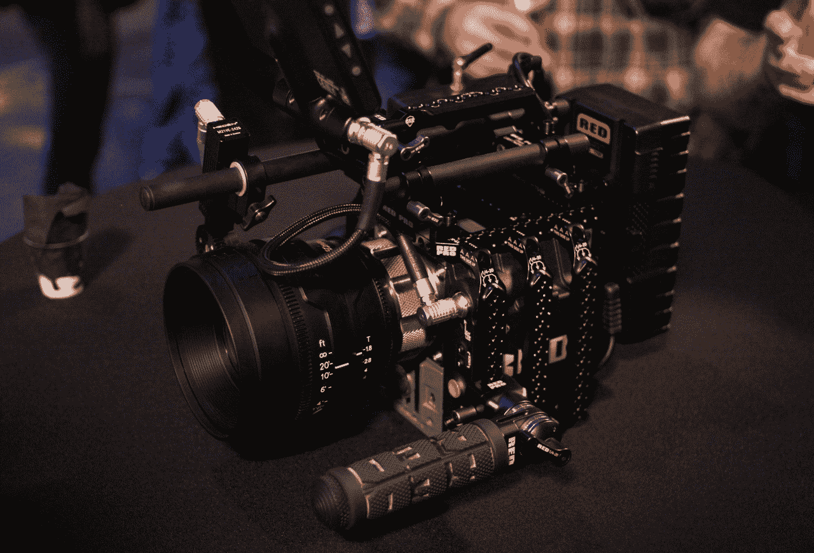
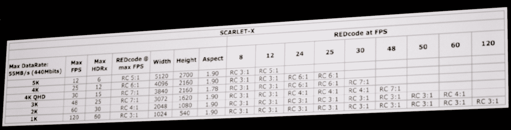

# RED's Scarlet 正式上市:4K 售价低于 10K 

> 原文：<https://web.archive.org/web/https://techcrunch.com/2011/11/03/reds-scarlet-gets-official-4k-for-under-10k/>

三年多来，新贵相机制造商 [RED](https://web.archive.org/web/20230204120652/https://techcrunch.com/tag/red/) 一直在戏弄 Scarlet，这是一款紧凑型相机，与他们功能更强大但体积更大的 RED One 和 Epic 相机处于同一级别。我们实际上在今年的 CES 上看到了一个，但他们完全重做了设计和功能。他们打算在他们的网站上公布所有这些信息，但他们显然受到了攻击，所以我们在现场直播。

它以前做 3K，有一个固定的 8 倍变焦。现在，它基本上是与 Epic 相同类型的相机(也就是说，一种可以固定镜头等的笨重“大脑”)，只是价格低得多。

大脑:

全副武装:

[这款名为 Scarlet X](https://web.archive.org/web/20230204120652/http://www.red.com/products/scarlet) 的手机售价为 9750 美元，最早将于 11 月 17 日发货——他们说会提前发货，至少是在他们修改了十几次发货预期之后。那么它能做什么呢？

嗯，首先，它对 4K 有影响。也就是 4096×2160，最高 25FPS，或者 30 的 quad HD。这比他们多年来拍摄电影的压缩率更高，但数据速率仍然是佳能新 C300 系统的 8 倍。这相当于每秒 50 兆字节，或者说对于那些保持跟踪的人来说是每秒 400 兆字节。静态图像的完整传感器尺寸为 5120×2700。

它还可以以 48fps 的速度进行 3K，以 60fps 的速度进行 2K，以 120fps 的速度进行 1K，这是一个相当低的分辨率，但保留了颜色深度等。这是一个超 35 尺寸的传感器，他们使用 Epic brains 的剩余芯片，价格几乎是它的三倍。事实上，如果你用同样的镜头用《猩红》和《史诗》拍摄同样类型的镜头，图像应该是“相同的”对于喜欢这类东西的人，这里有一些数据速率规格:

从美学角度来看，它与其他产品相似，因为它与所有配件都兼容，但它是“战舰灰”，正如 RED 创始人吉姆·詹纳德(Jim Jannard)所描述的那样，它没有“肋骨”，因为“她是个女孩，她很光滑。”

它将于 11 月 17 日发货，但前提是你愿意多花 1500 美元购买钛 PL 支架。他们正在安装的新铝制佳能支架将于 12 月 1 日开始上市。9750 美元的价格让你得到了大脑和固态硬盘；Jannard 说，一台全功能相机，包括 LCD、镜头、导轨和手柄，将花费你大约 13k 美元。