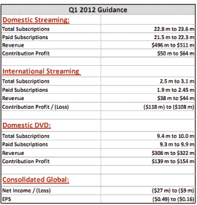

# 雷德·哈斯汀斯:“我们预计 DVD 订户每个季度都会下降...永远”TechCrunch

> 原文：<https://web.archive.org/web/https://techcrunch.com/2012/01/25/reed-hastings-we-expect-dvd-subscribers-to-decline-every-quarter-forever/>

在去年夏天发生了一些相当大的失误后，网飞在 2011 年余下的时间里饱受煎熬，股价大幅跳水，订户纷纷离开。这就是为什么当网飞今天反弹[第四季度收益](https://web.archive.org/web/20230205031500/https://techcrunch.com/2012/01/25/netflix-q4-earnings-beat-the-street-but-next-quarter-may-be-a-different-story/)——超过华尔街的预测——尽管由于在国际上推广其服务的成本(以及其他因素),预计 2012 年全年将出现亏损时，至少有点令人惊讶。

当然，虽然创建 Qwikster(并拆分其 DVD 和流媒体业务)在回想起来似乎是欠考虑的，[正如 Erick 今天指出的](https://web.archive.org/web/20230205031500/https://techcrunch.com/2012/01/25/netflixs-streaming-dvd-margins/)，网飞第四季度的收益表明，该公司有一些不那么微不足道的经济动机来分离这两者。第四季度，网飞首次将 DVD 与流媒体分开，表明这两项业务的利润率截然不同，流媒体的利润率为 11%，而 DVD 业务的利润率为 52%。

另一方面，每个人都知道流媒体内容比 DVD 有更光明的未来，所以网飞(和其他人)可能不得不在这方面“咬紧牙关”，对吗？毕竟，当首席执行官雷德·哈斯汀斯今天下午在网飞 4Q 收益电话会议上被问及 DVD 盈利能力和用户份额的未来时，他只是简单地说:“我们预计 DVD 用户每个季度都会下降……永远下降。”

例如，在 2011 年最后一个季度，DVD 业务失去了 276 万用户，而流媒体却增加了 22 万。虽然它希望流媒体订阅率将在明年回升(包括国内和国际)，但没有理由认为下降的 DVD 数量将会改变。

然而，DVD 业务有固定成本，网飞被迫不断争夺流媒体内容的权利，因此，在短期内，人们会认为其 DVD 业务将更加有利可图；然而，黑斯廷斯说，在现实中，情况恰恰相反。

流媒体用户现在比 DVD 用户多 2:1，首席执行官说边际流媒体用户“几乎是纯粹的贡献”，而普通 DVD 用户导致许多可变成本。

“每个新流媒体用户的盈利能力几乎是 DVD 的两倍……我们显然希望他们两者都做，但如果他们只打算使用一个，我们更希望他们使用流媒体，”他说。

网飞将继续专注于国际扩张，尽管扩张的成本会影响明年的收益，但领导层坚信海外的机会。尽管亚马逊去年收购了 LoveFilm(英国版的网飞)，但领导者们认为 LoveFilm 的业务仍然以 DVD 为主。黑斯廷斯说，盈利能力自然基于竞争壁垒和规模。

 虽然他们认为 LoveFilm 和其他公司显然构成了一些竞争壁垒，但它们的价格大多很低，因此在国际上开拓流媒体市场的机会可能是巨大的，而且可能非常有利可图。基本上，黑斯廷斯的话暗示，网飞在国外的点播视频流方面并没有真正看到任何大规模的竞争，所以他们正在积极投资，以“在游戏中处于领先地位”

在今天的投资者电话会议上，黑斯廷斯和首席财务官大卫·威尔斯提出了其他一些有趣的观点。其中之一是，尽管他们[现在认为拆分业务是一个错误](https://web.archive.org/web/20230205031500/https://techcrunch.com/2011/10/24/reed-hastings-qwikster-symbol-not-listening/)，但他们继续袖手旁观去年 7 月 60%的价格增长，这确实是网飞在今年剩余时间里经历的订户流失背后的主要驱动力。自那以后，网飞的股票从每股 300 美元左右跌至不到 70 美元。呀。

然而，威尔斯说如果让他重来一次，他会再次做出同样的决定。我明白了…关于信息的事情，马后炮是 20/20，等等。等等。但是如果他们的内容没有明显的改善，网飞仍然面临着失去客户的危险。很难与有线电视网竞争独家经营权，但与 DVD 相比，他们的流媒体选择仍然相形见绌。

另一个有趣的地方是，虽然智能电视流媒体是其业务增长最快的部分，3d 流媒体将是未来的一大亮点，但网飞没有进入视频游戏租赁的计划，这将是 Qwikster 的一项新功能。有些人可能认为，凭借其发行规模，网飞可以轻松进入视频游戏租赁市场，并迅速开始削弱竞争。但高管们表示，事实并非如此。听到这个消息，Redbox 和 Gamefly 显然会松一口气。(至少目前是这样。)

今天电话中的第二个问题是问黑斯廷斯和威尔斯为什么他们不考虑单点选择(即按次付费)，暗示这可能有助于他们成为电影和电视节目的一站式商店。考虑到我们许多人可能都经历过的一个例子，这是一个有趣的话题。如果你没有 Tivo，而你碰巧错过了你喜欢看的一集电视连续剧，并且你想免费观看，那么你就不走运了，Hulu 和一些大型有线电视网是个例外。黑斯廷斯和威尔斯似乎暗示，电视网只会越来越多地在自己的网站上播出他们的节目(这越来越受欢迎，例如，看看福克斯)。

如果网飞在《广告狂人》播出后立即提供按次付费的剧集，这难道不是顾客会喜欢的吗？很可能，但 Hulu 已经赢得了很多这些权利(其中大部分是视频流中的独家权利)。黑斯廷斯说，他认为“为所有人提供一切”没有太多的品牌优势，以低费用提供无限制的流媒体视频是他们品牌主张的核心——增加按次付费会混淆品牌身份和客户。

他说，随着 Vudu、亚马逊、百视达(Blockbuster)和更多公司已经加入游戏，已经有一大批公司提供按次付费服务，“我们不认为我们有办法做得更好。”

“从某种意义上说，这是一个利基市场，”这位首席执行官说，“但这是一个非常大的利基市场，我们认为我们可以领导它。”他说，我想到了杜比数码，这是网飞想要做的事情的一个例子——在每个平台上，和每个人相处。很明显，这是另一种说法，在这一点上，按次付费会给它的关系带来压力，它可以催化的潜在客户获取不值得花费。

[在这里收听网络直播](https://web.archive.org/web/20230205031500/http://ir.netflix.com/events.cfm)。