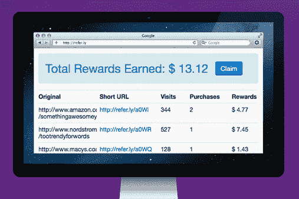

# Refer.ly 让普通人通过推荐他们喜欢的产品获得代销商收入 TechCrunch

> 原文：<https://web.archive.org/web/https://techcrunch.com/2012/05/14/refer-ly-lets-regular-folks-earn-affiliate-revenue-for-recommending-products-they-love/>

丹妮尔·莫里尔的这个想法至少已经考虑了三年。我知道这一点，因为几年前，在一次晚宴上，她几乎可以连续讲一个小时。

如果你是一名企业家，当你被一个想法打败时，你无法摆脱它。因此，在像 Twilio 这样的建筑公司实习了几年后，Morrill 终于凭借 [Refer.ly](https://web.archive.org/web/20221006162102/http://refer.ly/) 开创了自己的事业，这一概念已被纳入下一期 Y Combinator 课程。

有什么想法？在网络上，有一个 30 亿美元的秘密联盟商务世界，像亚马逊这样的大型网上商店奖励其他公司或个人向他们推荐客户。普通人并不真正参与其中，所以 Morrill 的公司 Refer.ly 给了他们访问权限。

在 [Refer.ly](https://web.archive.org/web/20221006162102/http://refer.ly/) ，你可以创建专门的链接，跟踪你是否在推动其他网站的销售。如果一个推荐最终让你的朋友或家人购买了你的产品，你将获得一小笔佣金(根据产品的不同，佣金通常从百分之几到百分之十不等)。如果你赚了超过 10 美元，你可以拿出来，捐给慈善机构或与朋友分享。

“整个互联网都以这种方式货币化，人们往往在不知不觉中被货币化，”Morrill 说。“任何有‘购买’按钮的网站都有会员计划。但是很难成为加盟商。注册的过程相当漫长。”

她称之为“人人加盟”的概念。目前是基本产品。只有直接推荐人赚加盟费。因此，如果你分享一个链接，朋友的朋友的朋友最终购买了该产品，你将是唯一赚取佣金的人。她还暂时放弃了 Refer.ly 用户的全部会员费。所以公司没有提成。

莫里尔自己建造了许多初始原型。令人印象深刻的是她的决心。她没有上过大学，也不觉得有必要。但是她知道她想成为一名企业家。我想你可以说她花了几年时间研究建立公司的艺术。她在一家初创公司工作，当时这家公司还为时过早。Pelago 开发了一个名为 Whrrl 的早期位置共享应用，但它在与媒体宠儿 Foursquare 的竞争中并没有太大的吸引力。它[在一次人才收购中去了 Groupon](https://web.archive.org/web/20221006162102/https://beta.techcrunch.com/2011/04/18/groupon-acquires-whrrl-creator-pelago/)。

但不久之后，一个坚实的打击。Morrill 是第一个加入 Twilio 的非创始员工，Twilio 是一家允许开发人员使用 IP 语音、短信和普通电话号码来破解和构建应用程序的公司。该公司支持超过 30，000 名开发人员，[已经在几轮风险投资中从 Union Square Ventures 和 Bessemer Venture Partners 筹集了超过 3，300 万美元。](https://web.archive.org/web/20221006162102/https://beta.techcrunch.com/2011/12/07/twilio-series-c/)

在那里领导市场营销时，她自学了编码。“多年来，我身边都是营销人员和技术产品经理，”她说。“我不得不学习如何自己建造东西。”

在 Twilio 首席执行官杰夫·劳森的支持下，她辞职去追求自己的想法。她招募了她的丈夫凯文·莫里尔、另一位联合创始人艾尔·阿布特以及一名工程师和一名营销专家。劳森是公司的天使，500 Startups 的戴夫·麦克卢尔也是。

当然，有很多问题。几美元的代销商收入会足够激励人们使用 Refer.ly 吗？难道我们不只是与朋友和家人分享产品，因为我们真诚地喜欢帮助别人吗？

Morrill 说她并不期望 Refer.ly 的用户能靠这个产品谋生。她今天刚刚推出，看看市场反应如何。

“我们正处于 YC 的开端，所以我想知道人们现在想要什么。等几个星期真的很冒险，”她说。

确实如此。动作要快，要早破事。