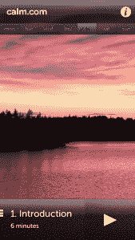

# 放松资源 Calm.com 推出帮助你放松的 iPhone 应用程序，获得 41.5 万美元天使投资 

> 原文：<https://web.archive.org/web/https://techcrunch.com/2013/02/26/relaxation-resource-calm-com-launches-iphone-app-that-helps-you-chill-grabs-415k-in-angel-funding/>

Calm.com 最初是一个帮助忙碌的、信息超载的网络工作者休息精神的网站，现在正变成一个真正的企业。该公司今天宣布从一些著名的天使投资者那里获得 41.5 万美元的资金，并推出最初旨在教授放松的移动应用程序。

《平静》的新投资者包括[迈克尔·伯奇](https://web.archive.org/web/20221006010731/https://angel.co/mickbirch)(猴子地狱，Bebo)[乔·格林斯坦](https://web.archive.org/web/20221006010731/https://angel.co/joseph77b)(弗利斯特，烂番茄)[安迪·麦克洛林](https://web.archive.org/web/20221006010731/https://angel.co/bandrew)(赫德)[塔布雷兹·维尔吉](https://web.archive.org/web/20221006010731/https://angel.co/tabreez-verjee) (GAC，Kiva)[奥列格·茨切尔佐夫](https://web.archive.org/web/20221006010731/https://angel.co/olichoun)(福托利亚)[基里尔·马卡林斯基](https://web.archive.org/web/20221006010731/https://angel.co/kirill)(奥斯特罗沃克)[杰夫·坎塔卢波](https://web.archive.org/web/20221006010731/https://angel.co/jeff-cantalupo)(聆听)

你可能还记得去年夏天读到的关于 Calm.com 的报道，当时它开始引起一些轰动。(例如，这个商业内幕标题[相当有趣地总结了它](https://web.archive.org/web/20221006010731/http://www.businessinsider.com/the-hyper-active-weirdos-of-silicon-valley-are-going-crazy-for-this-site-that-calms-them-down-2012-6):“硅谷极度活跃的怪人正为这个让他们平静下来的网站而疯狂。”)这个想法似乎触动了一种文化的神经，在这种文化中，一切都是向前推进，不休息，不睡觉，永远保持联系。

Calm.com 网站是由 Alex Tew 创建的，他因之前的努力而闻名，如 PopJam，The Million Dollar 主页和[Calm 2011 年的 pre-cursor，Do Nothing For 2 Minutes](https://web.archive.org/web/20221006010731/https://beta.techcrunch.com/2011/01/21/creator-of-million-dollar-homepage-makes-do-nothing-for-2-minutes/) 。

“我每天都在与对社交媒体和信息的沉迷作斗争，”图说。“这些年来，我注意到它影响了我的注意力……我认为现在大多数人都是如此。”

 图从 14 岁就开始冥想，他说他对放松技巧感兴趣已经有一段时间了，比如平静带来的放松。但令他惊讶的是“什么都不做”网站的反应——在第一天就跃升至 200 万后，他意识到除了有趣的兼职项目外，可能还有其他潜在的东西。

此后不久，他与 Calm 的联合创始人迈克尔·阿克顿·史密斯(Michael Acton Smith)合作进行这项新工作。史密斯今天仍然是联合创始人，尽管没有参与日常工作，因为他也是游戏公司 Mind Candy 的首席执行官和创始人，该公司是广受欢迎的 Moshi Monsters 游戏的开发商。图说，史密斯每周检查，仍然坐在董事会，但迄今为止的发展来自他自己和另一名工程师目前。(但他现在正在寻找新员工。)

有了 iPhone 专用的移动应用程序，用户可以通过一个名为“冷静的 7 个步骤”的程序，这个程序是由伦敦的冥想老师 Maggie Richards 开发的。该应用程序是免费下载的，第一次会话是免费的，但要解锁其余部分，则需要 4.99 美元的应用内购买。

“我们尽量不使用‘冥想’这个词”，图指出。他说，这个词让一些人望而却步，他们认为这是他们必须学习的全新技能。“我们希望人们去 Calm.com，而不是不得不学习冥想，冥想被认为是一件沉重、高摩擦的事情，”他说。“我们想要更简单的东西。如果你需要冷静，你可以去 Calm.com，按照指示去做。”

该公司的长期愿景是超越一个简单的放松应用程序，成为一个提供其他类型个人发展工具的平台，从戒烟到学习更具创造力。用户可以选择在订阅的基础上订阅 Calm 的内容。“如果我们能成为个人发展的网飞，”图说，“那就太棒了。”

更深入地进入个人发展市场将意味着 Calm 可以与市场风格的资源竞争，例如 [LiveNinja](https://web.archive.org/web/20221006010731/https://beta.techcrunch.com/2012/12/07/backed-by-500000-in-seed-funding-liveninja-launches-its-video-chat-marketplace/) ，后者更广泛地为用户提供了一种教授他人并提供建议或服务的方式。但图说，他不会采取平静下来的市场路线，因为该公司将仍然是所有内容本身的生产者。

Calm 的新应用程序[现已在苹果应用商店](https://web.archive.org/web/20221006010731/https://itunes.apple.com/us/app/calm.com/id571800810?ls=1&mt=8)上架。