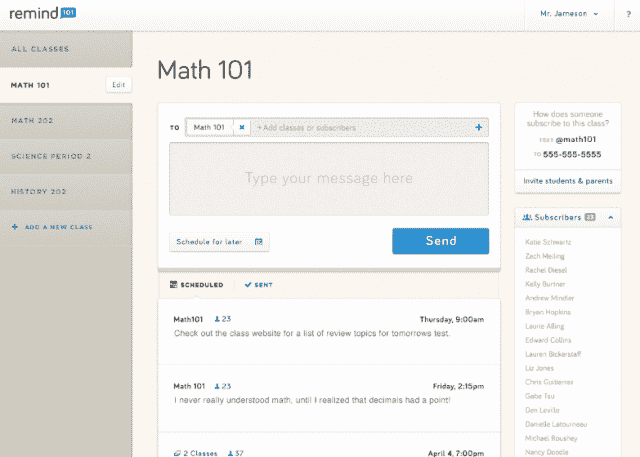
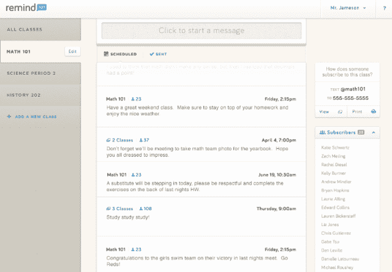

# Red Hot Remind101 从约翰·杜尔登获得 1500 万美元，为教师提供免费、安全的短信服务

> 原文：<https://web.archive.org/web/https://techcrunch.com/2014/02/04/remind101-gets-15m-from-john-doerr-to-bring-free-secure-text-messaging-to-teachers/>

布雷特和大卫·科普夫兄弟于 2011 年末在[推出了](https://web.archive.org/web/20230313195359/http://www.imaginek12.com/)[remind 101](https://web.archive.org/web/20230313195359/https://www.remind101.com/)Imagine K12，以解决他们认为小学教育中的一个关键问题:缺乏简单、用户友好的工具来帮助教师更好地与学生及其家长沟通。今天，尽管有效沟通在 K-12 学习等式中非常重要，但学校仍然依赖对讲机、PA 系统、纸质许可单和电话树。换句话说，他们用了 50 年的工具。

Remind101 去年发布了适用于 Android 和 iOS 的移动应用程序，以帮助弥合这一沟通鸿沟，创建了一个移动平台，使教师能够通过文本和电子邮件向学生和家长发送提醒——无论是关于许可单还是截止日期——并作为一个安全的私人通信网络。这款应用很快在教师中流行起来，此后需求一直没有放缓。

[到去年 9 月](https://web.archive.org/web/20230313195359/https://techcrunch.com/2013/09/18/now-in-30k-schools-remind101-lands-3-5m-from-socialcapital-yuri-milner-more-to-bring-texting-to-teachers/)，Remind101 拥有 600 万教师、学生和家长用户，如今这一数字已经增长到 1000 万，每月通过 Remind101 平台发送的消息超过 6500 万条。1000 万的用户数量使这家初创公司成为教育技术领域的独家公司——这一事实没有被投资者忽视。

这就是为什么今天，[在完成来自 Social + Capital、尤里·米尔纳、Maneesh Arora 和一些天使投资人的 350 万美元 A 轮融资后四个多月，Remind101 又为其金库增加了一枚硬币。](https://web.archive.org/web/20230313195359/https://techcrunch.com/2013/09/18/now-in-30k-schools-remind101-lands-3-5m-from-socialcapital-yuri-milner-more-to-bring-texting-to-teachers/)

今天，这家初创公司宣布完成了 1500 万美元的 B 轮融资，由凯鹏华盈(Kleiner Perkins Caulfield & Byers)领投，之前的投资者也参与了进来，包括 Social + Capital 和 First Round Capital。作为这轮融资的结果，凯鹏华盈合伙人、资深投资人约翰·杜尔登将加入这家初创公司的董事会，与他一起加入董事会的还有 Social + Capital 创始人查马斯·帕里哈皮蒂亚(Chamath Palihapitiya)，后者是 Remind101 首轮投资的一部分。

尽管凯鹏华盈最近经历了起起落落，但加入像多尔这样的资深投资者对这家成立两年的初创公司来说是一大胜利。虽然他自己的投资记录，[正如我们在](https://web.archive.org/web/20230313195359/https://techcrunch.com/2013/07/23/john-doerr-on-zynga-investment-we-own-60m-shares-so-i-want-that-stock-back-above-10-where-god-intended-it/)之前提到的，并不完美，但谷歌联合创始人兼首席执行官拉里·佩奇被引用说多尔“首先看到未来”是有原因的

多尔自 1980 年以来一直是凯鹏华盈的合伙人，投资过网景、太阳微系统、Intuit、亚马逊、谷歌、Twitter 和赛门铁克等公司。近年来，他也成为了创新和教育改革以及其他领域的大力支持者和传播者。Remind101 现在是 Doerr 担任董事会成员的两家教育公司之一，另一家是 Coursera，尽管是教育创新的倡导者，也是 Doerr 进行的少数几项教育投资之一，Coursera 和 Dreambox Learning 也是其中之一。

当我们问凯鹏华盈的合伙人，他为什么选择领导公司对 Remind101 的投资时，他简单地回答说，“所有的研究都表明，当你让老师、家长和学生更经常地交流时，你会获得更好的学习成果。”多尔暗指长期以来(现在有数据支持)的信念，即学生更有可能成功，毕业，并在家庭和家长积极参与学生教育事业的情况下更有效地学习。

虽然这对于许多家庭来说可能很难实现，但 Doerr 和 Remind101 创始人都认为，第一步是减少障碍，或者让父母和老师更容易弥合沟通差距，并鼓励双方更经常地对话。

传统上，教育创业公司不得不在系统内工作，以销售到 K-12 学校；换句话说，销售过程和采用倾向于只在地区和州一级起作用(或者至少是最有利可图的)。当然，赢得地区或州的合同需要时间、精力和处理令人头疼的官僚审批程序。多尔说，Remind101 的另一个吸引力是，创业公司不必获得机构的批准就可以在学校内运营，也不必获得学区的批准。

相反，Remind101 可以直接向教师销售(尽管这有些误导，因为该平台是免费使用的)。不仅如此，随着 Remind101 的采用和渗透率增加，Doerr 看到了该平台成为向教师和学校追加销售额外优质功能的接入点的潜力。

例如，这些功能可能包括通过移动设备签署文书、传输和共享许可单、促进支付、交易和其他服务，所有这些都可以构建在该平台之上。比方说， [TigerText 与](https://web.archive.org/web/20230313195359/https://techcrunch.com/2014/01/27/tigertext-raises-21-million-series-b-to-bring-secure-realtime-messaging-to-the-enterprise-and-healthcare/) K-12 教育并无不同。尽管教师可以免费使用该平台，科普夫夫妇告诉我们，他们计划在可预见的未来保持这种方式，这就是 Remind101 如何开始赚钱的方式。

然而，凭借新的资金，Remind101 创始人计划加大招聘和产品开发力度，在未来一年将现有的 15 人团队增加一倍，并特别关注增加销售和业务开发团队。在产品方面，如上所述，Kopfs 计划在未来几个月内开始向平台添加额外的服务，例如，让教师能够调查家庭反馈和签署文件。

“事实上，”首席执行官布雷特·科普夫说，“老师们过度劳累，难以给予每个学生他们想要的单独关注，同时面临着找到与学生及其家长沟通的最有效渠道的困扰。”

虽然今天的学生接触到越来越多的数字和移动网络和平台，但共同点仍然是手机，因为 12 至 17 岁的青少年中约有 78%有手机。此外，任何一个在过去一年中接触过青少年的人都可以证明，发短信往往是与青少年沟通的最快、最有效的方式，尤其是。

科普夫认为，他们可以利用短信不仅在学生中，而且在家长中日益普及和采用的优势，让教师激励和提醒学生和家长有关重要信息。首席执行官说，目标是扩展教室，同时允许教师和家长只需点击几下鼠标就可以设置好，而不需要任何一方下载或管理额外的收件箱。

通过这样做，Remind101 至少在一定程度上扩展了自己的银行账户(和董事会经验)。不要夸大其词，但考虑到 Remind101 在过去四个月里每月能够增加约 100 万用户，这家初创公司已经迅速成为增长最快的教育科技初创公司之一，如果它能够保持目前的轨迹，它可能会成为下一个大型 K-12 教育公司。

