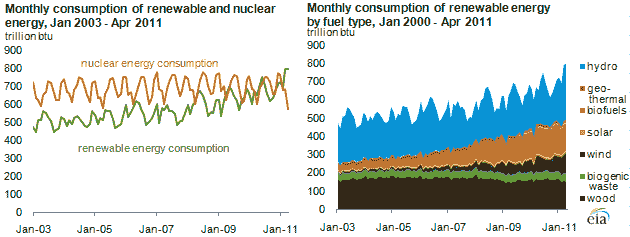
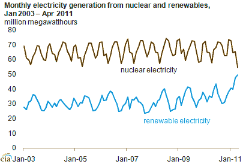

# 可再生能源消耗首次超过核能 TechCrunch

> 原文：<https://web.archive.org/web/https://techcrunch.com/2011/08/16/renewable-energy-consumption-tops-nuclear-for-first-time/>

根据美国能源信息署(EIA)的一份新报告,来自可再生能源的能源消耗最近超过了当前和历史核能消耗水平。这种转变是由与水力发电的高水位季节相吻合的核泄漏直接引起的。

但是，由于生物燃料消费的增加和风力发电能力的增加，可再生能源也有一个长期的上升趋势。

从短期来看，从核能到可再生能源的转变受到了美国天气趋势的影响。美国西部今年经历了破纪录的降雪，这导致水力发电厂以最大容量运行，时间比往常更长。这是在许多核设施关闭进行定期维护和换料时发生的，这是每年这个时候的典型情况。(核电站每年关闭两次，一次在春天，一次在冬天)。

然而，EIA 提供的图表显示，向可再生能源的长期转变也在进行中，这表明这不是由天气和工厂停工的巧合时间引起的偶然事件。

为了比较各种来源，消耗的能量以 btu(英国热量单位)来测量。1 月份，可再生能源消费量为 724 万亿英国热量单位，而核能消费量为 761 万亿英国热量单位。截至 3 月，可再生能源已达到 795 万亿英国热量单位，而核能为 687 万亿英国热量单位。到 4 月份，可再生能源为 798 万亿英国热量单位，而核能为 571 万亿英国热量单位。

EIA 提醒我们，可再生能源不仅仅意味着阳光、风、水和地热资源。它还包括生物燃料，如乙醇和生物柴油，以及生物质，如木材和木材废料。

然而，能源消耗的这种转变并不意味着可再生能源现在是我们的主要电力来源。除了发电之外，产生的能量还用于运输、供暖和工业蒸汽生产。

下面，你可以看到可再生能源目前仍略低于核能。但是假设这些趋势持续下去，在未来几年的某个时候，可再生能源也会超过核能。

