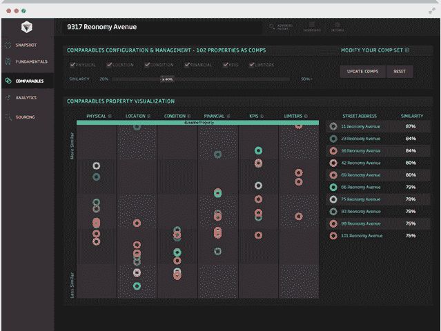

# Reonomy 从软银获得 370 万美元，以驯服商业房地产数据的狂野西部 TechCrunch

> 原文：<https://web.archive.org/web/https://techcrunch.com/2014/03/18/reonomy-lands-3-7m-from-softbank-to-tame-the-wild-wild-west-of-commercial-real-estate-data/>

如今，纽约的商业房地产业是你能找到的最接近西部的地方了。

投资者和贷款人花了太多时间研究房地产，但仍然缺乏他们真正想要的信息。经济学家的目标是改变这一切。

这家总部位于纽约的公司刚刚完成了由[软银](https://web.archive.org/web/20221225200842/http://www.crunchbase.com/financial-organization/softbank-capital)牵头的 370 万美元的首轮融资，之前的投资者如 Resolute Ventures、High Peaks Venture Partners、KEC 和 FinTech Collective 也参与了融资。

但是经济学是做什么的？

简而言之，该公司已经找到了一种方法，在公共记录和互联网上搜索各种财产的数千个数据点，以提供“公正、客观和基于量化的数据和分析”通常情况下，投资者和贷款人会派出团队去研究一处房产以及比较房产，以更好地了解潜在的购买行为。这需要几周的时间，研究人员通常只能找到两三个可比较的属性来相互权衡。

有了 Reonomy，同样的信息搜索只需点击几下鼠标就能完成。数据取自 100 多个来源，经过格式化、标准化、结构化和整合，为经济客户提供最大可能的价值，如机构和私人投资者、贷款人、研究人员和经纪公司的估值团队。

然后，这些数据允许客户将某个建筑与 30 多万个其他可比较的建筑进行比较，而不仅仅是少数几个。他们可以查看总体数据，如建筑状况、每平方英尺的价格等。以及更精细的数据，如过去的违规行为、电梯状况、锅炉房情况和已备案的资本支出。

三月初，[经济](https://web.archive.org/web/20221225200842/https://www.reonomy.com/)推出了一项测试，选择机构房地产投资者、贷款人和开发商。有了新的资金，该公司计划扩展到新的市场，开发移动设备，并建立团队。

